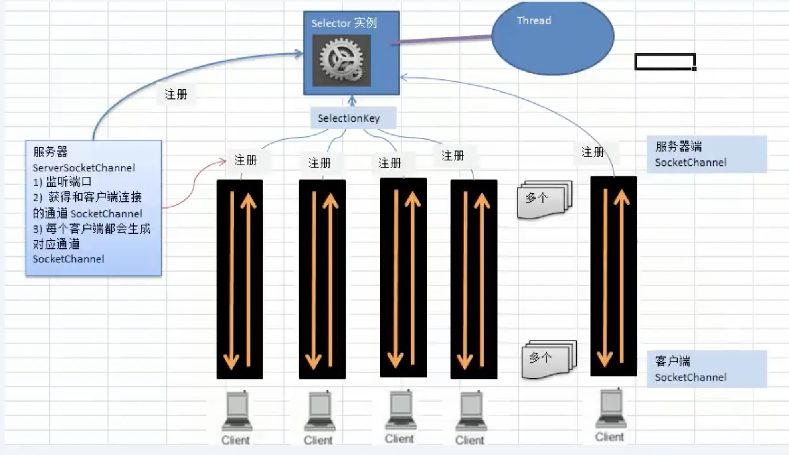

#NIO

##介绍
java对于非阻塞IO的实现。实际上就是解决BIO的block问题  

####改进方法
解决耦合性问题最直接的办法就是进入第三变量。如果一个不够，那就来多个。😂

废话不多说，先整个[示例](NIOServer.java)

#原理  

#核心组件
##1、Selector

##2、channel
#####2）SocketChannel

##3、Buffer
####ByteBuffer
####零拷贝

##4、[netty](../netty/read.md)
