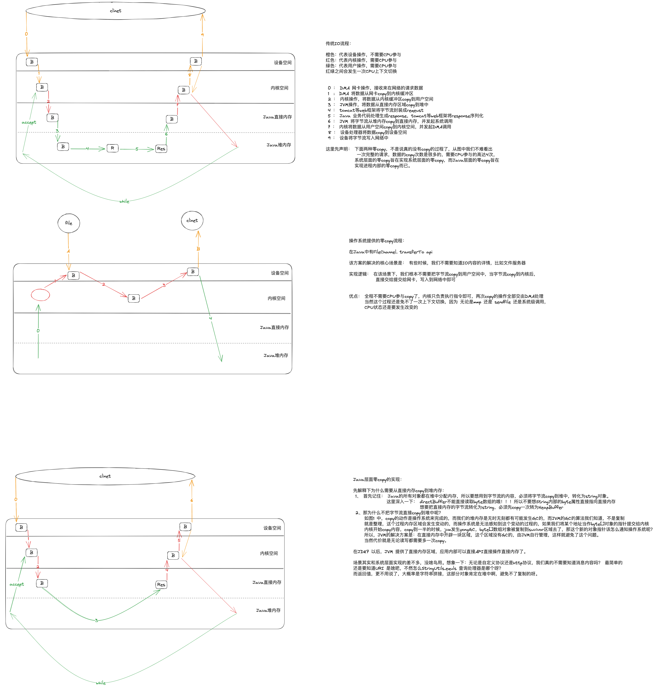
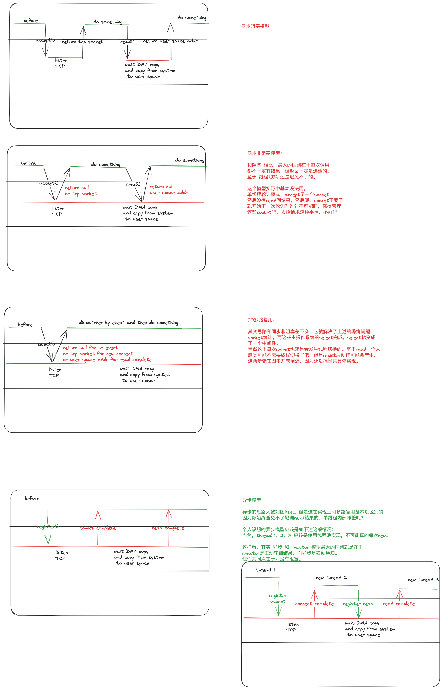
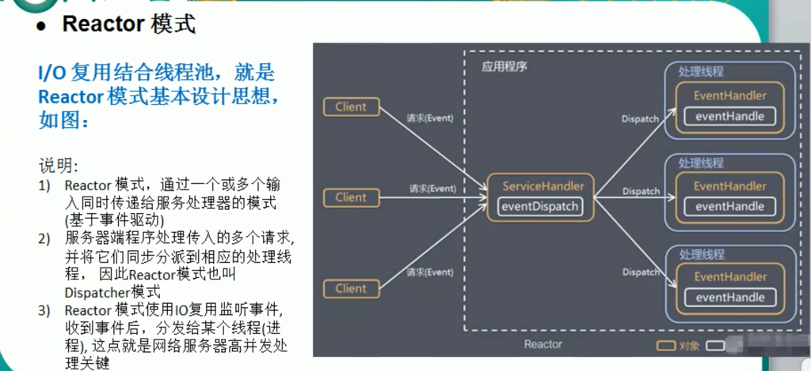
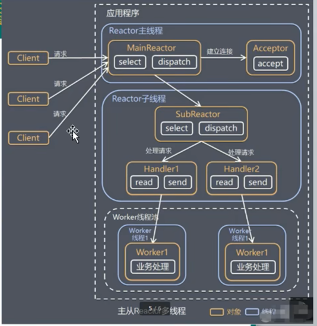
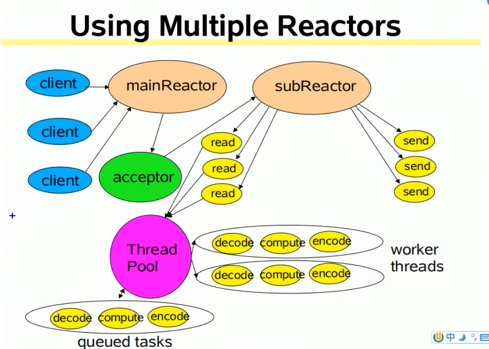

## IO从操作系统到java再回到操作系统的过程：
 
## IO 的4中模型总结
 
* BIO: 同步阻塞模型。用户线程在进行accept/read等操作时会发生阻塞，一直到有新的连接或者数据准备好时才会恢复
* NIO: 同步非阻塞模型。通过将socket设置为非阻塞模式，用户线程在进行accept/read操作时，如果没有新的连接或者数据会立即相应。
* NIO: 多路复用模型。非阻塞模型的场景下，每次都要去accept或者read后才能知道是否有操作，而且如果连接过多的时候，没办法批量操作，通过selector可以实现批量监听的能力。
* AIO: 异步非阻塞模型。
## reactor 模型总结
* Reactor模型
   
* 单reactor单线程模型
   
* 单reactor多线程模型（tomcat）
   
* 主从reactor
  * 形式一
 
  * 形式二
 
* netty的reator

## zero copy
#### 传统的IO  
~~~code
     -------DMA copy-----    -------CPU copy---     -------------jvm copy ---
    |                    |   |                |    |                         |
hardware buffer   ->  kernel buffer   -> user buffer(direct buffer)  -> heap buffer
~~~
#### mmap技术
* 用户内存的数据不需要CPU copy
* 读写user buffer时，直接映射到kernel buffer
~~~code
     -------DMA copy-----    -------mmp-------      -------------jvm copy ---
    |                    |   |                |    |                         |
hardware buffer   ->  kernel buffer   -> user buffer(direct buffer)  -> heap buffer
~~~
#### send file
~~~
     -------DMA copy-----     ------copy desc--     ---DMA copy-----
    |                    |   |                |    |               |       
socket buffer   ->  kernel buffer  ->    socket buffer    ->   hardware  
~~~

~~~java
    SocketChannel clientChannel = (SocketChannel)selectionKey.channel();
    ByteBuffer allocate = ByteBuffer.allocate(1024);
    try {
       while (clientChannel.read(allocate)>0){
            
       }
    
    } catch (IOException e) {
        throw new RuntimeException(e);
    }
~~~
read 该read多少呢？ 可以read的字节数是多少呢？ 一个数据包？多个数据包？ 和TCP 粘包/拆包有关系吗？
