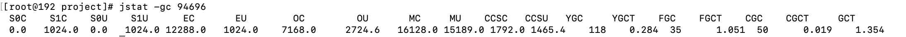
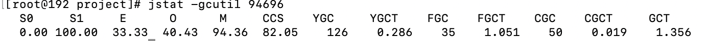
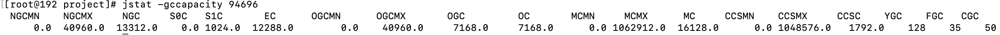

# JDK 性能检测工具

### jps

### jstat
###### jstat -gc 【pid】

* s0           survivor0 单位KB
* s1           survivor1 单位KB
* E            eden 单位KB
* O            old 单位KB
* M            meta space 单位KB
* CCS          compress class space 单位KB
* YGC          young gc 次数
* YGCT         young gc 总耗时
* FGC          full gc 次数
* FGCT         full gc 总耗时
* CGC          并发GC发生次数，当前是G1
* CGCT         并发GC发生总耗时，当前是G1
* S0、S1、E、O、M、CCS + C : 此处C代表总大小
* S0、S1、E、O、M、CCS + U : 此处U代表已使用过

###### jstat -gcutil 【pid】

* 列表基本和jstat-gc相同
* S0、S1、E、O、M、CCS 等使用的是百分比计数，而不是具体的值

###### jstat -gccapacity 【pid】

* NGCMN：新生代最小容量
* NGCMX：新生代最大容量
* NGC：当前新生代容量
* S0C：第一个幸存区大小
* S1C：第二个幸存区的大小
* EC：伊甸园区的大小
* OGCMN：老年代最小容量
* OGCMX：老年代最大容量
* OGC：当前老年代大小
* OC:当前老年代大小
* MCMN:最小元数据容量
* MCMX：最大元数据容量
* MC：当前元数据空间大小
* CCSMN：最小压缩类空间大小
* CCSMX：最大压缩类空间大小
* CCSC：当前压缩类空间大小
* YGC：年轻代gc次数
* FGC：老年代GC次数

### jinfo
* 查看指定java应用的配置参数
* 动态修改指定java应用的配置参数（不是每个参数都可以修改的）

### jmap
###### jmap -dump:live,format=b,file=/xxx/xxx.bin  【pid】
* java堆转快照，dump出java堆中对象相关信息
* 需要搭配其他应用使用
  * jhat 
###### jmap -histo:live 【pid】

### jhat 

### jstack 栈跟踪
