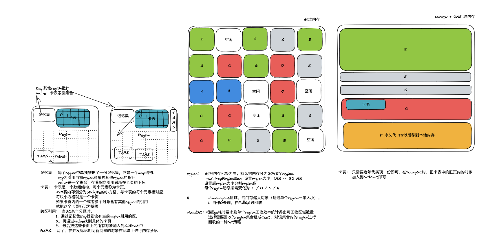

# CMS VS G1垃圾回收器

### 主要目标
* CMS ： 获取最短回收停顿时间
* G1  ： 为了适应现在不断扩大的内存和不断增加的处理器数量，进一步降低暂停时间（pause time），同时兼顾良好的吞吐量

### 工作区域
* CMS 主要针对老年代进行回收
* G1 工作区域包括新生代和老年代

### 回收算法
* CMS 
  * 优先采用标记-清理
  * 当碎片比例达到一定程度时，使用标记-整理
* G1
  * 整体对区域进行标记-整理
  * 区域内标记-复制

### 内存结构

### 回收过程

