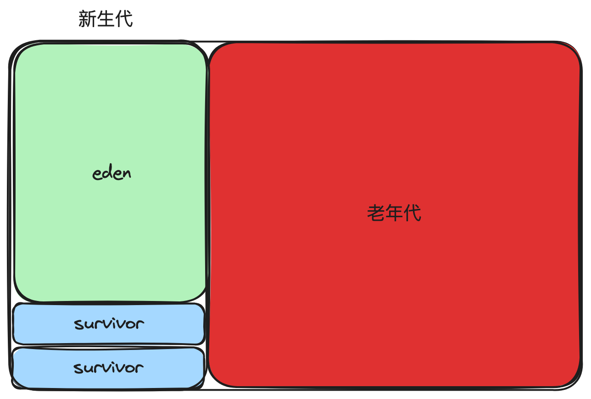
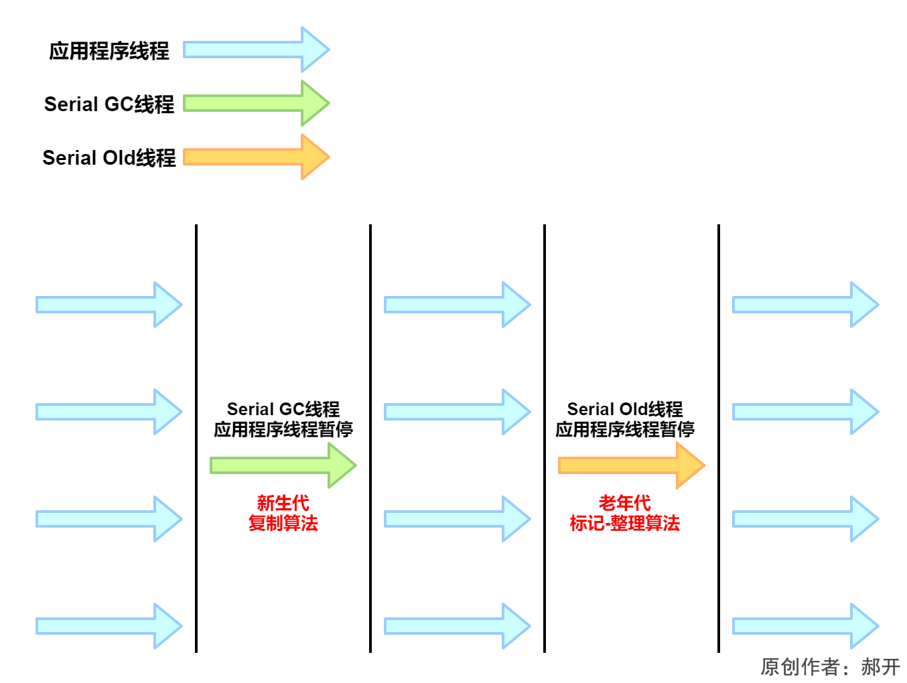
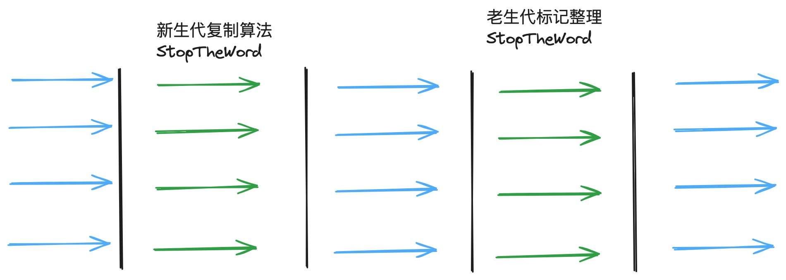
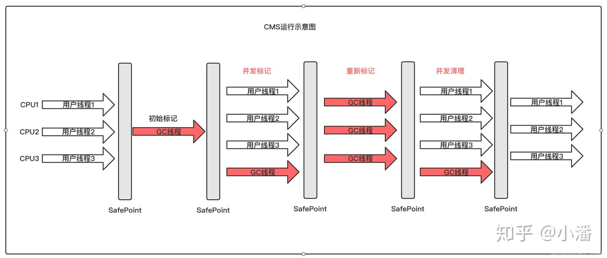
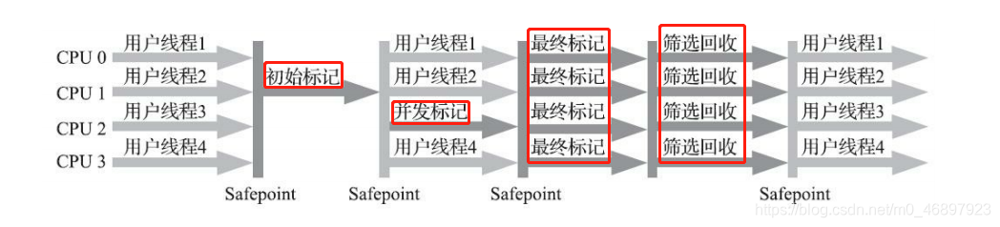

### 什么是垃圾回收(what)
* 自动化管理内存区域，包括对象内存的分配 和 无用对象的回收

### 为什么要垃圾回收(why)
* 高级语言的特性，自动化对象的内存分配和回收
* 为java应用的可持续运行提供基础保障

### 如何实现（how）
#### 1. 算法-如何找寻垃圾对象（标记）
###### 根节点枚举法
###### 跨代（区域）引用
#### 2. 算法-如何回收圾对象（回收）
#### 3. 如何分配内存

### 算法原理

| GC                | 回收区域 | 回收算法      | 线程模型 | 
|-------------------|------|-----------|------|
| serial            | 新生代  | 标记复制      | 串行   |
| serial old        | 老年代  | 标记整理      | 串行   |
| parNew            | 新生代  | 标记复制      | 并行   |
| parallel scavenge | 新生代  | 标记复制      | 并行   |
| parallel old      | 老年代  | 标记整理      | 并行   |
| cms               | 老年代  | 标记清理      | 并发   |      
| G1                | 全部   | 标记整理+标记复制 | 并发   |      

### 搭配效果

| GC                               | 目标                | 线程模型 | 优势        |
|----------------------------------|-------------------|------|-----------|
| serial + serial old              | 哪里都可用             | 串行   | 单CPU小内存场景 |
| parallel scavenge + parallel old | 可控制的吞吐量，满足程序的运行时长 | 并行   | 吞吐量优先     |
| parNew + cms                     | 低延迟，满足程序的响应速度     | 并发   | 停顿时间优先    |
| G1                               | 低延迟、高吞吐量          | 并发   | 大内存       |

###### par new + cms
* 获取最短回收停顿时间

###### G1
* 为了适应现在不断扩大的内存和不断增加的处理器数量
* 进一步降低暂停时间（pause time）并且让停顿时长可控
* 同时兼顾良好的吞吐量

### 工作区域
* CMS 主要针对老年代进行回收，一般和pallNew搭配使用
* G1 工作区域包括新生代和老年代

### 回收算法
###### G1
* CMS 
  * 优先采用标记-清理
  * 当碎片比例达到一定程度时，使用标记-整理
* G1
  * 整体对区域进行标记-整理
  * 区域内标记-复制

### 内存结构
###### 分代算法
* 包括：
  * serial + serial old
  * par new + parallel scavenge
  * par new + cms
* 他们都是把堆内存分为：  
  
###### G1

# 线程模型对比
* 单线程模型
  * 代表人物 ： serial new 、 serial old 

* 并行模型
  * 代表人物： parallel scavenge 、 parNew 、 parallel old 

* 并发模型
  * CMS
    
  * G1
    

### 关键点
* Parallel old 和 Parallel scavenger、 ParNew 采用的算法不同，但是他们的线程模型相同
* Parallel scavenger 和 ParNew 采用的算法和模型不同，但是他们的效果不同
  * Parallel scavenger 和 Parallel old 搭配使用。为的是吞吐量优先策略。原理是 动态调整堆大小
  * parNew 和 CMS搭配使用，从而降低STW时间。这个可以理解为：ParNew就是为了配合CMS而生的。
* CMS和G1的区别，CMS并发的阶段比G1多，但是G1可以并行的回收多个区域，所以面对大内存的情况下，G1优于CMS

# 综合评估
* G1将内存划分为多块，分别进行回收，所以内存上看
  * 在大内存场景下，通过回收特定数量的区域来降低单次停顿的时长，但总时长依然要比CMS高
  * 在小内存场景下，G1的区域回收反而成为浪费时间和空间的产品
* 回收过程上看
  * 对于停顿时长有要求的场景下，G1更具优势，它可以控制单次回收的时长。
  * 回收效率比较好的场景下，由于G1是标记复制算法，显然造成内存碎片化的要比CMS的标记清理要好。

# 常用参数列表

### 面试题
##### CMS vs G1
* 目标不同
  * CMS+ParNew 为低延迟而生。通过尽量降低单次GC的时长来降低服务延迟。
  * G1的目标是大内存场景下低延迟、高吞吐量。
* 内存区域划分不同
  * CMS+ParNew 采用分代算法，CMS负责老年代，parNew负责新生代
  * G1 默认将内存划分为2048个内存区域（region），每个region可以是老年代、新生代、大对象中的任一一种
* 算法不同
  * CMS采用标记-清除算法，在内存碎片达到一定层度时，整理一次。
  * G1采用标记-复制和整理算法结合的算法，从一个region复制到另一个region，而目标region又是从前到后选择，看起来像整理算法
* 线程模型不同
  * CMS的过程是：初始标记-并发标记-重新标记-并发清除
  * G1的过程是：初始标记-并发标记-重新标记-筛选回收。
  * 其中G1的筛选回收是控制GC时长的关键，优先选择回收效果好的区域。此过程是STW的。
  * 也就是说，G1在高吞吐和低延迟只能二选一。
* 使用场景不同
  * 官方建议超过6G，优先G1，低于6G时，追求低延迟选择parNew+CMS，追求吞吐量选择Parallel scavenger + parallel old
* 优缺点不同
  * G1将内存region划分为2048个region，跨区域引用太多，而为了维护这种跨区域引用需要耗费一定的内存空间。当然这对于大内存场景来说，无需考虑
  * 而CMS采用只有新生代和老年代，跨代引用相对较少，耗费额外内存不多，内存使用更好。
  * G1基本么有fullGC这样说，如果发生了，那么说明整体就有问题了。而CMS full gc是有可能的。
