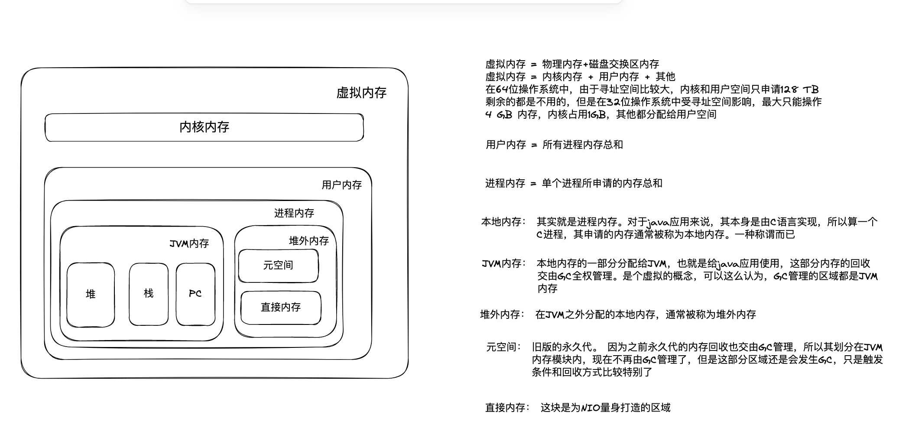
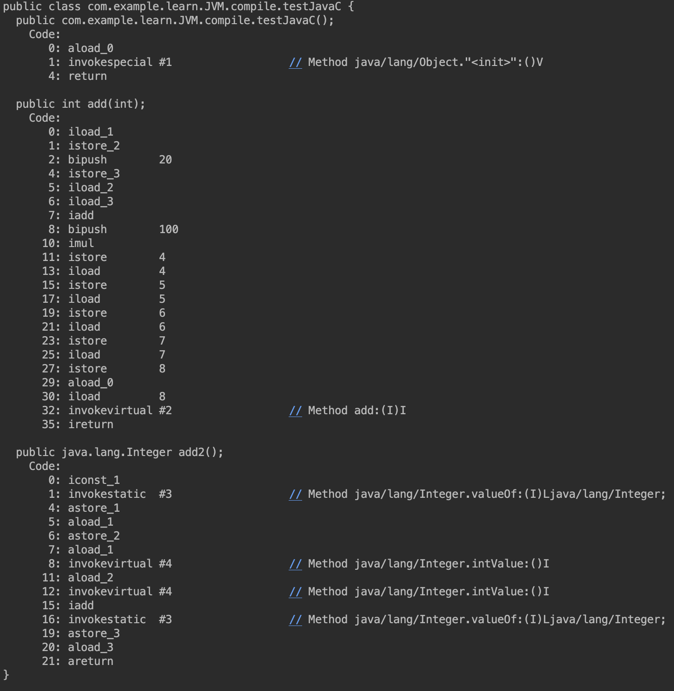

# java内存区域
* 对于一个只运行了一个java进程的系统而言，其内存分布大致如图：

* Java 堆内存由 [GC](#GC) 进行管理 

### 运行时数据区域
##### 程序计数器
* 它是一块很小的区域，为虚拟机栈(线程栈)提供服务
* 它在虚拟机 **字节码解释** 时为虚拟机提供下一条指令的位置
  * 它和CPU的 **计数寄存器** 功能类似
  * CPU的 **计数寄存器** 为CPU提供下一条指令的位置
  * 同时代码中过的 分支、跳转、循环、异常处理、线程恢复等都依赖它
* 它和线程绑定，一个线程对应一个 程序计数器，可以认为是 线程私有的一块区域
* 本地方法栈 不需要程序计数器
  * 本地方法通常是由C或者C++执行，不需要虚拟机参与进行字节码解释
* 一般情况，它不会发生OOM
  * 由于程序计数器和线程同生共死，不需要额外的GC，也不存储其他数据，大小固定
  * 它是一块很小的区域，即使内存不够，也不少它这么一点

##### 虚拟机栈
* 每个方法被执行时，都会同步创建的一个栈桢
  * 这里的【方法】个人觉得，不是我们代码中的常规的方法，而是虚拟机最后执行的方法。
  * 这不是一样的，因为JVM在运行时会动态优化代码的，方法内联就是其中之一
* 栈内部包含
  * 操作数栈 
  * 局部变量表
  * 动态连接
  * 方法出口
* 栈中包含的内容是固定的，所以栈的大小其实也是固定的，而且是在加载时就可以确定的
  * javac testJavaC.java  javap -c testJavaC.class 
  * 我们可以看到，通过javaC编译后，操作数个数，局部变量个数，动态链接这些都是可见的
* 局部变量表中存储基本类型的变量，或者对象的引用
  * long和double占两帧，避免32位操作系统问题 ？ 
  * 栈中每个帧的大小是由操作系统决定的（32，64位）
* 当内存不够，无法分配时报错
  * stackOverFlow : 没有空间分配栈时，一般是在无限递归时发生，或者堆外内存不够用
  * OutOfMemory :  扩展栈时，hotspot栈无法扩展,也就没此报错
* JIT 优化
  * 方法内联。
    * 内联减少栈帧数量，从而减少栈深度
    * 内联可以使得逃逸分析的价值更大。（对象逃逸的可能进一步降低）
  * 逃逸分析 ： 静态/私有对象，方法参数传递、方法返回值 等使得对象的作用域扩大的行为称为逃逸
    * 同步消除  不存在逃逸现象的对象，一般不会被多线程共享，也就没必要同步了。
  * 栈上分配
    * 矢量替代

##### java堆
* 所有对象和数组实例都在堆上进行分配。[对象构建](#objCreate)
* 堆的大小是可以动态扩展的，由-Xms 到 -Xmx区间
* 由于JIT的一些优化，使得对象的内存分配不一定在堆中了
* 而堆中的内存也不一定是全部共享的

##### 方法区
* 存储被虚拟机加载的类型信息、常量、静态变量、即时编译后的代码缓存等数据
* 早前被称为 永久代

##### 运行时常量池
* 存放编译期产生的各种字面量和符号引用
* 位于方法区中的一块特殊区域

##### 直接内存
* 为NIO的DirectByteBuffer量身定制的一块区域
* 目的是为了解决数据在内核空间和用户空间来回复制的问题

##### 各部分内存大小配置及限制

# <a id = "GC">垃圾回收器 (GC)</a>
### 功能
* 垃圾回收器的功能包括
  * 堆内存的管理与布局 
    * 不同回收器有不同的布局
  * [对象内存的分配](#object_head)
  * [对不再使用对象所占用内存进行回收](#gc_)
  * 与解释器和编译器以及监控子系统的协调工作
* 垃圾回收器影响点
  * 1、对象内存分配的速率
    * 内存碎片越少分配越快。碎片的多少由垃圾回收的算法决定。针对碎片的情况对象分配的不同算法有不同的性能表现
  * 2、回收算法引起的额外资源损耗
    * 比如G1，相对与CMS，它的记忆集所占用的内存空间很大
    * 为了维护记忆集以及为了和用户进程并发进行而增加的额外处理都会引起CPU的损耗
  * 3、服务吞吐量的大小。吞吐量不是服务器能处理请求的多少，而是在单位时间内CPU用于处理服务指令的多少。而GC难免会发生STW，在STW的长短直接影响着吞吐量的大小
    * 各个垃圾回收器的算法不同，是否并行或者并发都影响着吞吐量

### 对象分配策略
* 对象在堆上分配、偶尔JIT进行栈上分配
* 一般情况都在新生代区域上进行分配
* 大对象也会直接进入老年代
* 长期存活的对象进入老年代。默认当对象分代年龄在15时，进入老年代
* 如果survivor空间中相同年龄的对象大小的总和大于survivor空间的一半时，年龄大于等于该年龄的对象就可以直接进入老年代
* 

### <a id = "object_head">对象的内存布局</a>
* mark word
  * 这部分区域主要存储hashCode、GC分代年龄 和锁相关信息。
  * 这部分区域是动态可变的，具体可参考[synchronized相关知识](../../jreApi/lock/readme.md)
* 对象类型信息
  * 其实就是一个指向方法区地址的指针，以实现通过对象获取对象类信息
  * 如果是数组，则记录数组中元素的类型指针以及数组的长度
    * 数组必须有界，理由：对象的空间分配必须要先知道对象的内存大小，如果无界则无法准确申请内存长度
* 对象的数据部分
  * 属性区域是连续的，包括了常量、对象以及父类的所有属性，罗列的顺序也是有规则的
* padding hotspot要求对象的大小必须是8的整数倍，不够的部分用0填充

### <a id = "gc_">垃圾回收</a>

##### 关于内存回收的各种关键词

| Name       | 回收区域        | 触发条件          | 描述                                          |
|------------|:------------|:--------------|:--------------------------------------------|
| Partial gc | 局部GC，无特指    | 无             | 相对于full gc的一个抽象概念                           |
| young gc   | 新生代         | 新生代满或者已使用一定比例 | 和minor gc 同义                                |
| minor gc   | 新生代         | 新生代满或者已使用一定比例 | 和young gc 同义                                |
| old gc     | 老年代         | 老年代满或者已使用一定比例 | 这是个概念，无特指                                   |            
| major gc   | 老年代         | 老年代满或者已使用一定比例 | CMS独有的概念，针对老年代独立回收 详见[CMS](./GC.md)    |
| mixed gc   | 新生代+部分老年代   | 老年代满或者已使用一定比例 | G1 独有的概念，和full gc 不尽相同,详见[G1](./GC.md) |
| full gc    | 新生代+老年代+方法区 | 老年代满或者已使用一定比例 | 详见[full gc](./fullgc.md)                    |
 
|      | 串行        | 并行           | 并发           |
|------|-----------|--------------|--------------|
| 线程场景 | 单CPU，单线程  | 单CPU，多线程交替执行 | 多CPU，多线程同时执行 |
| GC场景 | 单线程GC且STW | 多线程GC且STW    | 多线程GC不影响用户线程 |

##### 那些区域需要回收行为
* 堆
* 方法区
  * 常量池

##### 什么样的对象需要回收
* 没有有效[引用](#reference)的对象
  * 通过可达性算法来判定一个对象是否有效：程序定义一些[GCRoot节点](#gcroot)对象，通过一个对象的所有引用链都无法到达任何一个GCRoot时，就说明该对象已经没有有效引用了
    * GCRoot 节点选取
      * 栈帧中的变量
      * 常量池中的常量
      * 静态变量
      * 被本地方法引用的变量
      * synchronized 关键字持有的对象
* 不再使用的class
  * 没有任何对象存活
  * 没有任何子类对象存活
  * 类加载器不存活

##### 垃圾收集算法
* 引用计数法
* 根节点枚举法

##### 怎样回收对象
###### <a id="GC_artithmetic">回收算法</a>
* 分代回收。两个分代假说
  * 大部分的对象都是朝生夕死
  * 熬过越多次回收过程的对象越难以消亡
  * 为此，JVM通过为对象增加GC年龄，同时将内存分为两块，分别存储年龄较小的和年龄较大的对象
* 基于上述两个假说，JVM把内存区域划分成多块，同时提供的垃圾回收器要不就是针对某个区域，要不按照不同区域采用不同策略
* 标记-清除 : 将回收分为两步，标记 & 清除
  * 优点1: 满足回收需求，且过程简单，作为最初的版本，为后续升级奠定了基础
  * 优点2: 清理工作中对象没有发生移动，不需要修改引用的指针，省下了一笔消耗
  * 缺陷1: 对于需要回收的对象很多时，标记 和 清理都需要大量的时间，使得整体回收效率较低
  * 缺陷2: 回收的对象未必连续，所以回收后会产生大量的碎片空间
* 标记-复制 : 继承自标记-清理算法，优化了分代假说1的情况
  * 将内存区域分为两块，每次独立使用其中的一块，在清理阶段，将未死亡的对象复制到另一块区域，然后将上一个使用的区域全部清理掉
  * 优点1: 对于回收效率较高的情况下，清理的效率更高
  * 优点2: 在复制的之后，内存重新划分，使用的空间又将编程连续的
  * 缺陷1: 对于清理效果差点的区域，清理效率将会奇差无比
  * 缺陷2: 复制算法将会始终保持着一部分内存不使用，这相对来说是一种浪费
  * 缺陷3: 对象的指针发生变化，所有引用的值需要修改
* 标记-整理 : 继承自标记-清理算法，优化了假说2的情况
  * 在回收阶段，将所有对象往内存的一端移动，让内存再次连续
  * 优点：解决了标记-复制 内存块空闲的问题，而且不用担心内存不够或者浪费
  * 缺点1：整理的对象较多时，花费的时间较多 
  * 缺陷2: 对象的指针发生变化，所有引用的值需要修改
* 分代算法
* 增量算法
* Stop the world
  * 在GC的过程中，对象的分配和使用会收到干扰，所以所有的用户线程都会暂停，以保证内存的安全性
  * 标记过程 ： 就像打扫垃圾，不能一边扔一边扫，跟节点的枚举过程中也是，一边统计一边增加或者删除，都会导致对象的引用链错误
  * 移动过程 ： 不管是复制还是整理，在所有引用的指针没有同步完之前，用户线程的任何操作都可能导致严重的后果
* 这里有个鱼和熊掌的问题，垃圾回收的过程中必然牵涉到Stop the world，垃圾回收的时间越长，stop the world的时间就越长
  * 高吞吐量优先 : 尽可能的减少回收的时间，标记-清除 相比其他算法就会省去复制或者整理的时间
  * 内存分配优先 : 复制和整理 相较于清除算法，对象堆放规整，内存分配省去空闲列表的操作及空间
  * 混合使用 : 在内存碎片比例的某个零界点时，优先考虑吞吐量，当碎片化过于严重就复制/整理一次。CMS就是这样

###### <a id = "gcroot">如何确定GCRoot</a>
* 放弃遍历，遍历所有对象那太耗时了，而且内存那些位置存放着对象也不知道，使用独立空间进行统计的方式进行
* 用户线程在[安全点](#safe_point)上把当前线程的所有GCRoot都统计进oopMap中
  * 实际上在类加载时，对象的存储位置都是确定的并且被记录下来了
  * 代码在编译期间，需要加载那些对象到操作数栈中，也是可以确定的
  * 这样在安全点到来时，可以毫不费力的直接将这些对象统计为GCRoot
  * 同时对象的引用链也十分清晰了

### <a id = "objCreate">对象创建过程</a>
对象创建流程
* 0、加载、解析、初始化类
  * 这一步不是每次都需要，JVM会先去方法区中检索该类是否加载过，如已经加载过，直接读取类信息
  * 如果类没有加载，则必须利用[classLoad加载类](../vmRunSystem/classload/classload.md)
* 1、申请对象存储内存
  * 当class被加载后，对象的内存空间大小是可以确定的，直接申请固定大小的内存即可
  * JVM内存分配的方式有两种：
    * 指针碰撞（基于标记-整理、标记-复制 的GC机制时使用），它要求内存地址必须是连续的，有一个index指针指向空闲内存的首位。eden区通常都是通过这种方式
    * 空闲列表(基于标记-清除的GC机制时使用)，它不要求内存地址是连续的，所有空闲内存都被空闲列表记录着。也就是说JVM需要花费一部分地址空间来存储空闲列表
    * 无论哪种方式，其实在对象的构建必然是多线程的，内存分配必然存在竞争，而且必然很激烈
      * 所以JVM在内存分配时使用循环CMS来确保内存分配的线程安全
      * TLAB策略： 为了避免循环CMS高并发下的性能问题，将堆中的一部分内存拿出来设置为线程私有区域，当CMS循环到一定次数时，选择在线程私有空间开辟内存。当然这个策略需要参数配置
* 2、初始化默认值
  * 理由： 物理内存是宝贵的，在系统运行期间，物理内存是重复使用的，将分配到的内存区域全部初始化为0，以保证在属性初始化之前访问该区域时能获取正确的值
* 3、初始化[对象头信息](#object_head)
* 4、调用构造方法。new 关键字一定会执行<init>方法（构造函数），其他方式不一定
