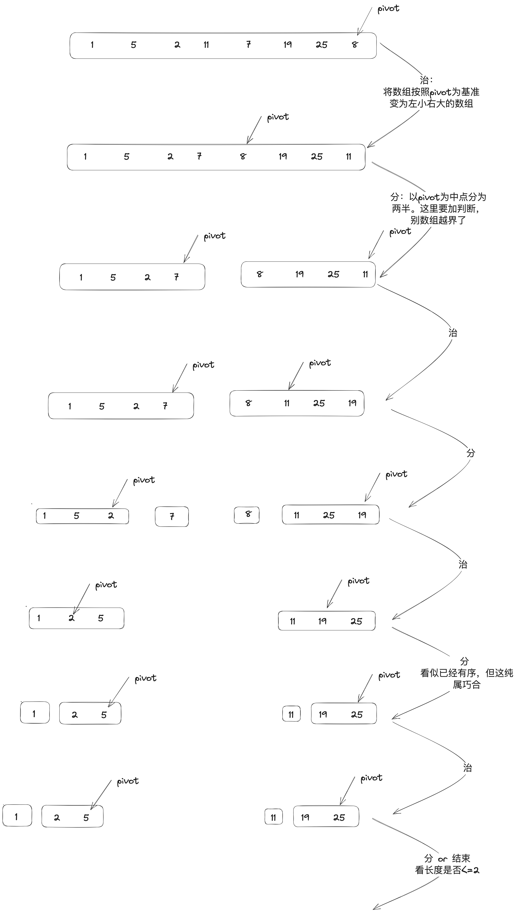

# 排序算法
* 排序算法的选择标准
  * 1、时间复杂度。平均/最坏/最好场景下复杂度是可变化的。需要根据实际的场景灵活判断
  * 2、空间复杂度（原地排序的概念，整个排序过程中不额外申请空间）
  * 3、比较/交换的次数
#### 快速排序
  * 采用治-分思想。过程如图
    * 治的过程会先选一个基准，这个基准选取可根据实际数据情况来。最好实现55分
  * 分的过程也会形成树。由于其按照基准来划分，所以很难做到五五分，所以快排的树基本不可能平衡。这也是它不稳定的原因  
  * [Java实现](sort/快速排序.java)  
#### 归并排序
  * 采用分治思想。过程如图 
    * 分的过程是递归的 : [递归算法](#递归算法) 
    * 分完的结构是树形结构 : [二叉树算法](#二叉树算法)
    * 治的过程牵涉到合并算法 : 将两个有序数组重组 重组 为一个有序数组 [合并算法](#合并算法)
  * [Java实现](./sort/归并排序.java)
* 

# 合并算法

# 优先级算法

# 淘汰算法
* [LRU算法](%E6%B7%98%E6%B1%B0%E7%AE%97%E6%B3%95%2FLRUCache.java)
