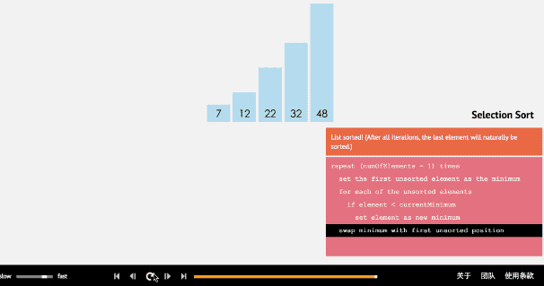

# 排序算法
* 插入排序
  * [直接插入排序（InsertSort）](#insertSort)
  * 二分插入排序
  * [希尔排序（ShellSort）](#shellSort)
* 选择排序
  * [简单选择排序](#selectsort)
  * [堆排序](#heapsort)
* 交换排序
  * [冒泡排序](#bubblesort)
  * [快速排序](#fastSort)
* [归并排序](#mergerSort)
* 基数排序

### 直接插入排序
* 原理
  1. 从1开始，假设已经有N个节点已经有序
  2. 取第N+1个数字，把它插入到已经有序的数组中，把比它大的节点往后移动一位
* 实际执行中：
  1. 从1开始，取第N+1个节点
  2. 依次 和第N节点相比，如果满足N+1<N，则换位置，否则，N++
* 伪代码：
 ~~~
for(int i =0; i < array.length-1; i++){
    for(int j = i-1; j>=0; j++ ){
       if(array[i] < array[j]){
          swap(array[i],array[j])
       }else{
          break;
       }
    }
 }
~~~

* [java测试类](快速插入排序.java)

### <b id="shellSort">希尔排序（ShellSort）</b>
* 对于插入排序而言，如果给定序列原本就比较混乱，比如最小值在队列的末尾，那么该值需要移动n-1次才能来到队首
* 希尔排序在插入排序的基础上进行了改进。

* 如图，它先按大步进行分组后，插入排序，这样每次交换，后面较小的元素就会跨越大步来到前面

### <b id="selectsort">选择排序</b>

* 简单选择排序的基本思想：比较+交换。
  1. 从待排序序列中，找到关键字最小的元素；
  2. 如果最小元素不是待排序序列的第一个元素，将其和第一个元素互换；
  3. 从余下的 N - 1 个元素中，找出关键字最小的元素，重复(1)、(2)步，直到排序结束
* 实现
  1. 第一层循环：依次遍历序列当中的每一个元素
  2. 第二层循环：将遍历得到的当前元素依次与余下的元素进行比较，符合最小元素的条件，则交换。

### <b id="heapsort">堆排序</b>
* 原理：
  1. 把i=n个元素构建最大值二叉树（保证父节点大于字节点即可，左右不必有序）
  2. 将最大值和 n-i交换
  3. i-- 重复1～2

* [代码示例](HeapSort.java)
* 相较于快速选择排序，它每次都是三个节点进行比较，所以比较的次数会比快速排序少一半左右

### <b id="bubblesort">冒泡排序</b>
* 原理
  1. 从0开始，直到n-i位，两两比较，如果前一位大于后一位就交换。这样一次遍历后，最大值移动到队尾
  2. i++ 重复第一步，直到i=0
* 
* [代码示例](BubbleSort.java)

#### <b id="fastSort">快速排序</b>
* 采用治-分思想。过程如图
  * 治的过程会先选一个基准，这个基准选取可根据实际数据情况来。最好实现55分
* 分的过程也会形成树。由于其按照基准来划分，所以很难做到五五分，所以快排的树基本不可能平衡。这也是它不稳定的原因
* [Java实现](快速排序.java)

#### <b id="mergerSort">归并排序</b>
* 采用分治思想。过程如图 
  * 分的过程是递归的 : [递归算法](#递归算法)
  * 分完的结构是树形结构 : [二叉树算法](#二叉树算法)
  * 治的过程牵涉到合并算法 : 将两个有序数组重组 重组 为一个有序数组 [合并算法](#合并算法)
* [Java实现](归并排序.java)
