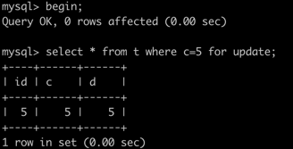
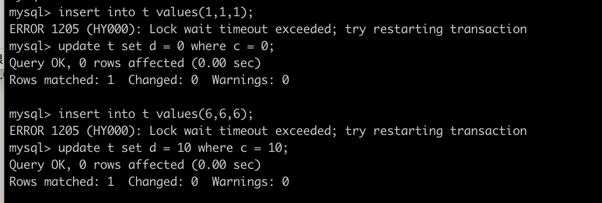
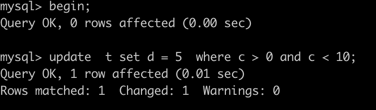
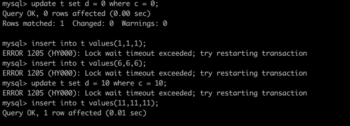
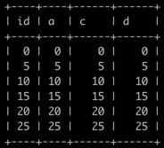
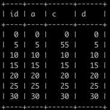
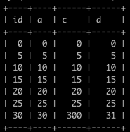

前提：

~~~ roomsql
drop table t ;
CREATE TABLE `t` ( 
`id` int(11) NOT NULL, 
`a` int(11) NOT NULL,
`c` int(11) DEFAULT NULL,
`d` int(11) DEFAULT NULL, 
PRIMARY KEY (`id`),
KEY `a` (`a`), 
KEY `c` (`c`)
) ENGINE=InnoDB;

insert into t values(0,0,0,0),(5,5,5,5),(10,10,10,10),(15,15,15,15),(20,20,20,20),(25,25,25,25);
~~~
#### 根据索引查找到第一个符合条件的行，以该行的前一行为开，该行为闭的区间开始加锁 后续的每个都可以见证就不单独测试了
#### 根据加锁方式，行锁可能是读锁，也可能是写锁。读写之间不互斥
#### 加锁的目标是索引。SQL中查询走的索引（有且仅有一个），以及修改的索引（多个）才会被加锁。

#### 原则 1：加锁的基本单位是 next-key lock。 next-key lock 是前开后闭区间。
#### 原则 2：查找过程中访问到的对象才会加锁。
#### 优化 1：索引上的等值查询，给唯一索引加锁的时候，next-key lock 退化为行锁。
同样适用于插入操作：插入操作先获取间隙锁，在确定完成后降级为行锁，撤销间隙锁。[案例](#案例3-insert的锁范围)
#### 优化 2：索引上的等值查询，向右遍历时且最后一个值不满足等值条件的时候，next-key lock 退化为间隙锁。[案例](#案例1-非唯一索引等值查询-update--from-where-index---)
#### bug：唯一索引上的范围查询会访问到不满足条件的第一个值为止。[案例](#案例2-非唯一索引范围查询-update--from-where-index---and-index---)

#### 案例1: 非唯一索引等值查询 （update * from where index = $ ）

| SessionA                              | SessionB                          | 结果              | 分析                   | flag |
|---------------------------------------|-----------------------------------|-----------------|----------------------|------|
| begin;                                |                                   |                 |                      | 1    |
| select * from t where c=5 for update; |                                   | 加锁范围(0,5](5,10) | 非唯一索引等值查询，id=10的行锁退化 | 2    |
|                                       | update t set d = 0 where c = 0;   | 成功              | id=0没有加行锁            | 3    |
|                                       | insert into t values(1,1,1);      | 阻塞直到超时失败        | (0,5)间隙锁生效           | 4    |
|                                       | insert into t values(6,6,6);      | 阻塞直到超时失败        | (5,10)间隙锁生效          | 5    |
|                                       | update t set d = 10 where c = 10; | 成功              | 非唯一索引等值查询，id=10的行锁撤销 | 6    |
##### 测试：

##### 结论
* 范围：（0，10）;
* 理论依旧：原则1 + 原则2 + 优化 2

#### 案例2: 非唯一索引范围查询 （update * from where index > $ and index < $ ）

| SessionA                                     | SessionB                          | 结果              | 分析                   | flag                 |
|----------------------------------------------|-----------------------------------|-----------------|----------------------|----------------------|
| begin;                                       |                                   |                 |                      | 11                   |
| update  t set d = 5  where c > 0 and c < 10; |                                   | 加锁范围(0,5](5,10] |                      | 非唯一索引等值查询，id=10的行锁退化 | 12   |
|                                              | update t set d = 0 where c = 0;   | 成功              | id=0没有加行锁            | 13                   |
|                                              | insert into t values(1,1,1);      | 阻塞直到超时失败        | (0,5)间隙锁生效           | 14                   |
|                                              | insert into t values(6,6,6);      | 阻塞直到超时失败        | (5,10)间隙锁生效          | 15                   |
|                                              | update t set d = 10 where c = 10; | 阻塞直到超时失败        | 非唯一索引等值查询，id=10的行锁退化 | 16                   |
|                                              | insert into t values(11,11,11);   | 成功              | 当扫描到id=10后结束         | 17                   |
##### 测试：

##### 结论
* 范围：（0，10];
* 理论依旧：原则1 + 原则2 + 优化2反证

#### 案例3: insert的锁范围

| SessionA                     | SessionB                        | 结果  | 分析         | flag |
|------------------------------|---------------------------------|-----|------------|------|
| begin;                       |                                 |     |            | 21   |
| insert into t values(3,3,3); |                                 | [3] |            | 22   |   
|                              | update t set d = 0 where c = 0; | 成功  | id=0没有加行锁  | 23   |
|                              | insert into t values(1,1,1);    | 成功  | (0,5)无间隙锁  | 24   |
|                              | insert into t values(6,6,6);    | 成功  | (5,10)无间隙锁 | 25   |
|                              | update t set d = 3 where c = 3; | 阻塞  | id=3行加锁    | 26   |
| commit;                      |                                 |     | 27         |
|                              | update t set d = 3 where c = 3; | 成功  | id=3锁释放    | 28   |
##### 结论
* 范围：（3，3];
* 理论依旧：原则1 + 原则2 + 优化3
* 加锁范围降低，可保证长事务场景下插入阻塞降低。
* 而从案例1，2 可确定，在插入之初，它还是或先获取到间隙锁的，在插入完成后，降级为行锁。

#### 案例4: next-key-lock 行锁影响所有索引，而非单独查询索引。而间隙锁，是查询扫描的索引，而不是全部索引。

| SessionA                                     | SessionB                         | 结果 | 分析          | flag |
|----------------------------------------------|----------------------------------|----|-------------|------|
| begin;                                       |                                  |    |             | 21   |
| update t set c = 5 where id > 0 and id < 10; |                                  |    |             | 22   |   
|                                              | insert into t values(1,1,1,1);   | 阻塞 | (0,5)有间隙锁   | 24   |
|                                              | insert into t values(6,6,6,6);   | 阻塞 | (5,10)有间隙锁  | 25   |
|                                              | insert into t values(30,1,1,30); | 成功 | 索引a和c上没有间隙锁 | 26   |
|                                              | insert into t values(30,6,6,30); | 成功 | 索引a和c上没有间隙锁 |
|                                              | update t set d = 3 where c = 3;  | 成功 | id=3锁释放     | 28   |
##### 结论：
* 行锁影响所有索引，而非单独查询索引。而间隙锁，是查询扫描的索引，而不是全部索引。

#### 案例5: next-key-lock 解决幻读能力有限

| SessionA                           | SessionB                                      | 结果                   | 分析                     | flag |                                            |
|------------------------------------|-----------------------------------------------|----------------------|------------------------|------|--------------------------------------------|
| begin;                             |                                               |                      |                        | 51   |                                            |
| select * from t;                   |                                               | 6行                   |                        | 52   |                                            |
|                                    | update t set c = 55 where id > 0 and id < 10; | 成功                   |                        | 53   |                                            |
| select * from t;                   |                                               | 6行，和52结果一致           | 可重复读生效                 | 54   |  |
|                                    | insert into t values(30,30,30,30);            | 成功                   |                        | 55   |                                            |
| select * from t;                   |                                               | 6行，和52结果一致           | 可重复读生效                 | 56   |  |
| select * from t for update;        |                                               | 7行，sessionB两次写都可见    | 当前读，隔离级别变更为读提交         | 57   |  |
| select * from t;                   |                                               | 6行，和52结果一致           | 当前读没有写时，并不影响后续的sql     | 58   |  |
| rollback中断，跳过57测试                  |                                               |                      |                        |      |                                            |
|                                    | update t set c = 300 where id = 30            |                      |                        | 59   |                                            |
| update t set d = d+1 where c = 30; |                                               | 成功                   |                        | 60   |                                            |
| select * from t;                   |                                               | 7行，53不可见，55、59、60可见, | 60当前读SQL的修改会导致事务的版本号后移 | 61   |    |
|                                    | update t set d = 300 where id = 30            | 阻塞                   | 行锁生效                   | 62   |                                            |

##### 结论：
* 间隙锁只解决了非当前读的问题，当事务中发生写操作后，写操作引发的读是读已提交级别，之后该行的版本保持最新。因为加了行锁，所以不会再有并发问题。
