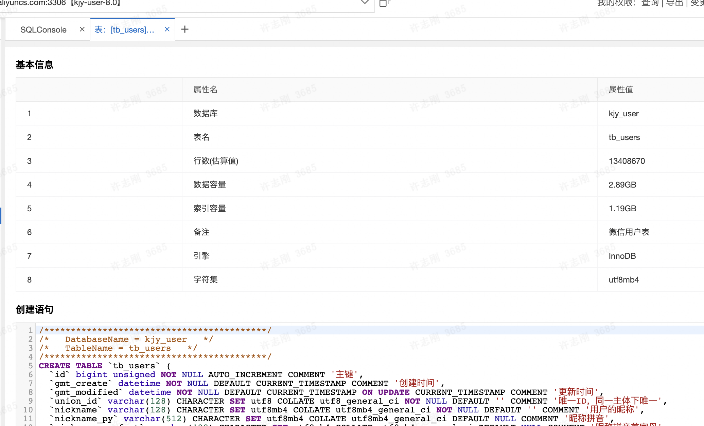
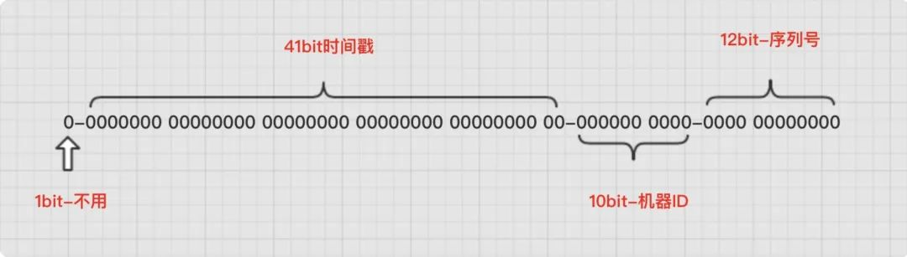

# 表结构设计
### 关于主键
* 必须有主键且必须为自增主键。（有效减少B+树的页分裂）
* 根据情况，写少建议mysql自增主键，写多建议不用mysql自增主键，改用自定义自增发号器
  * innodb_autoinc_lock_mode 配置为2，避免自增属性加锁时间过长。缺点就是插入失败ID不会会滚
* 主键类型建议选择无符号数字类型

### 关于字段设计
* 字段设计必须是不可再分的。尽量避免json这些复杂类型
* 存储空间满足需求的情况下字段所占用字节越少越好
* 字段数量上，如必要可以冗余字段，但建议字段数量小于20
* 禁止长文本字段。可选择oss存储文本，db存储地址
* 浮点类型：统一 decimal
* 时间类型：datetime 长一点，但时间范围广

### 关于索引设计
* 主键索引 ： 三层B+树就可以存储3.84kw 行数据，主键索引IO次数3次，耗时3ms，如果是内存操作，会更快
* 普通索引选取规则：
  * 1、离散度：唯一标识为最佳。例如微信unionID、openID等，
  * 2、利用率：经常用做查询条件的字段
  * 3、空间小：长字符串不适合做索引
  * 4、合并索引：
    * 联合索引：多个索引经常联合使用时优先考虑联合索引减少索引数
    * 覆盖索引：必要时可将某些冗余字段加入到联合索引，满足覆盖索引，减少回表次数

### 关于存储
* 客集集直播用户表1.34kw数据，平均每条数据227b 
  *  

### 关于优化
* [explain](#a-idmysqlexplainexplain-详解a)
* 查询和更新必须走索引。 
  * key 字段 必须有值
  * possible_key 有值时，需要考虑自己的索引是否最优解
  * where条件不能全部走索引。在5.7之后加入filtered，该字段越大越好
* 范围查询优化。       
  * type字段 要在ref之上，type = ref 、range 和 index 时，需要根据rows进行判断，必要时可通过添加范围限定降低查询范围。
  * 分页优化
* 排序优化  
  * 最好是和where子句使用相同索引，或者在同一个联合索引中满足最左匹配原则
  * 实在不行的时候只能尽量减少查询结果集，利用filesort
* 临时表优化
* 复杂sql优化
  * SQL子句优化

### <a id='mysql_explain'>explain 详解</a>

字段：
* ID : 执行编号,标识select所属的行
* select_type : 查询类型。 SIMPLE 为最佳
* table : 查询的表名。如果时引用则为derivedN，N为ID，表示访问的引用是ID=N行的结果
* type : 数据访问/读取操作类型(ALL、index、range、ref、eq_ref、const/system、NULL)
  * system > const > eq_ref > ref > fulltext > ref_or_null > index_merge > unique_subquery > index_subquery > range > index > ALL
  * system :    eq_ref的进阶场景，表里只有一行数据
  * const :     eq_ref的进阶场景，在查询前已知只有一行
  * eq_ref :    唯一索引单值匹配单行
  * ref :       非唯一索引的单值匹配多行，或者联合索引的最左匹配
  * fulltext :
  * ref_or_null :
  * index_merge :
  * unique_subquery :
  * index_subquery :
  * range : 范围扫描 in between > < 等
  * index : 索引扫描
  * ALL : 全表扫描
* possible_keys : 优化建议
* key  : 本次查询实用的索引
* key_len : 显示mysql在索引里使用的字节数
* ref  :  显示了之前的表在key列记录的索引中查找值所用的列或常量.命中联合索引中的列
* rows : 为了找到所需的行而需要读取的行数，估算值，不精确。通过把所有rows列值相乘，可粗略估算整个查询会检查的行数
* filtered : 存储引擎返回的数据在server层过滤后,剩下满足查询条件的比例。可以认为是：在where条件较多时，索引过滤的成功率
* Extra: 额外信息，如using index、filesort等

### 雪花算法

* 第一个部分：1个bit，无意义，固定为0。二进制中最高位是符号位，1表示负数，0表示正数。ID都是正整数，所以固定为0。
* 第二个部分：41个bit，表示时间戳，精确到毫秒，可以使用69年。时间戳带有自增属性。
* 第三个部分：10个bit，表示10位的机器标识，最多支持1024个节点。此部分也可拆分成5位datacenterId和5位workerId，datacenterId表示机房ID，workerId表示机器ID。
* 第四部分：12个bit，表示序列化，即一些列的自增ID，可以支持同一节点同一毫秒生成最多4095个ID序号。
 

