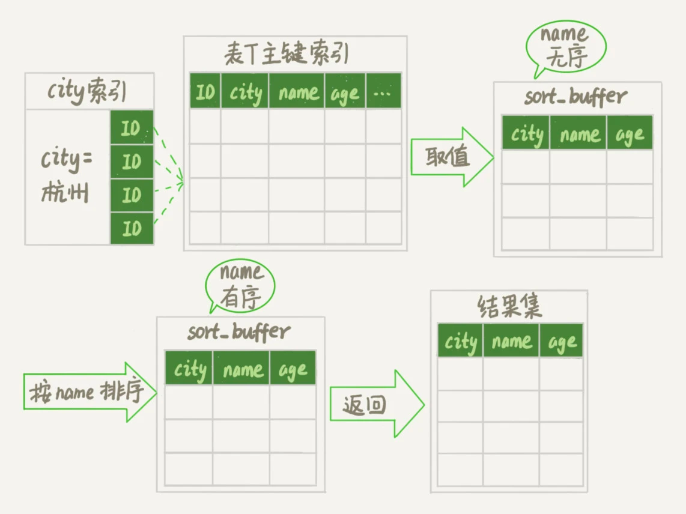
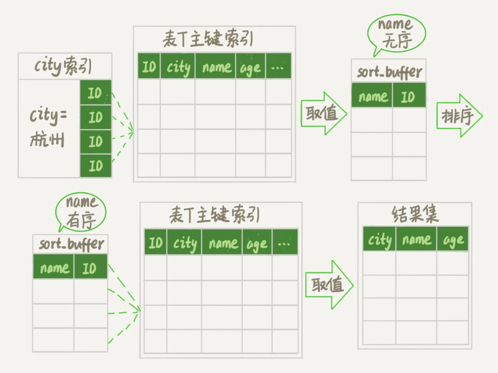
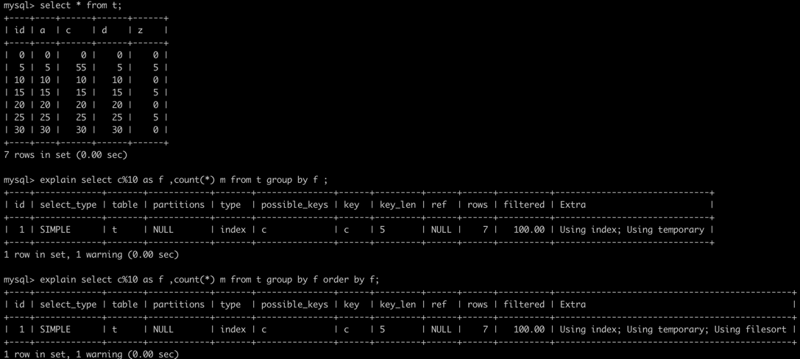
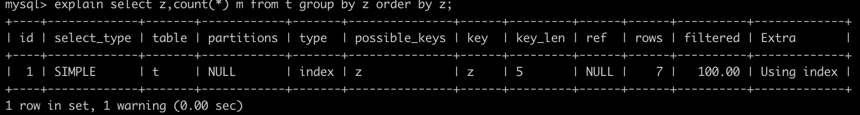
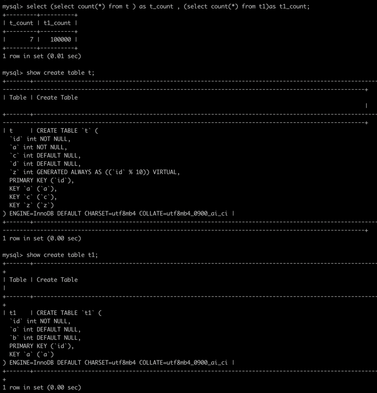
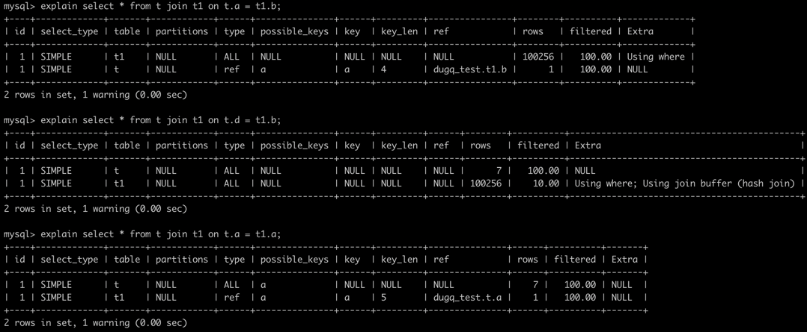
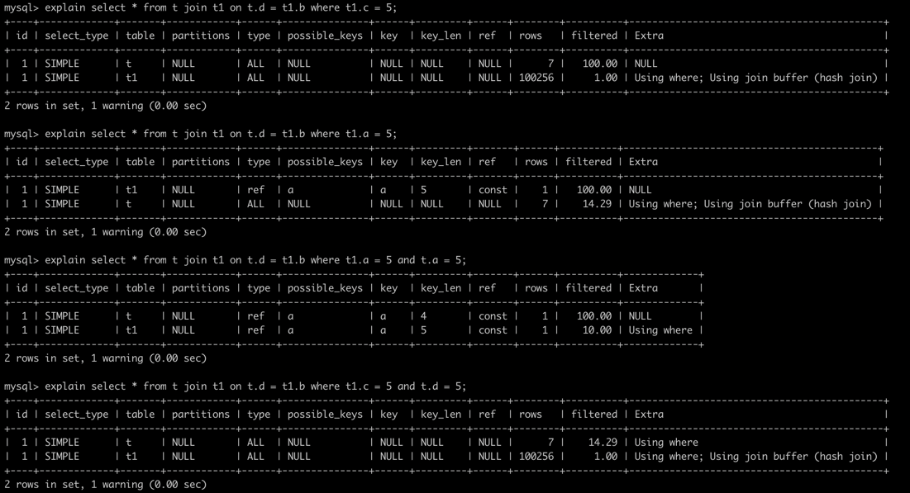
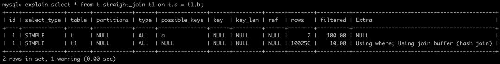

# 普通索引 VS 唯一索引
##### select
* 1、通过索引查询页
* 2、如果页在pool buffer中，则直接从缓存中读取数据
* 3、如果缓存没有，则从磁盘中读取页，并放入缓存

##### update / insert / delete
###### 普通索引：
* 1、通过索引查询页
* 2、如果缓存中没有页，则将修改放入change buffer中
* 3、将change buffer追加ibdata系统表(用一次追加IO，替代两次随机IO)
* 4、更新结束
* 5、下一次读取页时，将完整数据存入磁盘
###### 唯一索引
* 1、通过索引查询页
* 2、如果缓存中无该页数据，则从磁盘读取该页
* 3、进行唯一性判断
* 4、如果满足唯一，则更新缓存
* 5、更新成功
###### 小结
* 就查询来说，两者差距不大
* 就更新来说，非唯一的普通索引利用change buffer节省了两次随机IO，新增了一次有序IO，这将会是很大的性能提升

# 优化器选错索引
* 原因：可以认为是优化器的bug。但是也是无奈，
  * 1、优化器选择索引 是基于统计信息计算而来的预估结果，统计信息不准，扫描行也是不准的。
  * 2、innodb的MVCC模型使得数据存在多份，已删除的数据也不一定就是真的物理删除了。
* 解决方案：
  * 1、forceIndex强制选择更优索引
    * 局限：依赖索引名称，可移植性差
  * 2、修改SQL，引导优化器选择更优索引
  * 3、添加更合适的索引或者删除索引
    * 选错索引本身就是小概率事件
    * 引发此问题的原因大概率是没有契合条件的最优索引，却存在多个契合度差不多的索引。
    * 所以选择建立契合度更高的，或者删除掉一些无用的契合度一般的索引也是一种手段

# 字符串索引优化
* 字符串作为索引占用空间较大，所以想办法降低该索引的消耗成为需求
* 1、前缀索引。选择区分度高的前部分长度作为索引的字符串
* 2、倒排索引。和上述类似，如果发现字符串的识别度更高位于字符串的后面，可将字符串进行倒叙存储
* 3、新增hash字段(crc32()函数计算某个已有字符串字段)
* 这几种方法可以解决索引过大的问题，但同样也引入了新的问题
  * 1、范围查询无法走索引
  * 2、前缀索引和hash查询必须回表查询原数据，导致覆盖索引失效

# 频繁增删的表
* 频繁删除的表可能产生行空洞，页中的行记录只是标记为复用，而不是真实的删除了
* 当表数据所占空间远小于表实际占用空间时，可考虑将表进行重建

# count函数
* count(*) 约等于 count（1）
* count（字段）会从含有该字段的最小索引树进行遍历
* count(id) 也不一定走主键索引
* count(*) 和 count（字段）的选择
  * count（*）无疑是最优选择
  * count(字段)需要一个判空过程，需要返回字段，字段的copy过程会浪费一定的性能
  * 但是 如果需要对某个可为空字段进行非空计数，只能业务优先，选择count(字段)
* 无论如何，count 操作始终无法避免扫全表。如果确实需要，可考虑使用缓存计数，或者进行表计数进行

# order by
##### 执行过程
##### 排序字段在查询索引中
* 不需要额外排序，和普通查询一致
##### 排序字段不在查询索引中
* 
* 如果字段太多，或者字段太长，就不能全部字段参与排序
  
##### 排序的算法
* 排序如果没有走索引，就会选择全表排序
* 此时排序的算法有两种：
  * 需要的数据量多时：使用归并算法，Using temporary using file sort,建立临时表，如果内存不够，则创建新的文件存储，而且是多个文件.
  * 需要的数据量少时：使用优先队列排序算法，这样就可以使用少量内存。
##### 排序优化策略
* select * from user where city in ('杭州',"苏州") order by name limit 100000，100; 如何添加索引？
  * 可以选择union all 分别查询两个城市的前100，这样就可以走(city,name)索引。然后对两者结果再取前100。扫描行数就是100+100+200
* select * from user order by rand() limit 3;(随机取三条数据)
  * 换个角度思考，尽量保证可以走索引。
  * 可以选择 select * from user where id >= rand()*count() limit 1;

# 索引失效的场景
* 对索引字段使用函数会导致索引失效
  * 显示函数: count(); max() ; id + 1 > 1000
  * 隐式函数: 字段类型不匹配，字符集不匹配
* 联合索引，不符合索引连续的递增或者递减。
  * 如: where A in(a,b) order by C 。 索引A,C，的连续性被破坏
  * 如: order by A desc , B ASC .索引A,B,破坏了索引的递增或者递减
* 优化器认为走索引还不如不走索引

# 死锁检测
select * from sys.innodb_lock_waits; 查询由于锁阻塞的线程
select * from information_schema.processlist; 查询所有正在进行的任务，判断是否有锁等待

# group by 
* group by 会产生新的数据结构，如果可以直接返回，则只需要过内存传入网络端口，如果需要额外计算或者排序，就会产生临时表
###### 例子

* using temporary 就是使用了内部临时表的意思
###### 优化
* alter table t1 add column c int generated always as(id%102);

* 所以，避免临时表的方案：
  * 对group by结果进行排序时，该字段本身有索引，并且没有额外的函数运算。
    * 这种方案局限多；
    * 1）:这是5.7版本的优化，所以低版本不支持
    * 2）:group by的字段通常离散度小，不适合建索引
###### 例子2
* 并不是说不能使用，在数据量较小时，内存临时表空间足够存储的情况下，为了满足业务场景，该方案也没有问题，但是如果数据量大时，超过内存临时表的大小了，它会重新构建一个基于磁盘的临时表，这就耗费比较大了。
* 这个说法个人目前找不到证据，而且也不好去证明 使用using file sort 优于 using temporary。
  * 反而从耗时上来看，file sort 还不如 using temporary
* 但是，这个可以让我有个关于group by的优化方向。: SQL_BIG_RESULT
* 

# join
###### 原理
    select * from t join t1 on t.a = t1.a;
伪代码:

    var lines_t = find line from t;
    for(var line_t : lines_t){
       var line_t1;
       while((line_t1 = (find line from t1 where t1.a = line_t))!=null){
          addLine2Result(line_t,line_t1);
       }
    }

* t表称为：驱动表，t1称为：被驱动表
* 从伪代码不难看出：
  * 时间复杂度 = O(N)(查询t的复杂度) + O(N)(查询t的复杂度) * O(M)(查询t1的复杂度)
  * 在已确定数据行数和需求的情况下，不管有没有where条件，N基本是固定值，所以O(M)就成为复杂度的关键
###### 优化  
* 已知：
  * 如果t1的字段a如果没有索引，则查询需要走主键索引，此时时间复杂度是O(M)=M
  * 如果t1的字段a如果有索引，则查询需要走索引a，此时时间复杂度是O(M)= log2M
* 结论1：
  * 所以在被驱动表的关联字段上建立索引，是降低时间复杂度的重要手段
* 已知：
  * 在t1字段a有索引的情况下；
  * 其中查询t是全表遍历，复杂度是O(n)，而查询t1是条件搜索，复杂度是log2M，N，M为行数，则整体的复杂度为N+N*log2M
  * 复杂度： N+N*log2M 中，N越小，效果越好（前提M > 2.😂） 
* 结论2：所以在选择驱动表时，使用小表驱动大表要好。

###### mysql 优化器
* 前提：

* 在无条件的情况下：

  * mysql优先选择join条件有索引的表作为被驱动表，而不是小表优先（第1条sql）
  * 在都有或者都没有索引的情况下，优先选择行数少的表作为驱动表（第2条sql都没有，第3条都有）
* 在有条件的情况下：（t1表增加字段c，无索引）
  
  * 某一个表的查询有索引时，优先选择走索引条件的作为驱动表
    * 重要：没有索引，单独有条件的大表依然不能作为主表 （SQL：1）
    * 查询走索引时，即使大表也作为驱动表（重要：这里不知道与索引的筛选度有没有关系，所以这条具有不确定性）(SQL:2)
  * 都没索引的时，优先选择小表作为驱动表
    * 不关心where条件（SQL：1，4）
  * 都有索引时，优先选择小表 （SQL:3）

###### mysql8.0
如果我非要小表驱动大表，而不要被驱动表查询走关联字段索引的话：

    select * from t straight_join t1 on t.a = t1.b;
结果如图：

* 8.0最新版本引入了hash join，伪代码变更为：

      var lines_t = find line from t;
      for(var line_t : lines_t){
        var line_t1;
        var hashmap  = hash(select * from t1) 
        while((line_t1 = (find line from hashmap where t1.a = line_t))!=null){
          addLine2Result(line_t,line_t1);
        }
      }
* 查询次数也不是那么离谱的笛卡尔乘积
###### join实战
* 假设不使用join，分开为多次查询
  * 在有被驱动表有索引时，其实查询过程和伪代码1实际上是差不多的。
  * 在被驱动表没有索引时，在8.0的hash join优化下，查询次数会变少哦。
  * 所以join不一定不能用
* 在使用了join后，怎么优化呢？
  * 1、虽然上面没总结，但一定记得，不要在join的结构后，在order by或者二次筛选。避免using filesort 和 using temp
  * 2、避免using join buffer ，所以，被驱动表要加索引
  * 3、where条件必须加，除非驱动表是个小表，但随着业务迭代，真的就是小表吗？
* 以前拒绝join硬编的理由
  * 在没有hash join的情况下，BKL算法产生笛卡尔乘积，每次都实际进行查询，是真的恐怖。数据量大时，很容易刷pool buffer
  * 即使设置好了驱动和被驱动表，但是随着业务的发展，数据量的增加，很容易在某个时刻突然崩溃

# 读写分离
