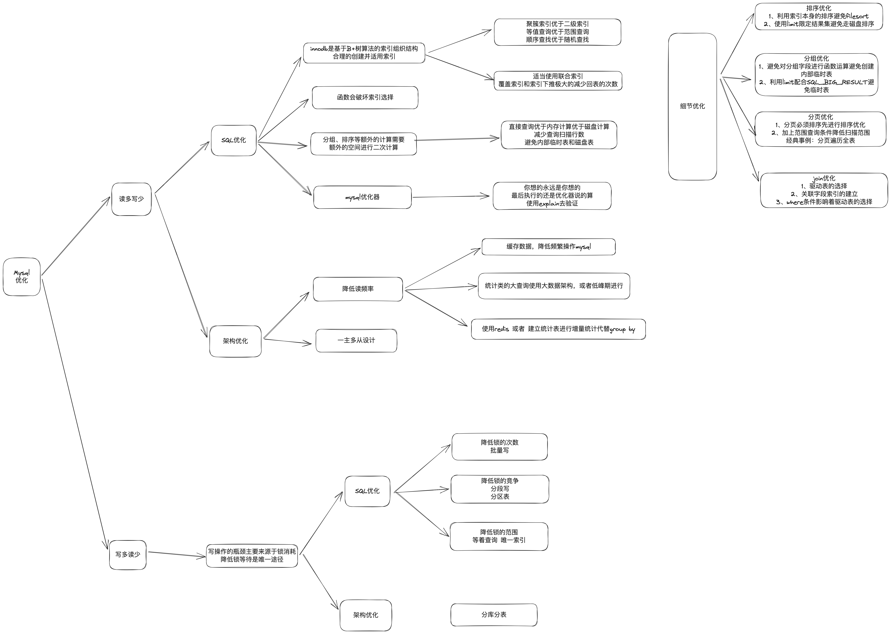
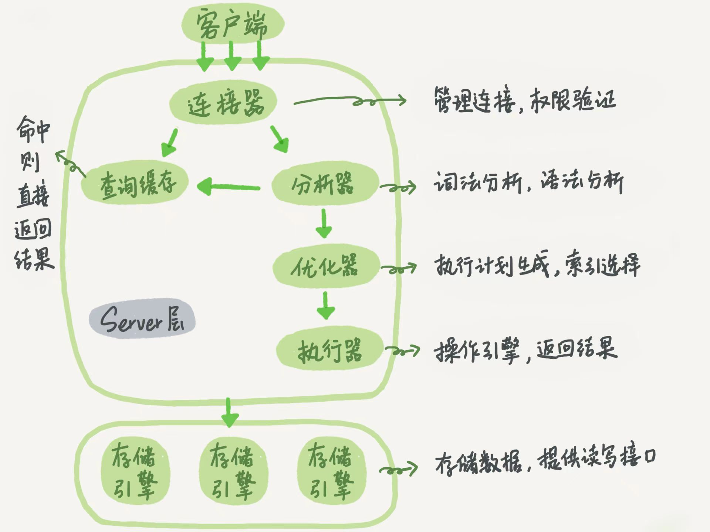
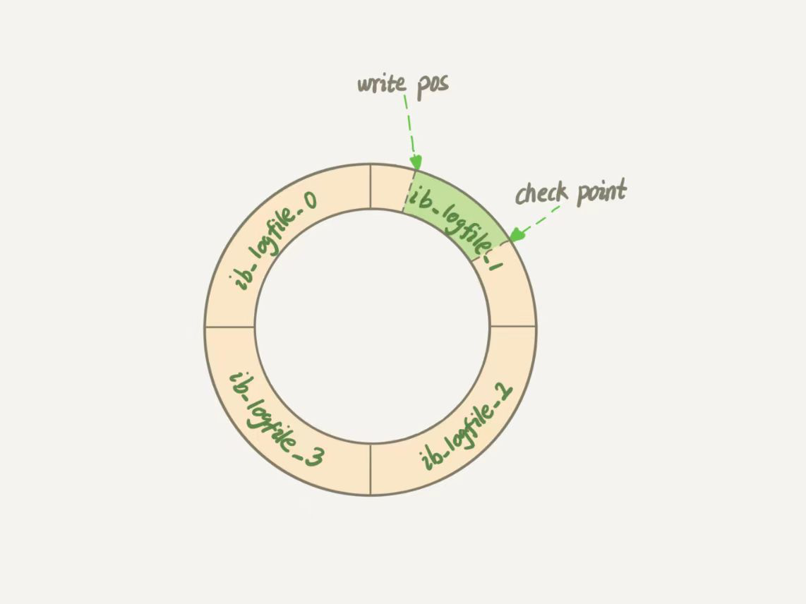
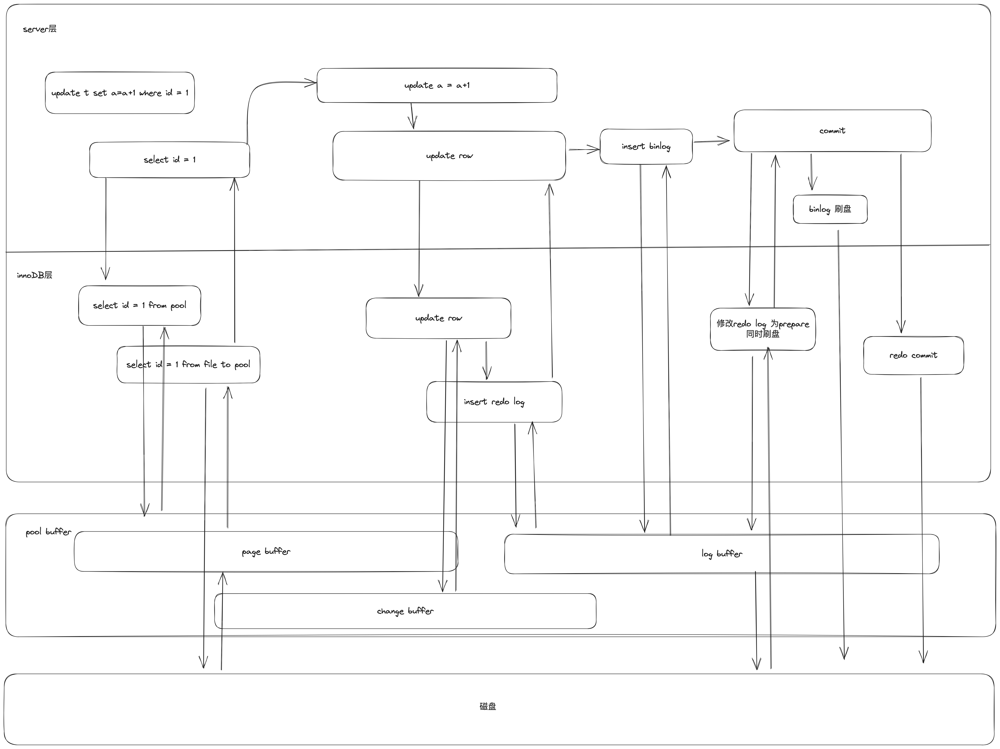
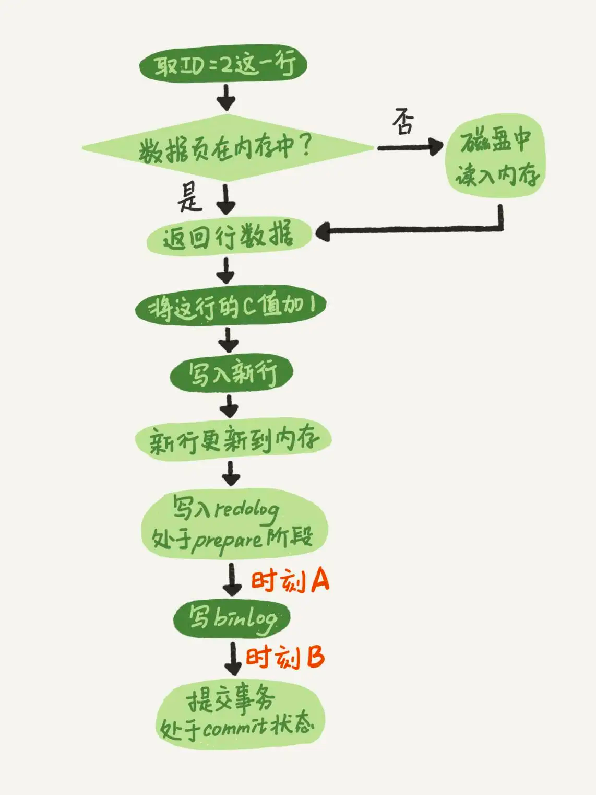
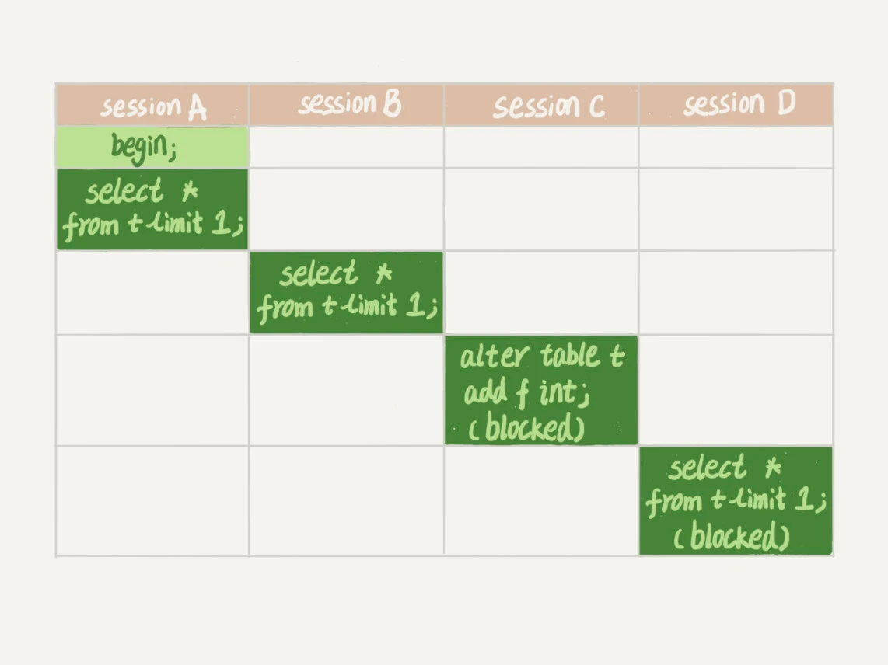
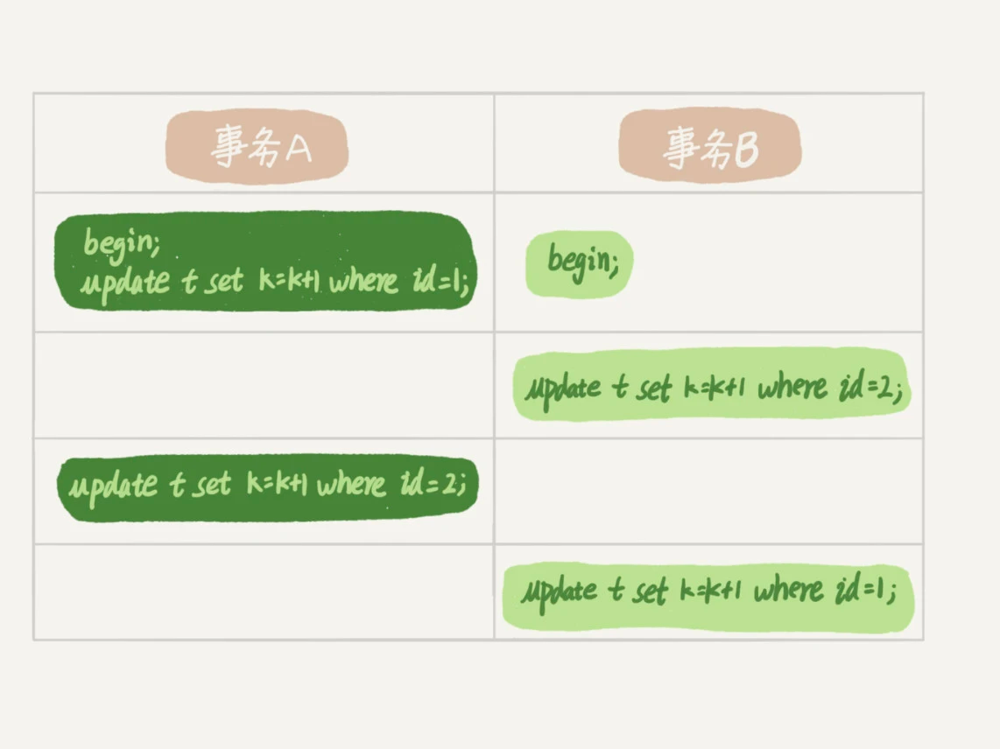

# mysql原理

整个大提纲：
* [存储结构](#索引结构)
  * B+树索引的优缺点
  * 索引的分类
    * 聚簇索引
    * 二级索引
      * 唯一索引
      * 联合索引
  * [索引失效的原因](mysql实战.md#a-idindexdisable索引失效的场景a)
* 如何实现事务，并保证ACID
  * [隔离级别](#iii) 可重复读 VS 读提交 innodb都支持的两种级别
    * MVCC机制
    * redo log 
    * undo log
* 如何安全的实现并发写
  * innodb的锁机制
    * MDL锁
    * next-key-lock
      * 记录锁
      * 间隙锁
        * 唯一索引下的等值查询情况特殊
* 如何实现持久化能力
  * binlog的应用。
  * 扩展的双M结构，主从结构，异构方案等
* 高性能
  * WAL技术
  * buffer pool 缓冲
    * 优化LRU算法
  * online DDL
* 高可用能力
  * crash-safe能力： innodb redo log
  * redo log + bin log 两阶段提交
* SQL优化
  * 索引选择
  * 锁消除
  * order by
  * group by
  * join
  * count(*）
 在上个图吧
  * 

### 整体架构

### 事务
* ACID特性
##### 隔离性

* <a id='iii'>隔离级别</a>
  * 读未提交
    * 解释：一个事务在执行过程中的任何修改，其他事务立刻就能看到。V1 = V2 = V3 = 2
    * 可实现方式：多线程对同一变量进行修改
    * 存在问题：
      * 脏读： A线程读到了B线程未提交事务内修改后的数据，但B线程的数据稍后会滚了。这样A线程读到的就是错误的数据
      * 幻读：
      * 不可重复读：
  * 读已提交
    * 解释：一个事务在执行的过程中，可以看到它已提交事务修改的数据。V1 = 1，V2 = V3 = 2
    * 可实现方式：未提交事务存储在私有区域，当事务提交时，数据同步回主存中，并且通知其他事务数据已修改。有点像volatile
    * 存在问题：
      * 不可重复读：事务内部先后执行的两条查询语句结果不一致
      * 幻读：
  * 可重复读
    * 一个事务在执行的过程中的任一时刻，看到的数据和事务开始时一致。不管其他事务有没有提交。V1 = V2 = 1, V3 = 2
    * 可实现方式：在每个事务执行时，创建一个视图，这个视图是事务开始整个数据库的切片。之后所有的查询都基于本视图进行
    * 存在问题：
      * 幻读：在一个事务中看到其他事务新插入的数据行
        * 在快照读的情况下，是没有幻读问题的。
        * 但是如果严格执行快照读，那就不能实现并发写了。所以mysql的写时当前读
          * A线程先开始，B线程后开始，但是B线程先新增了一条数据并先行提交了。这时候A线程姗姗来迟，根据条件修改数据，恰好B线程新增的数据包含在内
          * 此时，按照快照读来说，不应该修改新行，但是如果不修改，由于A线程的事务后提交，所以binlog后产生，在数据回放或者同步时，先执行B线程的事务，在执行A，就一定不满足快照读。就会发生数据不一致。
        * 虽然幻读专指新行，但上述事例同样适用update
  * 串行化
    * 通过加锁的方式，让事务排队执行
    * 可实现方式：事务的粒度不一样，加锁对象不一样。
    * 存在问题：性能不行
* InnoDB 实现方式 [MVCC](#mvcc)

### 索引结构
mysql的索引是由引擎实现，各引擎实现方式不同
###### 索引的实现方式
* key-value 键值对
  * hash冲突少时，查询速度快
  * 区间查询不太好
* linkList 有序链表
  * 插入和查询效率都不太高
* 二叉树
  * 层级太高
###### mysql索引分类
* 主键索引 = 聚簇索引
* 普通索引 = 二级索引
* 联合索引
* 唯一索引
###### innoDB实现方式 ：[B+树](https://www.cs.usfca.edu/~galles/visualization/BPlusTree.html)

特点：
* 1、所有的数据存于叶子节点中，索引节点字节少
* 2、innoDB的B+树，每个节点都是一个页，页内存多个行，一个页的字节量是固定的，所以数量是不固定的
* 3、同一层级相邻页有指针连接
* 4、非主键索引没有数据节点，索引节点隐式含有主键索引，走普通索引查询后，需要再走一次主键索引查询到完整的行数据(回表)
  * 关键点1：非主键索引没有“数据存在叶子节点”这个说法
    * 推导：特定条件下，二级索引查询优于主键索引
  * 关键点2：非主键索引字段最后追加主键索引
    * 推导：非主键联合索引含有ID排序，所以节点数据一定不会重复

优点：
* 1+3 ： 通过条件定位到范围查询的开始位置后，轻松开始向后遍历
* 1+2 ： 索引节点的数据量少，索引页小

根据特点推倒优化技巧：
* 1 => 查询优先使用主键索引
* 1+2 => 优先选择自增字段作为主键索引 （理由如下）
  * 主键自增使得新数据以追加的方式存入文件，从而减少节点移位现象
  * 主键自增可以使得B+树减少页分裂现象
  * 同理，数据删除尽量不要随机删除，以减少页合并和页空洞
* 2 => 索引的字段尽量小（理由如下）
  * 字段字节少可以使得一个索引页能存储的行数更多，使得IO的次数更少
* 4=> 普通索引，优先考虑联合索引（理由如下）
  * 覆盖索引：减少回表操作。      using index
  * 覆盖索引：比主键索引更优。它可以不需要查询到叶子节点就可以返回数据
  * 最左匹配原则。可以适合多个查询情况
  * 索引下推：mysql5.6的优化。即使不能全部满足最左匹配，也可以通过二级索引优先进行一次筛选 using index condition
  * 但是在不满足上述的任一条时，还是要满足索引最小，索引占用空间更小

### 日志
###### WAL技术 write-Ahead Logging
* 先写日志，再写磁盘
  * 1、innoDB引擎先把记录写到redo log中
  * 2、更新内存。(更新操作即表示完成)
  * 3、innoDB会在适当的时候把记录更新到磁盘
    * 适当事件的选择：
      * 1、系统比较空闲的时候
      * 2、redo log满了的时候

###### bin log (server 层)：
* 解决问题：
  * 所有写入到bin log的数据都不会丢失
  * 通过bin log，数据库可以恢复到bin log中记载的任何时间点
* 1、mysql 实现的，在存储引擎之上
* 2、 bing log存储是追加写入的，只要磁盘有空间，可存储历史所有修改
* 配置参数 sync_binlog ： 刷盘策略
  * 0：每秒一次，将os cache中的数据刷到磁盘
  * 1：每次提交事务时，将数据刷到磁盘
  * n：每提交n个事物

###### redo log （引擎层 innoDB独有的）：
* 解决问题： 
  * 1、数据存储在物理磁盘上，对于数据的修改是随机读写。而数据库的文件可能很大，这个写的速度就会很慢
  * 2、所以一般情况都会先将数据写到内存中，然后再异步把数据写到磁盘上
* redo log并不是完全基于内存实现的
  * redo log 记录和事务绑定，通常事务开始时，记录一条redo log。并存与redo log buffer中
  * 当事务提交时或者redo log buffer满了的时候，会将redo log写入到redo log file （磁盘文件中）
  * redo log file 不是一个文件，而是多组，每组多个。
    * 
    * write pos 是写操作的游标
    * check point 是可写区域终点的游标
    * 由于文件是循环使用的，所以当write pos 追上check point时，必须保证check point后的数据已经写到磁盘，然后将check point后移

###### bin log vs redo log
* 1、实现者不一样。
  * bin log 是mysql 在server层实现，redo log 是innodb 存储引擎实现
* 2、目的不一样
  * bin log 是为了数据恢复的。现在企业常常用来做数据同步。包括：
    * 数据异构
    * 主从同步
  * redo log 是修复 bin log 可能造成崩溃零界点的数据丢失。也就是常说的crash-safe能力 
* 3、存储方式不同。
  * bin log 以追加写的形式存储每次修改信息，是逻辑日志，数据是相对加减的，并且可以存储很长一段事件的日志
  * redo log 以循环写的形式存储每次修改前后的页数据，是物理日志。数据是实际值。

###### 日志存储过程 ：数据一致性
* 这里的一致性说是：bin log 和 redo log的一致性
* 为什么需要一致性：当数据库异常奔溃时，由于mysql的更新并不会直接刷盘，而是部分存储于内存之中，也就是常说的脏页
  * 在mysql重启后，为了保证数据完整，innodb利用redo log恢复脏页数据，而bin log常常用来同步数据，如果bin log不正确，那此时主从的数据就不一致了。
* 来看看innodb的update过程

* 抽象流程图

* 解决办法：
  * 两阶段提交的方式：
    * 1、大家一起准备好
      * redo log 先写不提交。如果无异常，则继续执行
        * 如果在时刻A发生异常宕机，那么由于bin log 不完整，所以事务无法提交，此时重启服务，事务自动回滚。
      * 再写bin log
    * 2、都准备好了，大家一起提交
      * 这里优点出入，让bin log的写和提交一起执行了，实际上也无法保证一起提交。所以这里先提交bin log也没问题。
      * 如果在时刻B发生异常，由于redo log 和 bin log 都完整，所以事务可以恢复并提交。
      * 时刻B发生异常也不会有问题了。事务可以继续执行了。
  * 前提：
    * innodb_flush_log_at_trx_commit 和 sync_binlog 都设置为1

### 锁
根据加锁范围：MySQL里面的锁可以分为
* 全局锁
* 表级锁
* 行级锁

##### 全局锁：
**对整个数据库实例加锁**
###### Flush tables with read lock(FTWRL)
* 这个命令可以使整个库处于只读状态。使用该命令之后，数据更新语句、数据定义语句和更新类事务的提交语句等操作都会被阻塞。
* 使用场景：全库逻辑备份。
* 风险：
  * 1.如果在主库备份，在备份期间不能更新，业务停摆
  * 2.如果在从库备份，备份期间不能执行主库同步的binlog，导致主从延迟

###### --single-transaction
* 官方自带的逻辑备份工具mysqldump，当mysqldump使用参数--single-transaction的时候，会启动一个事务，确保拿到一致性视图。而由于MVCC的支持，这个过程中数据是可以正常更新的。
* 一致性读是好，但是前提是引擎要支持这个隔离级别：可重复读。

###### set global readonly=true
* 1.在有些系统中，readonly的值会被用来做其他逻辑，比如判断主备库。所以修改global变量的方式影响太大。
* 2.在异常处理机制上有差异。如果执行FTWRL命令之后由于客户端发生异常断开，那么MySQL会自动释放这个全局锁，整个库回到可以正常更新的状态。而将整个库设置为readonly之后，如果客户端发生异常，则数据库就会一直保持readonly状态，这样会导致整个库长时间处于不可写状态，风险较高。

##### 表级锁
MySQL里面表级锁有两种，一种是表锁，一种是元数据锁(meta data lock,MDL)

###### 表锁
      lock tables ... read/write
* 可以用unlock tables主动释放锁、也可以在客户端断开的时候自动释放。
* lock tables语法除了会限制别的线程的读写外，也限定了本线程接下来的操作对象。
  * 如果在某个线程 A 中执行 lock tables t1 read, t2 write; 
    * 则其他线程写 t1、读写 t2 的语句都会被阻塞。
    * 同时，线程 A 在执行 unlock tables 之前，也只能执行读 t1、读写 t2 的操作。
    * 线程A 连写 t1 都不允许，自然也不能访问其他表。
* 对于InnoDB这种支持行锁的引擎，一般不使用lock tables命令来控制并发，毕竟锁住整个表的影响面还是太大。

###### 隐式表锁：重建表
* 开发中表锁一般不常用，但是ddl一定会用到。
  * 在5.6之前的版本中，ddl通常都需要进行表锁，而表锁时DML会受到影响。
* innoDB的数据文件中的数据时紧凑的，默认情况下，一行挨着一行，是连续的。当表结构发生改变时，所有的行可能都收到影响。重新移动所有行是不现实的，所以innodb选择重建表
  * 场景1:修改表的存储引擎。 这一定会引起数据重构的
  * 场景2:增删列。
  * 场景3:修改行数据格式。引起占用空间变化
  * 场景4:修改列数据类型
  * 场景5:修改字符集
* 如果表数据量大，那在重建期间，该表的DML都收到阻塞，这已经不是影响性能了，而是有损服务了，所以引入了MDL锁

###### 表锁优化：online DDL过程
* 1.拿MDL写锁 
  * 表级写锁，该过程DML的增删改受阻。
  * 该过程会备份表的所有页到一张临时表。如果此时可以对数据修改，那么备份的数据就不能保持一致性
* 2.降级成MDL读锁 
  * 表级读锁，该过程禁止表级的写锁，允许行级的读写锁
* 3.真正做DDL 
  * 该过程中，行的修改会记录到row log中
* 4.升级成MDL写锁 
  * 同步骤1，DML的增删改受阻
  * 这个步骤最重要的就是恢复row log中的数据
* 5.释放MDL锁
* 总结：
  * 1、2、4、5如果没有锁冲突，执行时间非常短。
  * 第3步占用了DDL绝大部分时间，这期间这个表可以正常读写数据，是因此称为“online ”

###### MDL(metadata lock)：不需要显式使用，在访问一个表的时候会被自动加上。
* MDL的作用：保证读写的正确性。
* 在对一个表做增删改查操作的时候，加MDL读锁；当要对表做结构变更操作的时候，加MDL写锁。
* 读锁之间不互斥。读写锁之间，写锁之间是互斥的，用来保证变更表结构操作的安全性。
* MDL 会直到事务提交才会释放，在做表结构变更的时候，一定要小心不要导致锁住线上查询和更新。
* 举个例子 
  * 我们可以看到 session A 先启动，这时候会对表 t 加一个 MDL 读锁。
  * 由于 session B 需要的也是 MDL 读锁，因此可以正常执行。
  * 之后 session C 会被 blocked，是因为 session A 的 MDL 读锁还没有释放，而 session C 需要 MDL 写锁，因此只能被阻塞。
  * 如果只有 session C 自己被阻塞还没什么关系，但是之后所有要在表 t 上新申请 MDL 读锁的请求也会被 session C 阻塞。
  * 前面我们说了，所有对表的增删改查操作都需要先申请 MDL 读锁，就都被锁住，等于这个表现在完全不可读写了。
  * 如果某个表上的查询语句频繁，而且客户端有重试机制，也就是说超时后会再起一个新 session 再请求的话，这个库的线程很快就会爆满。
  * 事务中的 MDL 锁，在语句执行开始时申请，但是语句结束后并不会马上释放，而会等到整个事务提交后再释放。
* 在执行DDL时，需要先做一下判断
  * 1、要先判断是否有长事务，如有长事务，需要先暂停
  * 2、在低峰期执行DDL。或者加超时时间，以免长时间锁表
* 这个onlne DML 特别像java新生代的并发GC。DDL相当于GC线程，DML相当于应用线程。
  * 在前置前置标记和再标记期间无法避免STW

###### inplace
* 这个名词在5.6出现。实际就是MDL的优化
* 在5.6之前，没有MDL，表重建由server层完成，执行逻辑和MDL一样，只不过它不会有锁降级，锁表期间，只能进行DML查询操作
* 在5.6之后表重构下沉到搜索引擎层，给server看到就是原地啦。官方吹牛逼关键词
* 所以inplace和online只是时间和地点重合，但实际不是一回事
  * online 重点是：有DML和DDL方法
  * inplace 重点是：在搜索引擎层实现
  * 所以目前看来 inplace包含online 。（未来server层如果页实现了online，那这条就不成立了）

###### 重建表的几种办法
* drop table
* alter table t engine=innodb,ALGORITHM=inplace;
  * 这个和表结构发生变化时自动触发时一样。但是并不是所有的表结构变化都会触发
* alter table t engine=innodb,ALGORITHM=copy;
  * 这个时旧版本方式，会触发表锁。重建期间DML都会被阻塞
* Truncate table 
  * 等效于 drop + create

##### 行锁
* MySQL 的行锁是在引擎层由各个引擎自己实现的
###### 两阶段锁协议
* 
* 在 InnoDB 事务中，行锁是在需要的时候才加上的，但并不是不需要了就立刻释放，而是要等到事务结束时才释放。这个就是两阶段锁协议。
* 因此，如果你的事务中需要锁多个行，要把最可能造成锁冲突、最可能影响并发度的锁尽量往后放。
* 最好的情况是通过索引找到指定的行
###### 死锁和死锁检测
* 
* 策略：
  * 1、innodb_lock_wait_timeout 锁等待超时时间。默认50s。
    * 弊端：无法识别锁是死锁还是正常等待，容易误伤
  * 2、innodb_deadlock_detect 锁检测 ： 当发送死锁时，主动会滚某一条事务
    * 弊端：锁检测带来性能损耗。而且，当并发量较大时，性能损耗极大
* 常用解决方案：
  * 在策略2的基础上，降低行锁的并发量
    * 1、通过中间件等代理层降低并发量(限流)
    * 2、将行裂变为多行，java concurrentHashMap的size字段一样。
* 热点更新导致的并发问题

###### next-key lock [测试见](./mysql-next-key-lock.md)
* next-key lock = gap + 行锁
* 根据索引查找到第一个符合条件的行，以该行的前一行为开，该行为闭的区间开始加锁
* gap 是写锁.
* 根据加锁方式，行锁可能是读锁，也可能是写锁。读锁之间不互斥，而写锁是独占锁
* 加锁的目标是索引。SQL中查询走的索引（有且仅有一个），以及修改的索引（多个）才会被加锁。

###### 行锁的加锁规则 [测试见](./mysql-next-key-lock.md)
* 原则 1：加锁的基本单位是 next-key lock。 next-key lock 是前开后闭区间。
* 原则 2：查找过程中访问到的对象才会加锁。
* 优化 1：索引上的等值查询，给唯一索引加锁的时候，next-key lock 退化为行锁。
* 优化 2：索引上的等值查询，向右遍历时且最后一个值不满足等值条件的时候，next-key lock 退化为间隙锁。
* bug：唯一索引上的范围查询会访问到不满足条件的第一个值为止。
  * 加上limit限定数量，可阻止访问到不满足条件的第一个，从而避免加锁

| 锁名称            | 锁范围 | 失效方式 | 解除方式 | 说明 |   |   |   |
|----------------|-----|------|------|----|---|---|---|
| 排他锁（写锁）        |     |      |      |    |   |   |   |
| 共享锁（读锁）        |     |      |      |    |   |   |   |
| 间隔锁(gap写锁)     |     |      |      |    |   |   |   |
| next-key lock  |     |      |      |    |   |   |   |

### MVCC
##### undo log
* innodb修改数据的流程：
  * 1、事务开始，获取一个唯一且递增的事务ID,并记录一组正在执行中的事务ID集合。
    * 比这组事务ID都小的最大事务ID记做:up_limit_id。是可重复读的阈值。
  * 2、获取行锁
    * 这一步很关键，修改是当前读，就是根据当前值进行修改(set k = k+1)，必须利用锁避免脏读，实现读提交级别。（二阶段提交。锁只有在事务完成后才释放）
  * 3、将当前行的当前状态（数据和事务ID）记录在undo log中
  * 4、修改当前行和事务ID
  * 5、提交事务并释放锁
* 所以 innodb 每行记录记载着其自身的数据情况，以及修改它的事务ID
* 只要undo log存在，每行数据可以恢复到历史的任何时刻(版本)也就是说每行数据都有多个版本

##### 读提交 & 可重复读
按照概念区分：
* 读提交：    在执行语句的时候创建一张视图，读取到已经提交事务的最新结果
* 可重复读：  在事务开始的时候创建视图，后续在事务中执行的所有查询都基于此视图。**一致性视图**
MVCC实现上：
* 读提交：    在执行语句时记录一个up_limit_id，根据undo log获取到最新已提交版本的值
* 可重复读：  在事务开始时记录一个up_limit_id, 根据undo log获取到事务开始时刻的值。

##### 更新
更新数据都是先读后写的，而这个读，只能读当前的值，称为“当前读”（current read）。
* 个人理解：
  * MVCC毕竟是假象，行数据实际只有一份，通过undo log可以计算出历史版本，但更新只能发生在行上
  * 而当前读的情况下，如果发生并发update，那数据就完全乱套了，按照前述规则，每个事务或者undo log 都可以向前或向后追述唯一记录，如果发生并发update，那极有可能发生多分之，或者事务会滚导致脏读
  * 所以innoDB引入行锁，避免了这种情况

### 存储过程
###### 查询列表
SELECT routine_name FROM information_schema.routines WHERE routine_type = 'PROCEDURE';
###### 查询创建语句
show create procedure 'name';

### 分析器
SET optimizer_trace='enabled=on';
/* 执行语句 */

/* 查看 OPTIMIZER_TRACE 输出 */
SELECT * FROM `information_schema`.`OPTIMIZER_TRACE`\G

select * from sys.innodb_lock_waits; 查询由于锁阻塞的线程
select * from information_schema.processlist; 查询所有正在进行的任务，判断是否有锁等待

# [mysql实战](./mysql实战.md)

# [mysql优化篇](./mysql总结.md)

