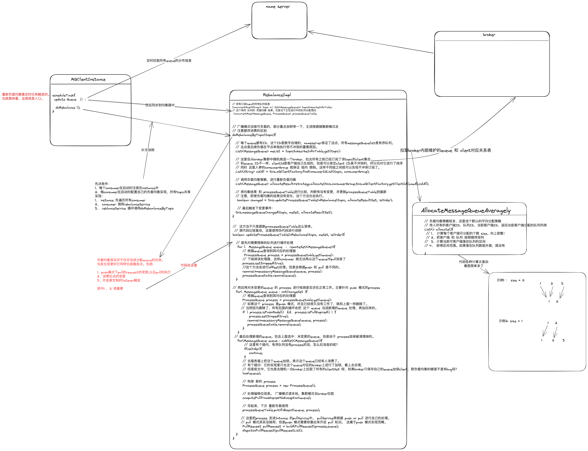

## 概览
###### 提问
* rocketmq的整体架构
* rocketmq集群的一致性
  * broker节点的一致性
    * nameserver 数据的一致性
  * broker数据的一致性
* 如何存储和持久化数据 （rocketmq存储不是基于内存的，而是基于文件实现的）
  * 如何实现高效的文件读写
  * 顺序读写的优势： 顺序读写大大提高page cache的利用率。当触发page cache 时，磁盘IO等同于 主存IO
* 消息的发送过程
  * 集群模式下如何知道要发送到哪个broker
  * 集群模式下如何做负载均衡
* 消息的消费过程
  * 如何知道去哪个broker拉取消息
  * 负载均衡下，消息符合分配
* mq 服务端如何使用netty提供性能的
* 延时消息 和 事务消息 如何实现
  * 如何避免消息的回查 和 修改
* 总结rocketMQ 高性能 和 高可用的措施
* 

## 组成元件 和 重要概念
* name server
  * broker的注册中心。producer 和 consumer 获取broker连接的地方
  * 采用集群化部署。但集群内节点之间没有链接的。每个节点和所有的broker保持长连接，以维持注册状态
* broker
  * 消息存储的实际位置。producer 和 consumer 投递和获取消息的地方
  * 采用集群化部署。
  * 高可用
    * 将topic进行分片存储。单个broker宕机不影响topic的正常运转。存储在该节点上的消息在恢复之前无法消费
    * 主备部署。每个broker可以搭配若干从节点，当主节点宕机时，从节点代替主节点继续工作
  * broker 开启三个端口号
    * listenPort ：是remotingServer服务组件使用，作为对Producer和Consumer提供服务的端口号，默认为10911。 可通过配置：listenPort=10911 修改
    * fastListenPort： 是fastRemotingServer服务组件使用，默认为listenPort - 2，可以通过配置文件修改。可通过配置：fastListenPort=10909修改
      * 必须保证 fastListenPort = listenPort - 2。因为producer是无法从nameServer拉取fastListenPort的。vipChannel的选择是代码写死的=listenPort - 2
    * haListenPort： 是HAService服务组件使用，用于Broker的主从同步，默认为listenPort + 1；可通过配置： haListenPort=10912 修改
  * remotingServer VS fastRemotingServer 
    * fastRemotingServer 是为生产者准备的额外服务。目的是为了在消息生产速度极快时，通过增加单独服务来降低发送消息的延迟。
* topic
  * 一类消息的集合。producer 和 consumer 注册的最小集合
* queue
  * 队列存在每个broker的内部，每个topic在每个broker内有多个queue。
    * 一般情况会根据queue的总数平均分配给所有的master broker，也可自定义。
  * 每个queue可以绑定至多一个消费者。实际就是：用多队列实现无锁化的并发消费
  * 负载均衡
    * queue和consumer n：1 关系
    * rocketmq不对消息做负载均衡，只对queue进行负载均衡
  * 配置：
    * 读写队列。指的是一个topic在一个broker上的节点数量
    * 读写队列数量可能不同，但物理存在的队列是一定的。我们可以设置有效的读写队列数量。
      * 使用场景：队列缩容
        * 1、将writeQueue变小，此时writeQueue < readQueue < queue size
        * 2、等空与队列消费完毕后，将readQueue也变小
* 消费位点
  * 每个queue都会维护自己的最小 和 最大消费点。（队列的起点和终点）
  * 每个queue针对每个consumer group都有一个消费点。（记录当前消费的坐标）
    * 集群模式下，这个点由客户端提交服务端保存的。
    * 广播模式下，这个消费点需要客户端自己保存，所以，当客户端异常崩溃时，可能发生消息的重复消费。

* 消息获取方式
  * pull ：客户端去服务端拉去
    * 优点： 消费速度可控
    * 缺点： 无法感知消息的实时性
  * push ：服务端推送给客户端
    * 优点： 实时性好
    * 缺点： 不好把控消费速度
  
* producer ： 

* consumer ：

* 消息：message
  * UNIQ_KEY(UNIQ_ID) : ip + 进程ID + 利用时间戳 + 自增id设计的唯一值，用于标记消息的唯一性

## 消息持久化 
##### 存储文件列表
* broker的所有信息存储于store目录下
* commitLog 文件：   记录所有的消息。顺序存储，无差别topic 和 queue
* consumeQueue 文件：队列的索引文件。按topic/queueId/5.72MB文件 存储某个queue的所有消息。用于消费者查询
* index 文件 ：      索引文件，按照时间索引。文件大小固定。结构类似hashMap
* [1官方文档](https://github.com/apache/rocketmq/blob/4.9.x/docs/cn/design.md#1-%E6%B6%88%E6%81%AF%E5%AD%98%E5%82%A8)

##### 高效写入
* 文件写操作基本都是顺序写。以提高写入性能
* MappedByteBuffer 操作文件，减少一次缓存copy过程

###### 刷盘操作
* 异步刷盘 VS 同步刷盘 =》 page cache优势

###### 生产者的负载均衡
* 默认是 随机递增取模 。失败重试
* producer 配置 sendLatencyFaultEnable = true
  * sendLatencyFaultEnable开启后，采用latencyFaultTolerance 策略 ： 在随机递增取模的基础上，再过滤掉not available的Broker代理。
    * 采用latencyFaultTolerance ： 是指对之前失败的，按一定的时间做退避。
    * 例如，如果上次请求的latency超过550L ms，就退避30000L ms；超过1000L，就退避60000L；
    * latencyFaultTolerance机制是实现消息发送高可用的核心关键所在。

##### 高效读取
* rocketmq 为每个queue建立了消息索引文件.
* 消费位点同步记录在 store/config/consumerOffset.json 中
* 同写操作，读操作也是采用 MappedByteBuffer 来减少一次缓存copy
* 消息索引文件中每条数据的大小只有20Byte，linux pageCache 一次性可以缓存很多。同时对于msg读操作是顺序读，这极大的提高了缓存命中率，从而使得消息索引的读取几乎和内存读取速度持平。
* 由于commitLog也是顺序写，虽然比consumer queue保存的数据多，但和consumer queue中存在的消息的顺序一致。所以根据consumer queue中索引读取commitLog中消息，命中缓存的概率也不会太差。
* 虽然commitLog的读是随机读，但在producer 和 consumer全都正常运作的时候，commitLog的热点读区域应该是稳步向后移动的。毕竟不是数据库那样，磁盘指针乱跳。

###### 消费者的负载均衡
* 明确一点，一个consumer queue 只能被一个consumer 消费！！！ 
  * 所以无论consumer 如何进行负载均衡，都只能以queue的维度进行
* 在旧版本的consumer实现中过，消费者需要自己指定queueID，所以负载均衡完全由开发者自己实现。
* RebalanceImpl 实现的负载均衡
  * 所有的消费者在连接上broker后，会和broker保持心跳。在心跳包中包含了消费者 订阅的topic，客户端ID等
  * broker 在本地缓存中维护了一份 消费者列表
  * 消费者定时从broker拉去 订阅topic 的消费者列表
  * 根据消费者列表重新进行queue分配。
    * 例如平均分配策略：假设：三个消费者ID分别为1，2，3；6个队列分别为0，1，2，3，4，5。则 consumer 1 消费queue 0，1 ；consumer 2 消费 queue 2，3； consumer 3 消费 queue 4，5
  * 这里可以看出问题：
    * 假设消费队列数变动，客户端不一定能即使发现并消费的。需要等到下一次负载均衡检测时，才会发现，并重新分配。
    * 假设消费者数量减少，没有消费者消费的队列也会暂停消费，知道下一次负载均衡检测时，才会为其重新分配消费者。
    * 所以：
      * broker保证了每个队列只会被一个consumer消费！！！ 但不保证该队列一定有消费者
      * 每个queue的消费是顺序进行的，但各个queue之间消费是独立的，互不影响
      * 这么设计一定程度上降低了MQ的高可用性，但是却大大提高了consumer的性能

##### 低效读写 ： index file
* 
* 写入步骤： 
  * 1、根据key进行hash计算其hash值，并用hash % 500w 得出 slot_index 。
  * 2、根据slot_length(4yte)*slot_index + header_length(40bit)计算出slot_start起始位置
  * 3、从slot_start读取4byte 得出第一条数据的起始位置first_start
  * 4、如果 first_start 为空。   把next_index_offset记为0，          并将消息的索引追加到文件末尾后     把起始偏移量从slot_start开始写入
  * 5、如果 first_start 不为空， 把next_index_offset记为first_start，并将消息的索引数据追加到文件末尾后， 并把起始便宜量更新到slot_start处
* 读取步骤 ： 根据key查询消息
  * 1、根据key的hash值，并根据 hash % 500w 得出 slot_index 。
  * 2、从slot_index+40bit 读取4byte 即为 next_start 
  * 3、从 next_start + 4 读取8字节为commit_log_offset
  * 4、从 first_start + 16 读取4字节 为next_start 
  * 5、重复 3 ，4 直到 next_start 为空
  * 根据 commit_log_offset_list 去commit_log 读取所有消息
  * 根据消息的key进行二次判断是否等于需要的key，如果是，则加入返回列表
* slotTab是中记录的是每个linkList的末节点起始偏移量
* linkList的next_index_offset记录的是上一个节点的起始偏移量
* linkList是末尾插入，反向遍历的链表。从减少随机写的次数。
* 每次写入：1次随机读（slot） + n次随机读（list） + 一次顺序写 + 一次随机写
* 每次读取：1次随机读（slot） + n次随机读（list

##### 特殊消息
###### 延时消息 & 事务消息
* 特性上：
  * 延时消息： 在延时时间内，     该消息对消费者不可见
  * 事务消息： 在生产者二次确认前，该消息对消费者不可见
* 如何实现不可见：
  * rocket_mq 定义了一些特定的topic：RMQ_SYS_TRANS_HALF_TOPIC
* 事务消息的实现：
  * half 消息在第一次提交时将休息topic修改为half消息并存入half topic 的 consume queue中
  * 在第二次提交时，不会修改或者删除原half消息，而是追加一条op消息（提交时，在提交op消息之前，将该消息恢复为原消息存入原消息队列中）
  * 当half消息需要追述结果时，需要通过op消息的查询到half消息的offset，再通过half消息查询原消息。

## MQ client
* 客户端构建：
  * MQClientInstance
    * clientId ：IP @ getSystem("rocketmq.client.name") @ producer.unitName @ boolean(enableStream)
      * 注意：一般情况下，一个服务节点只有一个client，因为unitName 我们不会设置，stream也不会开启。
      * stream 的方式会影响客户端的实现，所以instance区别开
      * unitName就是为了区别开 不同的producer集群
    * MQClientInstance#start()方法：开始client的构建
      * mQClientAPIImpl.start() :              开始网络IO的构建。 内部依赖remotingClient（netty）。
      * MQClientInstance#startScheduledTask(): 开始定时任务
      * pullMessageService.start()
      * rebalanceService.start()
      * 修改producer状态
      * 修改instance状态
* MQClientInstance : 以一种确定的方式(steam ｜ 常规) 为 特定的客户端 和 特定的服务端 完成网络通信
* producer 和 consumer 需要注册到 MQClientInstance 内 去处理服务端发来的消息或者回复。当然缺少一个，也不影响另一个安全启动
* producer 和 consumer 需要持有 MQClientInstance，才能调用 MQClientInstance 去发送消息

##### NettyRemotingClient
NettyRemotingClient#getAndCreateNameserverChannel()

### 消息的生产流程
##### producer

##### topic的分布信息TopicPublishInfo
* DefaultMQProducerImpl#topicPublishInfoTable              属性存储了所有需要的topic分布消息
* MQClientInstance#updateTopicRouteInfoFromNameServer()    从nameServer中拉取topic信息

##### 负载均衡
* MQFaultStrategy 类实现的负载策略

##### 发送方式
* 同步      只有同步才有重试机制
* 异步
* oneway

##### nameSpace
* 用于隔离业务的
* 当producer设置了namespace后，topic会修正为namespace + topic

##### 发送实现
~~~java 源码没有注释，下面代码中有注释了部分为重点步骤自我注释
 public class DefaultMQProducerImpl{
  private SendResult sendDefaultImpl(Message msg, final CommunicationMode communicationMode, final SendCallback sendCallback, final long timeout) throws MQClientException, RemotingException, MQBrokerException, InterruptedException {
    this.makeSureStateOK();
    Validators.checkMessage(msg, this.defaultMQProducer);
    final long invokeID = random.nextLong();
    long beginTimestampFirst = System.currentTimeMillis();
    long beginTimestampPrev = beginTimestampFirst;
    long endTimestamp = beginTimestampFirst;
    // 根据topic 查询 consumeQueue列表 、 以及topic分布的broker信息，以及这些broker对应的queue信息。基本原数据，是发送的最基本数据需求。
    // 如果topic是新的，name server根据配置选择是否新建一个topic。不过这属于name server的事情了。
    TopicPublishInfo topicPublishInfo = this.tryToFindTopicPublishInfo(msg.getTopic());
    // 如果失败了，说明没连上name server服务。也就没有后续了，直接跳至方法最后一行抛出异常
    if (topicPublishInfo != null && topicPublishInfo.ok()) {
      boolean callTimeout = false;
      MessageQueue mq = null;
      Exception exception = null;
      SendResult sendResult = null;
      // 这里会计算总发送次数。可以看到，非同步发送是没有重试机制的。broker宕机的延时期间（broker宕机，nameserver需要一定的容错时间，之后才会通知客户端），客户端发送失败率很高。
      int timesTotal = communicationMode == CommunicationMode.SYNC ? 1 + this.defaultMQProducer.getRetryTimesWhenSendFailed() : 1;
      int times = 0;
      // 这是个记录，记录重试期间，每次选择的broker
      String[] brokersSent = new String[timesTotal];
      for (; times < timesTotal; times++) {
        String lastBrokerName = null == mq ? null : mq.getBrokerName();
        // 常规的分布式系统，比如ES，都把集群节点之间的转发放在服务端内部，但是rocketMQ不是，集群节点的选择放在客户端。
        // 这里producer 自己选择消息存储的queue。内置了负载均衡。可以在 负载均衡 小节查看详情
        MessageQueue mqSelected = this.selectOneMessageQueue(topicPublishInfo, lastBrokerName);
        if (mqSelected != null) {
          mq = mqSelected;
          brokersSent[times] = mq.getBrokerName();
          try {
            beginTimestampPrev = System.currentTimeMillis();
            if (times > 0) {
              //Reset topic with namespace during resend.
              // 重试时会把topic重置为 namespace+topic。 至于为什么，暂时不理解。而且存在顾虑，服务端是否也做相应处理呢？
              msg.setTopic(this.defaultMQProducer.withNamespace(msg.getTopic()));
            }
            long costTime = beginTimestampPrev - beginTimestampFirst;
            if (timeout < costTime) {
              callTimeout = true;
              break;
            }
            // 实际发送，且看下个方法
            sendResult = this.sendKernelImpl(msg, mq, communicationMode, sendCallback, topicPublishInfo, timeout - costTime);
            endTimestamp = System.currentTimeMillis();
            this.updateFaultItem(mq.getBrokerName(), endTimestamp - beginTimestampPrev, false);
            // 这里就是对发送方式选择是否重试的判断了。 是否重试 必须满足：同步；重试次数大于0；重试开启。
            switch (communicationMode) {
              case ASYNC:
                return null;
              case ONEWAY:
                return null;
              case SYNC:
                if (sendResult.getSendStatus() != SendStatus.SEND_OK) {
                  if (this.defaultMQProducer.isRetryAnotherBrokerWhenNotStoreOK()) {
                    continue;
                  }
                }

                return sendResult;
              default:
                break;
            }
          } catch (RemotingException e) {
            endTimestamp = System.currentTimeMillis();
            this.updateFaultItem(mq.getBrokerName(), endTimestamp - beginTimestampPrev, true);
            log.warn(String.format("sendKernelImpl exception, resend at once, InvokeID: %s, RT: %sms, Broker: %s", invokeID, endTimestamp - beginTimestampPrev, mq), e);
            log.warn(msg.toString());
            exception = e;
            continue;
          } catch (MQClientException e) {
            endTimestamp = System.currentTimeMillis();
            this.updateFaultItem(mq.getBrokerName(), endTimestamp - beginTimestampPrev, true);
            log.warn(String.format("sendKernelImpl exception, resend at once, InvokeID: %s, RT: %sms, Broker: %s", invokeID, endTimestamp - beginTimestampPrev, mq), e);
            log.warn(msg.toString());
            exception = e;
            continue;
          } catch (MQBrokerException e) {
            endTimestamp = System.currentTimeMillis();
            this.updateFaultItem(mq.getBrokerName(), endTimestamp - beginTimestampPrev, true);
            log.warn(String.format("sendKernelImpl exception, resend at once, InvokeID: %s, RT: %sms, Broker: %s", invokeID, endTimestamp - beginTimestampPrev, mq), e);
            log.warn(msg.toString());
            exception = e;
            if (this.defaultMQProducer.getRetryResponseCodes().contains(e.getResponseCode())) {
              continue;
            } else {
              if (sendResult != null) {
                return sendResult;
              }

              throw e;
            }
          } catch (InterruptedException e) {
            endTimestamp = System.currentTimeMillis();
            this.updateFaultItem(mq.getBrokerName(), endTimestamp - beginTimestampPrev, false);
            log.warn(String.format("sendKernelImpl exception, throw exception, InvokeID: %s, RT: %sms, Broker: %s", invokeID, endTimestamp - beginTimestampPrev, mq), e);
            log.warn(msg.toString());
            throw e;
          }
        } else {
          break;
        }
      }

      if (sendResult != null) {
        return sendResult;
      }

      String info = String.format("Send [%d] times, still failed, cost [%d]ms, Topic: %s, BrokersSent: %s",
              times,
              System.currentTimeMillis() - beginTimestampFirst,
              msg.getTopic(),
              Arrays.toString(brokersSent));

      info += FAQUrl.suggestTodo(FAQUrl.SEND_MSG_FAILED);

      MQClientException mqClientException = new MQClientException(info, exception);
      if (callTimeout) {
        throw new RemotingTooMuchRequestException("sendDefaultImpl call timeout");
      }

      if (exception instanceof MQBrokerException) {
        mqClientException.setResponseCode(((MQBrokerException) exception).getResponseCode());
      } else if (exception instanceof RemotingConnectException) {
        mqClientException.setResponseCode(ClientErrorCode.CONNECT_BROKER_EXCEPTION);
      } else if (exception instanceof RemotingTimeoutException) {
        mqClientException.setResponseCode(ClientErrorCode.ACCESS_BROKER_TIMEOUT);
      } else if (exception instanceof MQClientException) {
        mqClientException.setResponseCode(ClientErrorCode.BROKER_NOT_EXIST_EXCEPTION);
      }

      throw mqClientException;
    }

    validateNameServerSetting();

    throw new MQClientException("No route info of this topic: " + msg.getTopic() + FAQUrl.suggestTodo(FAQUrl.NO_TOPIC_ROUTE_INFO),
            null).setResponseCode(ClientErrorCode.NOT_FOUND_TOPIC_EXCEPTION);
  }
    
  private SendResult sendKernelImpl(final Message msg,final MessageQueue mq,final CommunicationMode communicationMode,final SendCallback sendCallback, final TopicPublishInfo topicPublishInfo, final long timeout) throws MQClientException, RemotingException, MQBrokerException, InterruptedException {
    long beginStartTime = System.currentTimeMillis();
    // 入参 ： mq 是负载均衡策略选择的 consume queue。同时根据nameSever返回的信息，也可以计算出broker
    // 这里看上去像是根据broker 获取到该broker的IP地址，实则是判断MQClientInstance有没有建立好和该broker的连接，如若没有要先准备好。
    // 这一段个人觉得理属MQClientInstance的事情。放在这里，应该是为了保持topicPublishInfoTab 和 MQClientInstance内维护的remoteSever集合保持一致。
    String brokerAddr = this.mQClientFactory.findBrokerAddressInPublish(mq.getBrokerName());
    if (null == brokerAddr) {
      tryToFindTopicPublishInfo(mq.getTopic());
      brokerAddr = this.mQClientFactory.findBrokerAddressInPublish(mq.getBrokerName());
    }

    SendMessageContext context = null;
    if (brokerAddr != null) {
        // 这里牵涉到 fastRemotingServer 了。前文有提到的。
        brokerAddr = MixAll.brokerVIPChannel(this.defaultMQProducer.isSendMessageWithVIPChannel(), brokerAddr);

      byte[] prevBody = msg.getBody();
      try {
        //for MessageBatch,ID has been set in the generating process
        // 为消息生成唯一标记。这很重要，是消息应答的基础
        if (!(msg instanceof MessageBatch)) {
          MessageClientIDSetter.setUniqID(msg);
        }

        boolean topicWithNamespace = false;
        // namespance 会被当作InstanceId传到服务端
        if (null != this.mQClientFactory.getClientConfig().getNamespace()) {
          msg.setInstanceId(this.mQClientFactory.getClientConfig().getNamespace());
          topicWithNamespace = true;
        }

        int sysFlag = 0;
        boolean msgBodyCompressed = false;
        if (this.tryToCompressMessage(msg)) {
          sysFlag |= MessageSysFlag.COMPRESSED_FLAG;
          sysFlag |= compressType.getCompressionFlag();
          msgBodyCompressed = true;
        }
        // 事务消息标记
        final String tranMsg = msg.getProperty(MessageConst.PROPERTY_TRANSACTION_PREPARED);
        if (Boolean.parseBoolean(tranMsg)) {
          sysFlag |= MessageSysFlag.TRANSACTION_PREPARED_TYPE;
        }
        // 禁止发送拦截器。开发者可自定义
        if (hasCheckForbiddenHook()) {
          CheckForbiddenContext checkForbiddenContext = new CheckForbiddenContext();
          checkForbiddenContext.setNameSrvAddr(this.defaultMQProducer.getNamesrvAddr());
          checkForbiddenContext.setGroup(this.defaultMQProducer.getProducerGroup());
          checkForbiddenContext.setCommunicationMode(communicationMode);
          checkForbiddenContext.setBrokerAddr(brokerAddr);
          checkForbiddenContext.setMessage(msg);
          checkForbiddenContext.setMq(mq);
          checkForbiddenContext.setUnitMode(this.isUnitMode());
          this.executeCheckForbiddenHook(checkForbiddenContext);
        }
        
        // 发送消息前的拦截切面，开发者可自定义
        if (this.hasSendMessageHook()) {
          context = new SendMessageContext();
          context.setProducer(this);
          context.setProducerGroup(this.defaultMQProducer.getProducerGroup());
          context.setCommunicationMode(communicationMode);
          context.setBornHost(this.defaultMQProducer.getClientIP());
          context.setBrokerAddr(brokerAddr);
          context.setMessage(msg);
          context.setMq(mq);
          context.setNamespace(this.defaultMQProducer.getNamespace());
          String isTrans = msg.getProperty(MessageConst.PROPERTY_TRANSACTION_PREPARED);
          if (isTrans != null && isTrans.equals("true")) {
            context.setMsgType(MessageType.Trans_Msg_Half);
          }

          if (msg.getProperty("__STARTDELIVERTIME") != null || msg.getProperty(MessageConst.PROPERTY_DELAY_TIME_LEVEL) != null) {
            context.setMsgType(MessageType.Delay_Msg);
          }
          this.executeSendMessageHookBefore(context);
        }

        SendMessageRequestHeader requestHeader = new SendMessageRequestHeader();
        requestHeader.setProducerGroup(this.defaultMQProducer.getProducerGroup());
        requestHeader.setTopic(msg.getTopic());
        requestHeader.setDefaultTopic(this.defaultMQProducer.getCreateTopicKey());
        requestHeader.setDefaultTopicQueueNums(this.defaultMQProducer.getDefaultTopicQueueNums());
        requestHeader.setQueueId(mq.getQueueId());
        requestHeader.setSysFlag(sysFlag);
        requestHeader.setBornTimestamp(System.currentTimeMillis());
        requestHeader.setFlag(msg.getFlag());
        requestHeader.setProperties(MessageDecoder.messageProperties2String(msg.getProperties()));
        requestHeader.setReconsumeTimes(0);
        requestHeader.setUnitMode(this.isUnitMode());
        requestHeader.setBatch(msg instanceof MessageBatch);
        if (requestHeader.getTopic().startsWith(MixAll.RETRY_GROUP_TOPIC_PREFIX)) {
          String reconsumeTimes = MessageAccessor.getReconsumeTime(msg);
          if (reconsumeTimes != null) {
            requestHeader.setReconsumeTimes(Integer.valueOf(reconsumeTimes));
            MessageAccessor.clearProperty(msg, MessageConst.PROPERTY_RECONSUME_TIME);
          }

          String maxReconsumeTimes = MessageAccessor.getMaxReconsumeTimes(msg);
          if (maxReconsumeTimes != null) {
            requestHeader.setMaxReconsumeTimes(Integer.valueOf(maxReconsumeTimes));
            MessageAccessor.clearProperty(msg, MessageConst.PROPERTY_MAX_RECONSUME_TIMES);
          }
        }

        SendResult sendResult = null;
        switch (communicationMode) {
          case ASYNC:
            Message tmpMessage = msg;
            boolean messageCloned = false;
            if (msgBodyCompressed) {
              //If msg body was compressed, msgbody should be reset using prevBody.
              //Clone new message using commpressed message body and recover origin massage.
              //Fix bug:https://github.com/apache/rocketmq-externals/issues/66
              tmpMessage = MessageAccessor.cloneMessage(msg);
              messageCloned = true;
              msg.setBody(prevBody);
            }

            if (topicWithNamespace) {
              if (!messageCloned) {
                tmpMessage = MessageAccessor.cloneMessage(msg);
                messageCloned = true;
              }
              msg.setTopic(NamespaceUtil.withoutNamespace(msg.getTopic(), this.defaultMQProducer.getNamespace()));
            }

            long costTimeAsync = System.currentTimeMillis() - beginStartTime;
            if (timeout < costTimeAsync) {
              throw new RemotingTooMuchRequestException("sendKernelImpl call timeout");
            }
            sendResult = this.mQClientFactory.getMQClientAPIImpl().sendMessage(
                    brokerAddr,
                    mq.getBrokerName(),
                    tmpMessage,
                    requestHeader,
                    timeout - costTimeAsync,
                    communicationMode,
                    sendCallback,
                    topicPublishInfo,
                    this.mQClientFactory,
                    // 这里有异步发送的失败重试。 同步和oneWay都没有。但是这个重试只是单broker重试
                    this.defaultMQProducer.getRetryTimesWhenSendAsyncFailed(),
                    context,
                    this);
            break;
          case ONEWAY:
          case SYNC:
            long costTimeSync = System.currentTimeMillis() - beginStartTime;
            if (timeout < costTimeSync) {
              throw new RemotingTooMuchRequestException("sendKernelImpl call timeout");
            }
            sendResult = this.mQClientFactory.getMQClientAPIImpl().sendMessage(
                    brokerAddr,
                    mq.getBrokerName(),
                    msg,
                    requestHeader,
                    timeout - costTimeSync,
                    communicationMode,
                    context,
                    this);
            break;
          default:
            assert false;
            break;
        }

        if (this.hasSendMessageHook()) {
          context.setSendResult(sendResult);
          this.executeSendMessageHookAfter(context);
        }

        return sendResult;
      } catch (RemotingException e) {
        if (this.hasSendMessageHook()) {
          context.setException(e);
          this.executeSendMessageHookAfter(context);
        }
        throw e;
      } catch (MQBrokerException e) {
        if (this.hasSendMessageHook()) {
          context.setException(e);
          this.executeSendMessageHookAfter(context);
        }
        throw e;
      } catch (InterruptedException e) {
        if (this.hasSendMessageHook()) {
          context.setException(e);
          this.executeSendMessageHookAfter(context);
        }
        throw e;
      } finally {
        msg.setBody(prevBody);
        msg.setTopic(NamespaceUtil.withoutNamespace(msg.getTopic(), this.defaultMQProducer.getNamespace()));
      }
    }

    throw new MQClientException("The broker[" + mq.getBrokerName() + "] not exist", null);
  }
}
~~~

### 消息的消费流程
##### consumer 启动过程
~~~
consumer.start
consumerImpl.start  -> getOrCreateMQClientInstance -> initRebanlanceImpl -> initPullAPIWrapper  -> initOffsetStore
    ｜                                                                                                      ｜
    ｜                                                                                              offsetStore.load
MQClientInstance.start()  ->  client.fetchNameServerAddr             ->                       startScheduledTask                   ->                      pullMessageService.start()          ->             rebalanceService.start()          ->            mqClient.serviceState = ServiceState.RUNNING;
                                  |                                                               |                                                                    |                                             ｜
                            mQClientAPIImpl.start()   -> NettyRemotingClient.start           schedule(fetchNameServerAddr);                          死循环轮训将pullRequest通过consumer的pullRequest          死循环：mqClientFactory.doRebalance()                  
                                                                 |
                                                        NettyRemotingClient.start            schedule(updateTopicRouteInfoFromNameServer)
                                                                                                 |
                                                                                            schedule(cleanOfflineBroker)
                                                                                                  |
                                                                                            schedule(sendHeartbeatToAllBrokerWithLock)
                                                                                                |
                                                                                            schedule(persistAllConsumerOffset)
                                                                                                |
                                                                                            schedule(adjustThreadPool)
consumerImpl.startScheduleTask  ->  schedule(fetchTopicMessageQueuesAndCompare)
   |
consumerImpl.serviceState = ServiceState.RUNNING;
   |
 over
 ~~~

[消费者代码详情追述结构](rocketMQ-Consumer-Code-Design.xlsx)

##### consumer group
* rocketmq的消费者以组的形式维护，多个具有相同consumerGroupName的消费者就形成了一个消费者组。
* 同一个topic可以用多个消费者组，各组之间没有必然关系，消费进度也是独立维护的。
* 同一个consumer group 下的所有consumer 订阅内容必须完全一致！
  * 1、 集群模式下，消费位点只有一个，要确保不能发生由于consumer 行为不同而引发多个消费位点的情况
  * 2、 在不手动重置消费位点的情况下，消费仅会被消费一次，而tag过滤等是consumer 实现，consumer把消息拉到本地过滤不消费，那就丢弃了。不可能手动去移动消费位点的，如果重置消费位点，那已消费了的消息也会被重新消费一次
* 消费模式 ： 同一个topic的同一个组内可以配置不同的消费模式
  * 集群模式：一条消息只会被一组中的任一节点消费成功。
  * 广播模式：一条消息会被消费者组中的每个节点消费成功
* 负载均衡（集群模式消费）
  * 在queue中已经提到，consumer的负载均衡是以队列为基础的。各种负载均衡策略都是以队列为单位进行分配。
    * 所以不是消费者越多，负载越好，当消费者数大于队列数时，再多的消费者也只是看客。
  * 平均分配策略 ：      每个消费者会被分配相同数量的队列
  * 机房优先分配策略 ：   消费者和broker位于相同机房的优先分配
  * 一致性hash分配 ：

##### 负载均衡
* MQClientInstance 会定时执行 轮训调用所有的consumer的RebalanceImpl的doRebalance方法
* 而rebalanceImpl 又会轮训为所有订阅的topic进行重新负载均衡
* 
~~~java 删掉了log日志行。 本类是抽象类，push 和 pull稍有不同的，在子类中进行.
public abstract class RebalanceImpl {
  // 当下 consumer 消费的队列集合。  MessageQueue ： brokerName + topic + queueId 的集合； ProcessQueue： 队列消费快照。
  protected final ConcurrentMap<MessageQueue, ProcessQueue> processQueueTable = new ConcurrentHashMap<MessageQueue, ProcessQueue>(64);
  // 这个是MQClientInstance 定时任务刷新的队列。每次刷新如果queue发送改变，都会来更新此map。
  protected final ConcurrentMap<String/* topic */, Set<MessageQueue>> topicSubscribeInfoTable = new ConcurrentHashMap<String, Set<MessageQueue>>();
  // 这个是订阅topic的配置，是否有tag 或者 code过滤等
  protected final ConcurrentMap<String /* topic */, SubscriptionData> subscriptionInner = new ConcurrentHashMap<String, SubscriptionData>();
  // 消费者组，很重要。集群模式如何保证一个组中不会重复消费，就是一组中的节点不重复订阅一个queue
  protected String consumerGroup;
  // 消费模式： 集群 or 广播
  protected MessageModel messageModel;
  // 负载均衡策略
  protected AllocateMessageQueueStrategy allocateMessageQueueStrategy;
  protected MQClientInstance mQClientFactory;
  
  private void rebalanceByTopic(final String topic, final boolean isOrder) {
        switch (messageModel) {
            // 首先进行的是广播模式处理。可以看到广播模式处理很简单的，一些事件触发后就结束了。毕竟人人都消费，还均衡个啥
            case BROADCASTING: {
                Set<MessageQueue> mqSet = this.topicSubscribeInfoTable.get(topic);
                if (mqSet != null) {
                    // 不管广播还是集群，此方法都有调用。而此方法 也需就是 本类 最重要的功能，检测queue变更与否
                    boolean changed = this.updateProcessQueueTableInRebalance(topic, mqSet, isOrder);
                    if (changed) {
                        this.messageQueueChanged(topic, mqSet, mqSet);
                    }
                } 
                break;
            }
            // 集群模式就会毕竟复杂 ，只要客户端数 和 队列数不为空，都应该重新检测负载均衡。因为不管两者中的哪个发生了变化，都需要重新负载。
            case CLUSTERING: {
                Set<MessageQueue> mqSet = this.topicSubscribeInfoTable.get(topic);
                // 使用MQInstance拉取注册在nameserver上该topic的所有客户端列表
                List<String> cidAll = this.mQClientFactory.findConsumerIdList(topic, consumerGroup);
                if (mqSet != null && cidAll != null) {
                    List<MessageQueue> mqAll = new ArrayList<MessageQueue>();
                    mqAll.addAll(mqSet);
                    Collections.sort(mqAll);
                    Collections.sort(cidAll);
                    AllocateMessageQueueStrategy strategy = this.allocateMessageQueueStrategy;
                    List<MessageQueue> allocateResult = null;
                    try {
                        // 使用配置好的负载均衡策略进行重新负载均衡
                        allocateResult = strategy.allocate(this.consumerGroup, this.mQClientFactory.getClientId(), mqAll, cidAll);
                    } catch (Throwable e) {
                        return;
                    }
                    Set<MessageQueue> allocateResultSet = new HashSet<MessageQueue>();
                    if (allocateResult != null) {
                        allocateResultSet.addAll(allocateResult);
                    }
                    boolean changed = this.updateProcessQueueTableInRebalance(topic, allocateResultSet, isOrder);
                    if (changed) {
                        this.messageQueueChanged(topic, mqSet, allocateResultSet);
                    }
                }
                break;
            }
            default:
                break;
        }
    }
}
~~~
##### 消费模型
* push
  * ordered(顺序消费)
  * concurrently(并发消费)
* pull
  * 只有并发消费
~~~ consumer 的拉取消息过程
# pull模式分为subscribe 和  assign
### consumer.subscribe(topic,tag)    ---->  consumer.setQueueListener(new DefaultLitePullConsumerImpl # MessageQueueListenerImpl())
    |        
    |        
    |                                                     |---> newQueue（新增的queue开始消费）       ->   taskTable.add( new DefaultLitePullConsumerImpl.PullTaskImpl() )         ->      pullTask.start()         ->(此处有本地堆积数量判断，太多时就会阻塞)      pullResult = pullAPIWrapper.pullKernelImpl     
 reblanceImpl.messageQueueChanged                         |                                                                                                                                   ^                                                          processQueue.putMessage(pullResult.getMsgFoundList()); 
    |                                                     |                                                                                                                                   |                                                          DefaultLitePullConsumerImpl.consumeRequestCache.put(consumeRequest);
    |                                                     |                                                                                                                                   |--------------------------------------------------------- schedule(pullTask,delay);//延时死循环
    |                                                     |                                                                                                                                   |-------|
   触发 LitePullConsumer MessageQueueListener--------------|                                                                                                                                           |
                                                          |                                                                                                                                            |
                                                          |                                                                                                                                            ｜
                                                          |----> delQueue（不再分给自己的停止消费)         ProcessQueue.droped(true);下线消费线程   ->     taskTable.getTask().cancel() ->  持久化队列消费位点    ｜
### assign模式，自己指定queue，跳过负载均衡                                                                                                                                                                  ｜
litePullConsumer.assign(queues);   ---->  consumer.assignedMessageQueue.updateAssignedMessageQueue 通过assignedQueue进行代理控制。   ->  taskTable.add(new DefaultLitePullConsumerImpl.PullTaskImpl()); ----｜

### poll 拉取消息。从上面的流程可以看到：MQ的消息其实已经在task中拉取下来了，消息存在processQueue中，请求存在consumer.requestCache中，poll其实是从本地队列中拉取消息。 consumer.assignedMessageQueue.assignQueueState保存了消费位点信息，服务端一个消费位点，但是poll内部有多个，pullOffset：拉取位点，consumerOffset

consumer.poll()。------------------------------------------------------------—》》》》 msgs=consumer.requestCache.pull()    ->   processQueue.remove(msgs)      ->   assignQueue.updateConsumerOffset();   -> 

     
    
# push 模式    
触发点：  
负载均衡器 把 server所有的queue按需分配给注册的客户端集合
然后执行 ： reblanceImpl.updateProcessQueueTableInRebalance -> 该方法会返回当前客户端分配到的queue集合，接着对
    |
    |
    |
    |                                                  |------>newQueue（新增的queue开始消费）           
    |                                                  |                 
    |                                                  |
    Push-----------------------------------------------|
                                                       |
                                                       |
                                                       |----->delQueue（不再分给自己的停止消费)          ->  持久化队列消费位点
    
~~~

##### 消费位点
###### pull消息时消费位点选择
pull ： DefaultLitePullConsumerImpl#nextPullOffset
~~~java
public class DefaultLitePullConsumerImpl {
    private long nextPullOffset(MessageQueue messageQueue) throws MQClientException {
        long offset = -1;
        // 优先选择seekOffset。seekOffset 是开发者自定义的起始点
        long seekOffset = assignedMessageQueue.getSeekOffset(messageQueue);
        if (seekOffset != -1) {
            offset = seekOffset;
            assignedMessageQueue.updateConsumeOffset(messageQueue, offset);
            assignedMessageQueue.setSeekOffset(messageQueue, -1);
            return offset;
        } else {
            offset = assignedMessageQueue.getPullOffset(messageQueue);
            if (offset == -1) {
              // seekOffset未设置，且首次拉取，offset 取服务端记录的消费位点
                return fetchConsumeOffset(messageQueue);
            }else{
                return offset;
            }
        }
    }
}
~~~

###### LocalFileOffsetStore

###### RemoteBrokerOffsetStore
