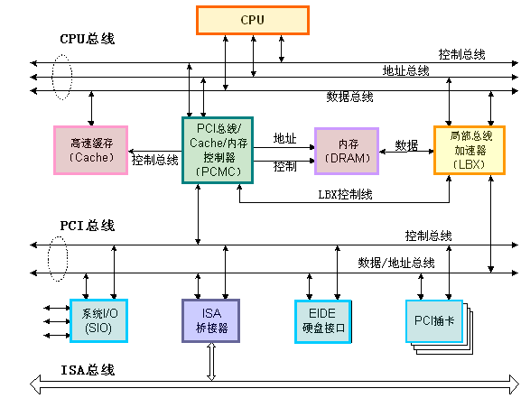

#计算机组成的发展
 *计算机科学领域的任何问题都可以通过增加一个间接的中间层来解决*
###问题
* 执行如何执行helloword程序   
###专业名词解释
* 总线（BUS）：
* 频率：
###早期的计算机组成

                    显示器         键盘            碟片机            硬盘    
                      |            |               |               |
                      |            |               |               |
     CPU  memory  videoCtrl  KeyboardCtrl     FloppuDisCtrl    hardDiskCtrl
     |      |        |             |               |               |
     |      |        |             |               |               |
     ——————————————————————————————————————————————————————————————————————     
                                    BUS         

一个总线上挂载了所有计算机组件，也是限于当时CPU和内存的频率较低导致的。
计算机的出现已经很了不起了，大家也并不在意计算机的反应速度问题。

###二代通用计算机组成
后来CPU的频率爆炸式上升，内存的频率也在持续上升，他们和其他组件的差距越来越大。
就出现资源浪费的问题：BUS总是被一些低效率的组件（硬盘I/O等）阻塞，导致CPU长时间空闲
所以依照理论追加了一个中间层 :北桥（PCI-Bridge） 南桥（ISA-Bridge ）

                  cache-BUS  local bus        mermory-bug
      level2-cache —————— CPU —————— PCI-Bridge —————— mermory
                                       |
      —————————————————————————————————|————————————————————————————————————PCI bus
        |          |                   |                     |          |
      scsi        USB             ISA-Bridge - IDE-disk   图形处理器   PCI-slot
                 /   \                 |
              mouse  keybord           |
                                       |
      —————————————————————————————————|————————————————————————————————————ISA bus
           |                   |                  |                 |
         modem             soundcard             printer          ISA-slot
                         
如图，
 * 1、北桥被设计为一个高速处理集中地，负责链接所有高速设备（核心）
 * 2、把速度最快的CPU单独一条线，并且由于CPU的频率比内存还要高出很多，所以为其再设计一个中间件-level2 cache
 * 3、内存的速度低于CPU但它的速度还是要比其他组件要快，所以为其也单独了一条线：mem-bug
 * 4、其他所有组件速度差不多的设计一条线
 * 5、有些设备总是很慢，系统更多时候都不想等它们了，所以独立出一个南桥芯片，专门去处理低速的组件消息
 
###最新计算机组成
随着人们对速度的极致追求以及制作工艺的不断进步，很多操作又可以变得简单化，
所以英特尔和AMD最新的CPU都把北桥的功能集成进了CPU中，所以单独的北桥芯片以及逐步推出历史舞台。
各个部件的也都变得快起来。比如闪存的固态硬盘，现代的独立显卡，都已经是超高速设备了。  

####SMP多核CPU
随着组件的细化，各个组件之间逐渐独立出来，但是系统的运行速度总是依赖CPU芯片组的运算速度，但是单CPU的发展已经达到顶峰
如果没有材料或者制作工艺上的突破性进步，那单CPU的频率基本已经达到顶峰。于是人们在想既然单个还不能满足需求，那就搞多个。
但是如果是多个CPU的话，成本太大，随着**集成**的思想普及，把多个核心集中到同一个芯片组中，成为了主流，即多核CPU。  
那么多核CPU是怎么协调工作的呢？  

###[CPU](CPU/readme.md) 

###操作系统
以上都是硬件相关的，硬件的指令。如果对于程序的开发者来说，需要记住这些复杂的指令，明显是不可能的。

CPU相关：
 硬件发展：
继电器 -> 真空管-> 分立晶体管
电线 -> SSI IC -> MSI IC -> LSI IC     集成电路（IC)：将大量的晶体管集中在一小块半导体片或芯片

门电路： 逻辑门定义和实现 
晶体管实现加法： 半加法器和全加法器的实现 

CPU组成
