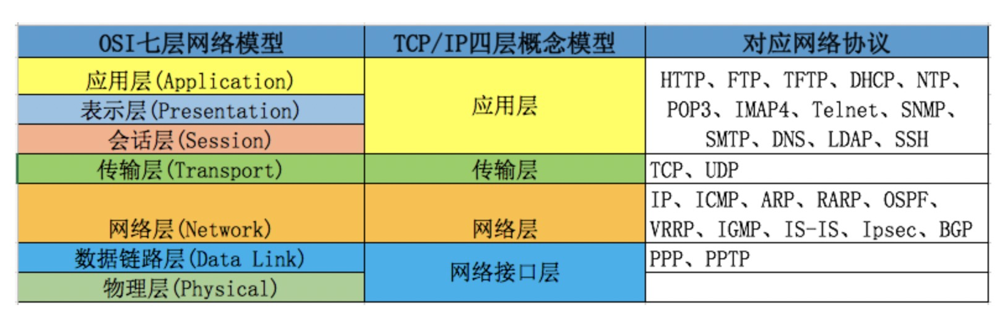
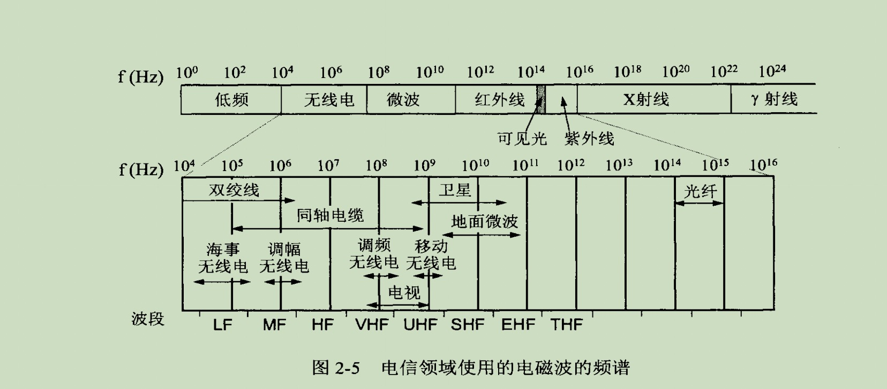
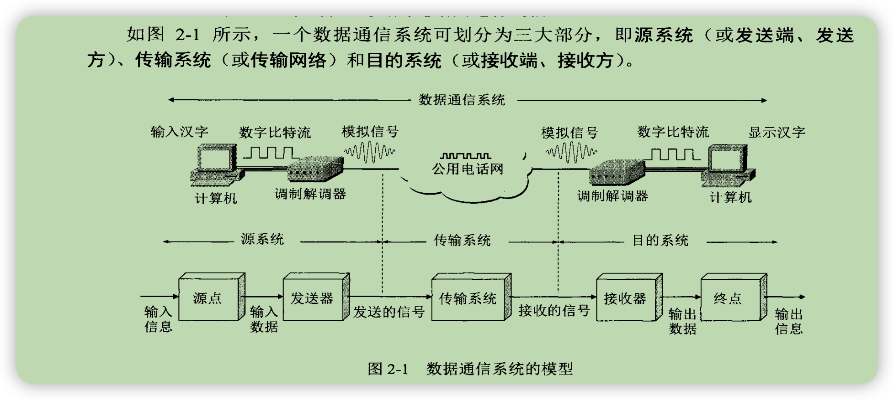
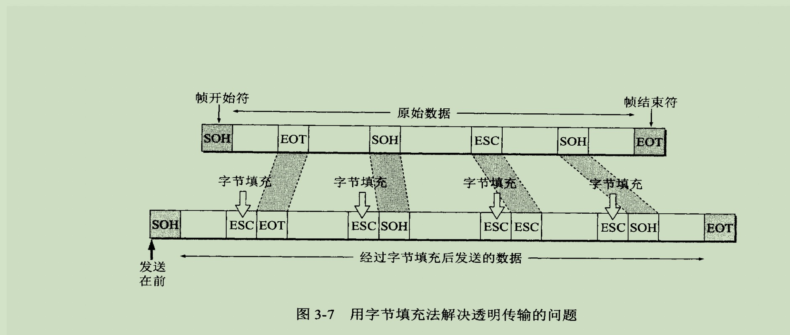
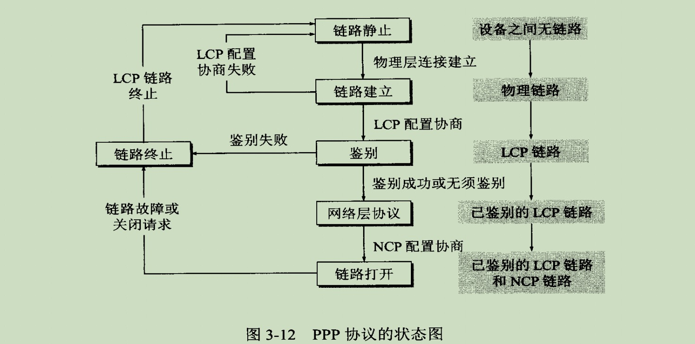
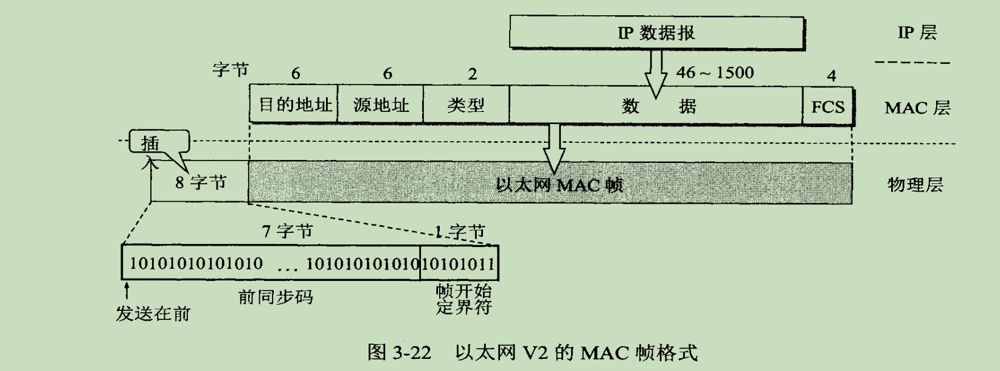
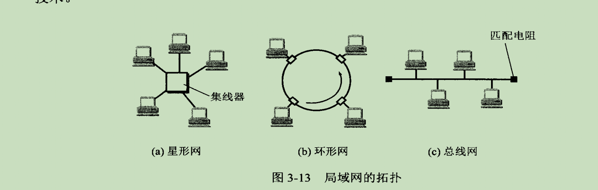
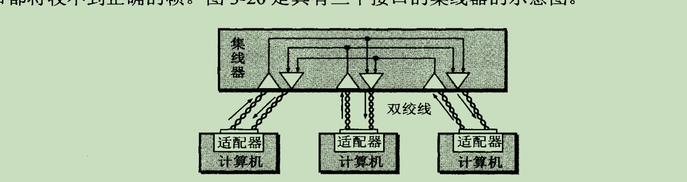
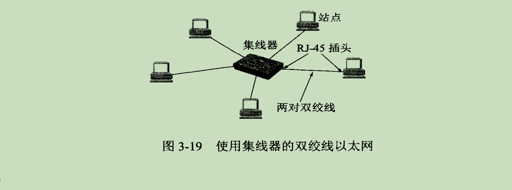

# IO 
## 序言
原本我只是想研究Netty框架，但是在接触Netty之后，我发现，Netty通常和NIO直接关联。那我就在思考：  
- IO是什么？  
- 为什么IO会这么复杂，分为了BIO，NIO，AIO， 它到底复杂在哪儿呢？
- BIO到底阻塞在哪里？ NIO又是怎样解决Block问题的呢？  
- JDK已经存在了NIO，Netty是个啥玩意？Netty存在的意义是什么？业界有句经典的话：使用netty后，IO不存在性能问题。可信吗？ 

**声明** 本系列专注网络IO，所以主讲都是以网络IO的实现为例子 

## 解释
**IO**  
  input & output的缩写  
  举个例子： 两个人面对面，A在说话，B在听。  
          那么可以看作：A就在输出内容（output），B在输入内容(input)，输入/输出的内容就是文字，媒介是空气，传递的具体实现是音波。 
  
  类比网络IO： 客户端给服务端发送消息，客户端在输出，服务端在输入，内容是消息，媒介是网线，传递的具体实现是电信号(0/1)  
同时我们传递的内容（消息或者对话）都不可能是一字或者一个信号，而是一长段文字或者信号，就像流水一样，所以，我们把它叫做：输入流/输出流（inputSteam/outputStream）

*那么问题就来了：怎么实现IO呢？*

## 关键名词
* 端口号：占2个字节 16位 0-65535
* IP地址：占4字节  32位 每8位转位十进制点分法记忆
* socket：用套字节表示{{ IP : 端口号 }}，标记唯一进程

## 网络IO的实现  
   
小知识，OSI协议是国际标准协议，但是由于协议的制定长达6年，而现实中TCP/IP协议已经普及了，所以，理论只能向实践妥协。
现如今更遵从5层协议，在TCP/IP协议的基础上，把网络接口层分为数据链路层和物理层。而表示层和会话层大多还是融入到应用层一起实现，有些协议甚至不实现。

### 网络物理层 
#### 任务
**物理层研究的不是传输数据的媒介比如光缆、铜线、双绞线、无线电等，而是研究如何在这些媒介上进行数据传输**  
 现如今随着物理设备和技术的发展，传输的媒介有很多，引导类的如光缆、铜线、双绞线，非引导类的广播信号如：无线电。
 **物理层存在的意义就是向上层提供信息在这些媒介上传输功能，并屏蔽掉他们之间的差异**
 
#### 基本概念

网络层会根据实际情况把计算机输出原始数字信号转化为模拟信号或者把模拟信号转化为数字信号  
至于为什么要转，这就牵涉到物理学了，反正就是模拟信号更便于长距离传输  

#### 信道复用
为利益最大化，现实中很难为每家每户甚至是没人实现专线，大部分情况还是多人公用同一信道，所以如何提到信道的传输能力就是科技需要解决的问题。  
具体的复用策略： 频分复用、时分复用、波分复用（光的频分复用） 、码分复用
#### 应用
* 光纤同缆混合网
* FTTx

### 数据链路层   
物理层已经解决了二进制传输的问题，那数据链路层就需要解决通信的双方如何进行数据交流的问题。  
数据链路层主要使用的信道分为两种：点对点信道和广播信道。   
为此数据链路层定义了一些通信协议： PPP协议 、 CSMA/CD协议

#### 三个基本问题
不管是那种协议，数据链路层必须要解决的三个问题：  
* 封装成帧。 一个完整的数据片段。
* 透明传输。 接收端能够完整的识别一个帧。帧头SOH、帧尾EOT。填充符：ESC 
* 差错检测。 CRC检错算法。并非绝对的可靠，只想相对检测。并且接收方是直接丢弃，并不会通知发送方重发。 

*帧*  
我们实际中进行传输的时候肯定是一段字节流，不可能一个字节一个字节的传输，所以在物理层之上，网络传输规范定义了一个网络链路层，用于把数据
包装成一段一段的字节流，而这个段被定义为帧。帧的内容包括 帧头、IP数据包、帧尾

所以：帧是网络接口层传输的最小单位。
我们玩游戏的时候，常说【掉帧】，实际上就是传输的片段丢失。这无关上层应用本身，就是网络太差，数据传输失败  

#### 点对点 PPP协议
**协议组成**  
* 将IP数据包封装到串行链路的方法(封装成帧) 也有MTU最大长度限制
  * 异步传输时透明传输使用字节填充
  * 同步传输时透明传输使用零比特填充
* 一个用来建立、配置、测试数据链路的 链路控制协议(LCP)
  * PPP协议规定了一系列LCP配置项，由一方发起，另一方选择接受或者不接受 
* 一套网络控制协议，用以支持不同的网络层协议  
  * 现代路由器支持多种网络协议，所以在连接建立之初就需要对网络层协议进行协商，比如IP协议的分配IP  
  
**协议状态图**
  

#### 广播协议 以太网V2
**MAC地址**
* mac地址固化在适配器的ROM中，是每台物理机的标识符
* 必须保证在局域网中是唯一的，用于在局域网中进行寻址。

**MAC帧**

* 前同步码由硬件随机生成，用以实现曼彻斯特码的时钟同步，加上帧的开始界定符
* mac帧的传输使用同步传输，且帧与帧之间由间隔，而曼彻斯特码在无信息传递时，没有电压变化，所以就没有任何信号传输，所以mac帧不需要额外实现透明传输
* mac帧的差错检测也是使用4字节的差错检测序列，同时如果帧的数据长度不在46～1500之间，也被认为由错

**广播传播网络结构**
* 总线结构 半双工通信
  * CSMA/CD协议，发送前检测碰撞，边发送边检测
  * 工作在物理层，直接转发，不做任何多余操作
* 星形拓扑
  * 集线器 -> 网桥 -> 交换机

**交换机**
* 交换机自带了处理器和存储器,上升到数据链路层
* 内部含有帧交换表(自学模式，无需配置)。
  * 自学过程：发送方发来消息时把发送方地址记录到交换表中，目的地不在配置表的消息采用广播模式发送。

#### 网络适配器(网卡)
* 计算机与外界局域网的连接是通过通信适配器（adapter）进行的。
* 适配器本来是在主机箱内插入的一块网络接口板（或者是在笔记本电脑中插入一块PCMCIA卡——个人计算机存 储器卡接口适配器）。这种接口板又称为网络接口卡NIC （Network Interface Card）或简称为 “网卡”。 现在计算机主板上都已经嵌入了这种适配器，不再使用单独的网卡了。
* 适配器上面装有处理器和存储器（包括 RAM和R0M），所以适配器在收发帧时，使用的都是自己的处理器和存储器
  * 适配器和局域网之间的通信是通过电缆或双绞线以串行传输方式进行的， 而适配器和计算机之间的通信则是通过计算机主板上的I/O总线以并行传输方式进行的。所以适配器的一个重要功能就是要进行数据串行传输和并行传输的转换。
  * 由于网络上的数据率和计算机总线上的数据率并不相同，因此在适配器中必须装有对数据进行缓存的存储芯片。
* 在主板上插入适配器时，还必须把管理该适配器的设备驱动程序安装在计算机的操作系统中。
这个驱动程序以后就会告诉适配器，应当从存储器的什么位置上把多长的数据块发送到局域网，或者应当在存储器的什么位置上把局域网传送过来的数据块存储下来。
* 适配器还要能够实现以太网协议。
* 现在适配器不仅实现了数据链路层功能，同时也实现了物理层功能。（网线其实就是插在网卡上的，至于无线设备，依赖的则是无线网卡）

#### 调制解调器
信号转换，工作在物理层。比如光猫，电信号和光信号的转换

### 网络层  
上面两层已经实现了两个点对点的通信。那么问题来了： *互联网是一个网状结构，我怎么知道我要找谁呢？*  
所以网络层的意义：**定位**  
IP协议就是广泛使用的网络层现已，改协议为每台连接到互联网的机器分配一个IP，这样每台机器就有了自己的唯一标记，不管你在何方，只要你注册了，我就能找到你。
怎么做的呢？
关键装备： 路由器 
 
                    顶级ISP  
                  /         \
            美国顶级ISP     中国ISP  
              ...         /     ｜     \
                       移动ISP 电信ISP  联通ISP      
                       ...       |       ...
                              省级ISP
                            /    |     \
                          宁波ISP 杭州ISP   ...
                               /    \ 
                         兑吧路由器  阿里云
                           /   \  
                          5楼  7楼     
                         /  \
                    我的电脑 你的电脑

想象一下，现在有一个路由器B1，它上面插了3根网线，挂载了3台电脑（A1,A2,A3）,路由器B1它又连接在公司的总路由器C1上，这个C1上其实挂载的不只你的路由器B1，还有B2,B3....
公司路由器C1的上面连接的可能是某个省级电信的路由器D1，D1上实际挂载着C1,C2,C3....这个D1之上可能就是中国的总路由器E1，E1下挂载着电信（D1）,移动（D2），联通（3）....
至于怎么联通世界互联网的，可以翻阅资料，在94年，中国第一个网站：【世界之窗】，正式宣布中国互联网时代的到来。  
那么问题来了：  
- 1、互联网那么多机器，IP要怎么分配呢？路由器如何判断是向上还是向下呢？ [ip协议](./ip/readme.md)  
- 2、这里说的都是通过网线进行传输的场景。那Wi-Fi怎么定位呢？  

### 传输层  
首先根据以上已经学习的内容，考虑两个问题：
- 1、A给B发消息，如果我的消息特别特别长，比如1个G的大文件，B怎么知道A有没有发完呢？    
- A给B发了个消息，A怎么知道B有没有收到呢？  
为了解决这些问题，在网络层之上，就出现了传输层。这一层的任务就是完成以上两个问题。  
比如：我们特别熟悉的TCP协议，和UDP协议。TCP协议就尽全力保证消息的可靠性，而UDP则不完全保证  
那么问题来了：TCP怎么保证的呢？大家都知道3次握手，4次挥手，为什么这么设计呢？  
[TCP](./tcp/readme.md)

如果大家专注于IO编程，那到这里的知识点，都是基础。为什么呢？  
- 其实在JDK中，跟网络IO最直接相关联的就是Socket对象。那socket内部对网络IO的实现，就到这里了。再往上的那些个协议，就需要其他扩展框架或者自定义了。  
- 下层的协议就那么几个，但是从此往上，那就五花八门了。比如：http,Ftp，ssl，websocket，smtp等等。  

为什么我们通常把整个网络层级统称为TCP-IP协议群呢？其实就是因为后续的所有实现，都是基于TCP/IP协议的。 
到此处的协议基本都是硬件和操作系统帮助我们实现的。所以我们从Java代码的角度去学习IO的话，也是从此开始的。而这个在JDK中相应的实现就是socket API  
* socket API我们怎么去使用？
* socket API内部的先又是什么呢？ 
 
一起去看看吧 —> [socket](./socket/readme.md)

####应用层  
后面的三层分为：会话层，表现层，应用层。个人感觉，就是那群学者脑子有病。无关紧要。我这里统一理解为应用层  
我们可以传输数据了，但是国有国法，家有家规。消息可以可靠传输了，但是你不能乱传。  
想象一个场景：  
你有个服务器S，客户端A发给你一条消息：aaaa，客户端B发给你一条消息：bbbb。  
你是不是想问：啥意思，给我这个干嘛？我需要帮你做点啥吗？

   
大家最熟悉的HTTP请求，其实在JDK socket中接收到的，就是一段字符串，啥也不是，根本看不懂，什么也干不了。但是我们都在用tomcat服务器，tomcat最重要的功能是什么？提供服务器吗？
你自己new 一个 ServerSocket不行吗？那肯定不行。 tomcat最重要的部分就是它实现了servlet规范。通常场景下，tomcat把客户端发来的消息封装成了HttpServletRequest，
把服务器发给客户端的消息封装成了HttpServletResponse。对普通开发者来说，这样就简单了很多。这就是应用层协议。  

####总结
回头再来看一个图：  
  

*网络层和传输层的协议都是由操作系统来实现了，而应用层协议由框架来实现的。那么问题来了，从操作系统到应用，是怎么连接的呢？*  

###HTTP协议

