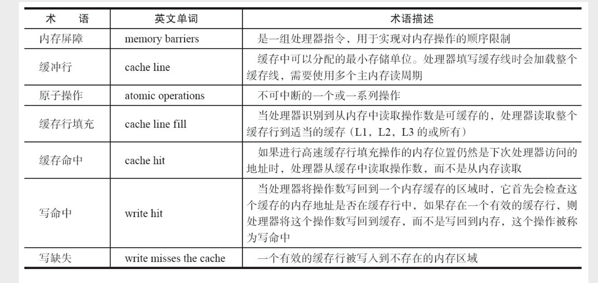
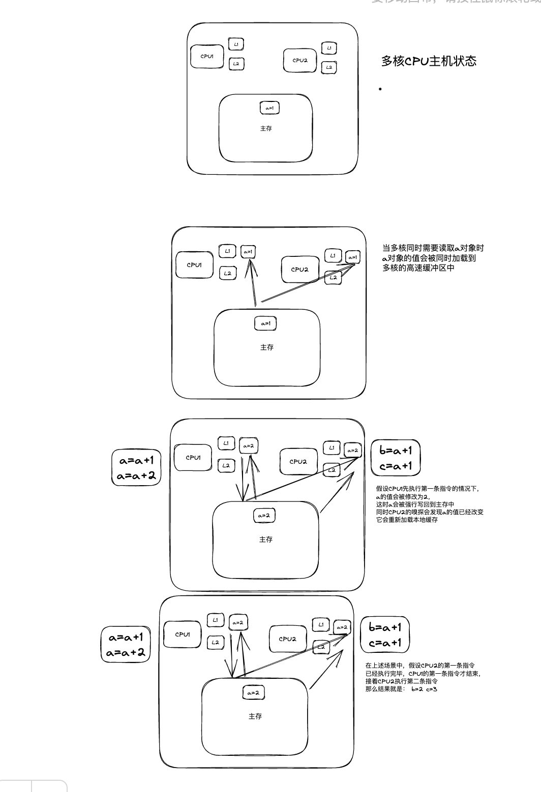
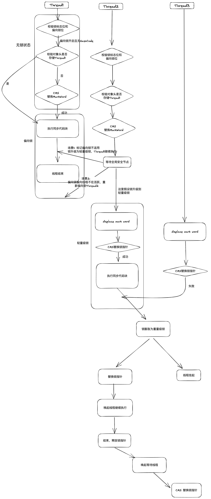
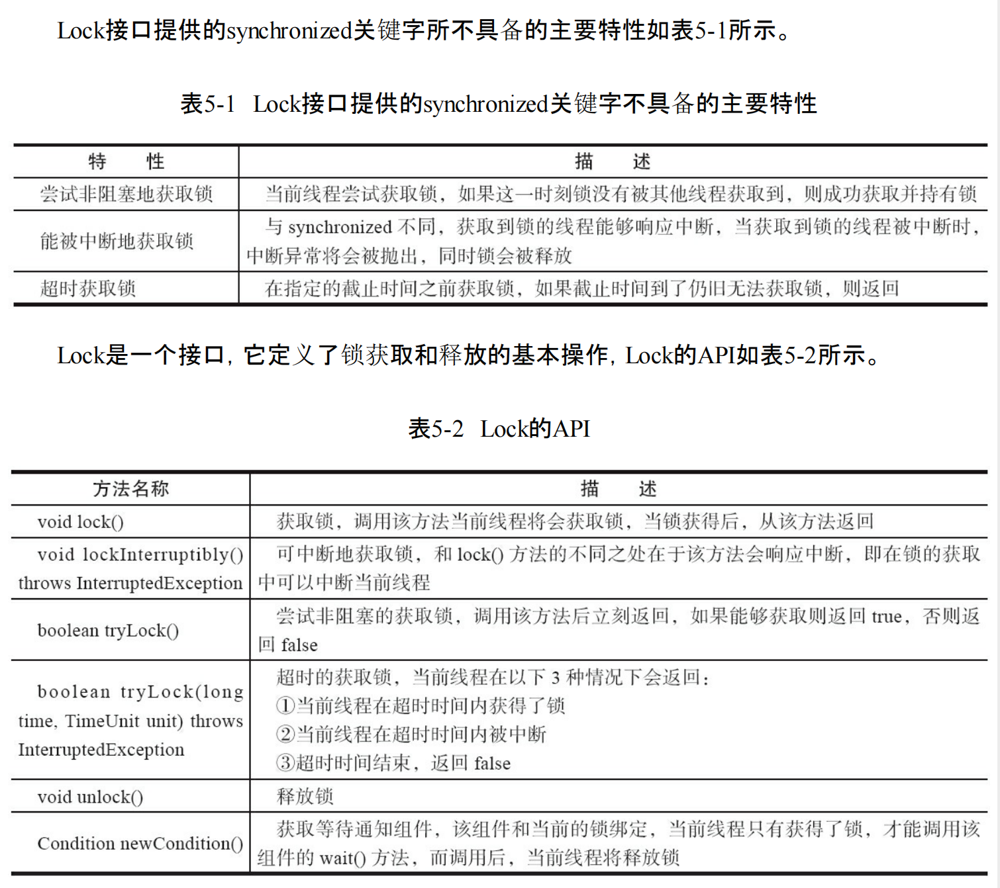
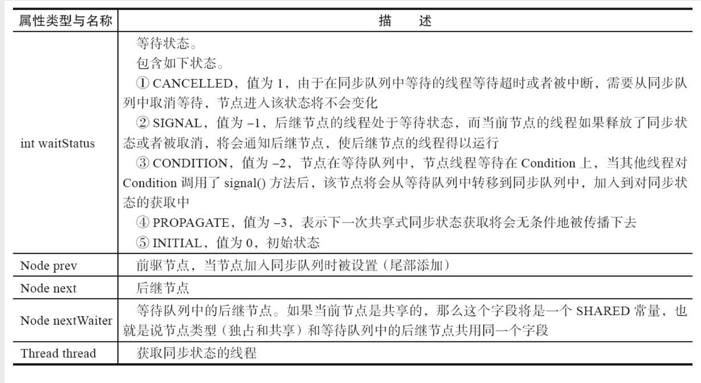
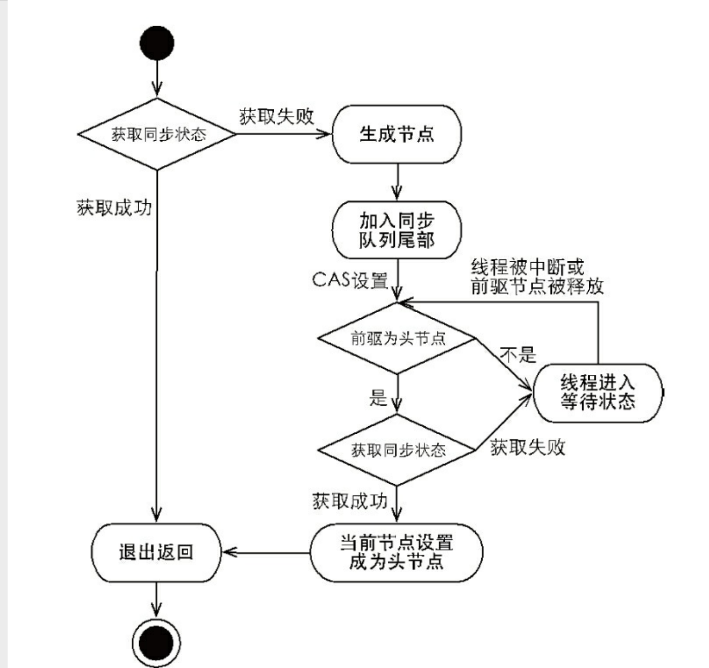

 # LOCK
* 锁是并发开发中的一个重要工具
* 锁解决的是多CPU并行前提下的内存资源竞争问题
* 锁在内存的角度来说解决的是指令顺序性和可见性问题，有了锁的存在，指令执行的顺序被强制保证了，可见性也就有了

## 关键词

## volatile
* 保证可见性 
* 如上图最后，volatile只保证可见效，不保证有序性
* 其实现原理依赖的是LOCK#开头的指令提供的缓存一致性原则。
* LOCK#指令完成两件事情，以实现缓存一致性  （注意这里本人不是很清楚，个人理解： LOCK#信号的实现是：优先锁缓存，其次锁总线）
    * 1、指令执行完后，及时将缓存的数据写回到主存
    * 2、这个写回操作会使得其他核上缓存的该变量的数据无效
    * 3、1/2 一定会发生，但具体是使用缓存锁定还是总线锁定，未知
* 当volatile修饰的连续变量同时被读到缓存行时，多核会来回相互通知缓存无效，从而导致性能浪费。
    * 所以jre的linkedTransferQueue才会通过占位变量来追加字节，以提高CPU性能

## synchronized
* 它基于JVM内置锁实现，通过内部对象Monitor（监视器锁）来实现。
* 而Monitor的实现依赖于底层操作系统的Mutex lock（互斥锁），因此是重量级锁，性能较低
* jdk6以后引入锁升级概念，依次为：
    * 无锁 
    * 偏向锁    
        * CAS直接替换markWord中存放线程的ID
        * 偏向锁的markWord中，线程ID占用了hashCode位置，所以hashCode和偏向锁不共存
        * 相较于轻量级锁，它减少了displaceMarkWord的过程
        * 存在竞争即升级为轻量级锁
        * 偏向锁可被禁用
    * 轻量级锁  
        * 在获取锁前，先在线程栈中开辟锁空间，进行displaceMarkWord，将丢下的markWord复制到线程的锁空间，在进行CAS操作，将markWord替换为锁空间的地址
        * 相较于重量级锁，轻量级锁线程不挂起，利用CAS自旋替换markWord中锁指针位
        * 当CAS失败时，触发锁升级。至于CAS的次数，hotspot 是JVM自己自适应的，老版本是可配置的。
    * 重量级锁  
        * 依赖操作系统的mutex（互斥量）和信号量（semaphore）实现的monitor lock
        * 在线程未获取到锁时，不会自旋，而是阻塞，直到锁释放被唤醒后，重新争夺锁
* 锁的存在对象的markWord区域内。markWord区域是可变的。
   * 32位系统 
   * 32位系统 
   * 64位系统 
   * 验证markWord的变化 https://blog.csdn.net/lengxiao1993/article/details/81568130
* 解说锁升级的过程    https://blog.csdn.net/u014044812/article/details/124302959
* 锁升级是不可逆的，为了性能考虑
    * 在什么时间点进行降级，就是个问题
    * 偏向锁和轻量级锁都依赖CAS自旋，自旋是需要耗费CPU的，一旦升级了，说明存在着竞争，那降级也还是会升级回来的不说，无用的自旋也是在浪费
* 自我理解的完整的锁升级的过程                
* 锁粗化是指将多个连续的synchronized代码块合并为一个大的synchronized代码块，以减少加锁和解锁的次数，提高性能。例如，如果有一个方法中包含多个synchronized代码块，且这些代码块之间没有竞争，那么可以将它们合并为一个大的synchronized代码块，以减少加锁和解锁的次数。
* 锁消除是指编译器通过逃逸分析等技术，将不可能存在竞争的synchronized代码块去除掉，以减少不必要的锁竞争，提高性能。例如，如果一个synchronized代码块中没有修改共享变量，那么这个synchronized代码块就不需要加锁，因为其他线程无法通过这个代码块访问共享变量。
* 锁状态 ：Thread#holdsLock [测试用例](LockStateTest.java)
    
## LOCK 接口
* javaSE提供了LOCK接口的API，其功能相较于synchronized提升了不少

### 队列同步器AQS
LOCK的定义了一套锁的使用规则 AbstractQueuedSynchronizer.java，其逻辑实现依赖的是队列同步器锁所提供的状态管理、线程排队管理

##### 状态控制
* 在AbstractQueuedSynchronizer内部定义属性state,状态变更时，通过Unsafe类的compareAndSwapInt方法线程安全的操作锁的状态变更
* state是一个int类型的值，如果同步器是独占式的，那么当锁被占用时state=1，当锁没有被占用时state=0，当state>1说明同一个线程多次获取锁。
* 当state初始值被设置为大于1时，锁就变成了共享式，通常信号量就是这样实现的

##### 节点(流程来源：ReentrantLock源码)
* 当线程尝试获取锁失败（改变state值失败时），当前线程会自行构建为一个节点存放如队列中
* 节点构造
* 入队（获取锁失败，进入排队 lock方法）
  * 1、将当前线程构建为Node节点
  * 2、利用CAS更新为tail
  * 3、将NODE的Pre指向之前的tail，将原tail的next指向当前节点
  * 4、判断当前节点是否为头节点的下个节点，如果是尝试获取锁，如果获取到锁，将当前Node设置为head，并将head的next滞空，踢掉head节点
  * 5、如果未获取到锁，尝试删除前置的已取消节点
  * 6、判断前置节点是否完成，未完成修改前置节点状态为1（前置节点完成时，唤醒本线程），并挂起本线程
* 出队（释放锁，唤醒下个节点 unlock方法）
    * 1、释放锁，利用CAS修改同步器状态
    * 2、判断当前锁状态是否为0（可重入状态下，释放一次并不能让锁进入无锁状态）
    * 3、读取head标记，尝试唤起head的后续节点（head只是作为标记，本身为空节点或者正在执行或已执行完毕的节点）。如果head或者head的next为null，则判断tail是否为null，如果tail不为null，则尝试从tail出发重新修正头节点
    * 4、next线程从上述入队的第6步。代码重复出队第4步
* 总结流程 
* * 锁状态 ：lock#isHeldByCurrentThread [测试用例](LockStateTest.java)

