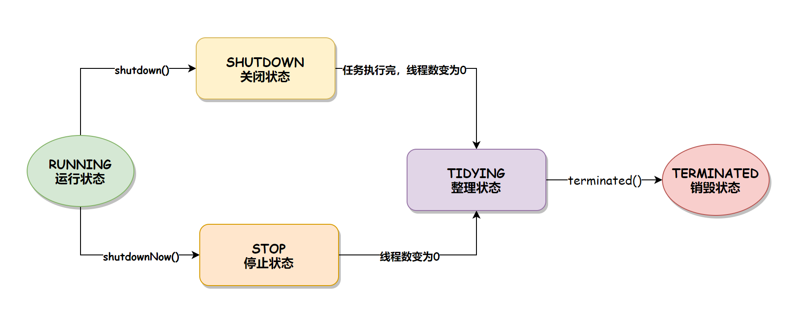
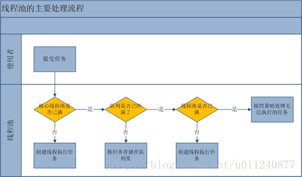

# ThreadPool
#### 线程池状态

#### showdown vs showdownNow
* showdown 使得线程池进入SHUTDOWN 状态， 无法提交新任务，已提交任务不受影响，包括正在执行和排队任务
* showdownNow 使得线程池进入STOPPED状态，无法提交新任务，已提交任务受影响，正在执行任务响应interrupt，排队任务直接丢弃

#### 线程池线程创建参数列表
* corePoolSize                       核心线程数
* maximumPoolSize                    最大线程数
* keepAliveTime                      线程活跃时间
* TimeUnit unit                      活跃时间单位
* BlockingQueue<Runnable> workQueue  等待队列
* ThreadFactory threadFactory        线程构造器
* RejectedExecutionHandler handler   任务饱和时的处理策略

#### 线程池任务执行过程

#### execute Vs submit
* submit 返回Future，可通过Future获取任务进度

#### [阻塞队列](../../queue/readme.md)

### 任务饱和时的处理策略
* 报错 
  * AbortPolicy
* 丢弃：
  * DiscardPolicy
  * DiscardOldestPolicy
* 提交任务线程自己运行
  * CallerRunsPolicy

### ThreadPoolExecutor vs ScheduledThreadPoolExecutor 
* ScheduledThreadPoolExecutor 是ThreadPoolExecutor的一种定制实现，包括：
  1. 空闲时间固定为0
  2. 队列定制为DelayQueue
  3. 最大线程池为Integer.MAX_VALUE
* 任务执行过程不一样
  1. 先将任务加入队列。队列是可扩容的，不会爆炸
  2. 如果任务线程小于核心线程，则创建新线程
* 新增schedule 和 scheduleAtFixed方法，可以延时或者定时重复执行任务
