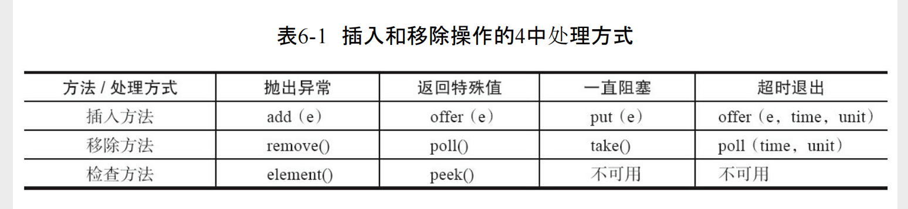

# Queue

## queue
### Dequeue
* LinkedList
* PriorityQueue
  * 内部使用数组实现队列
  * 扩容： 当容量小于64时，容量翻倍，大于64时容量增加50%
  * 内部定义了一个比较器Comparator
  * 插入元素时通过比较器找到比它大的第一个元素，将它以及它后面的所有元素后移1位，然后将添加的元素插入到该位置上
  * 使用堆排序算法

### BlockingQueue

* 如图BlockingQueue 对于增删查 操作提供了4套不同方法
  * 其中前两个是在Queue接口上进行的扩展，使其拥有边界性
  * 而后两个方法是BlockingQueue扩展的，让BlockingQueue具有边界性和阻塞性
* BlockingQueue内部定义了一个ReentrantLock类型的Lock来保证线程安全
  * 同时利用这个lock获取Condition来实现阻塞线程的挂起与唤醒
  * condition 和 lock 内部都依赖LockSupport.park来实现线程挂起，使用lockSupport.unPark来唤起线程
* BlockingQueue内部都定义了计数器count，该变量是一个AtomicInteger类型变量，具有原子性
* BlockingQueue实现的是Queue接口，所以它满足FIFO规则，所以其内部的Lock通常都是公平锁
* BlockingQueue的实现有以下几种
  * ArrayBlockingQueue：一个由数组结构组成的有界阻塞队列。 
    * 使用数组实现的队列，天然具有有界性，不可扩容。使用ReentrantLock保证线程安全。该lock可选择是否公平
    * 使用AtomicInteger变量计数
    * 使用lock.condition实现线程阻塞和唤醒
  * LinkedBlockingQueue：一个由链表结构组成的有界阻塞队列。
    * 利用队列实现的阻塞队列，最大长度为Integer.MAX_VALUE
    * 和 ConcurrentLinkedQueue 的区别在 竞争的处理方式。
      * LinkedBlockingQueue 使用ReentrantLock保证线程安全
      * ConcurrentLinkedQueue 利用自旋CAS锁（head / tail）来保证的
  * PriorityBlockingQueue：一个支持优先级排序的无界阻塞队列。
    * 该Queue是一个优先级队列，使用PriorityQueue实现
    * 使用ReentrantLock来保证线程安全
    * 扩容时通过CAS allocationSpinLock一个int性变量来保证线程安全、
    * 因为 lock 即是增加的锁也是删除的锁，扩容时，它会先释放lock，以保证在扩容的前期准备阶段依然可以删增元素。但是在进入到元素copy阶段时，它会再次加锁
  * DelayQueue：一个使用优先级队列实现的无界阻塞队列。
    * 使用PriorityQueue实现队列，所以它还具有优先级
    * 强制要求元素必须实现 Delayed 接口
      * 该接口内部定义方法getDelay，返回剩余的时间。注意这个方法返回0的时候，该元素才能出队，所以这是个动态的方法。[样例](QueueTest.java)
      * 该接口继承自Comparable，要求元素自定义优先级
      * 如果没有特殊的优先级，那就以等待时间作为优先级
    * 内部定义了 Thread leader
      * 该线程表示正在等待的线程
      * 初始化为空，当第一个线程获取元素并等待时，它将被赋值给leader
      * 当发生竞争时，只有第一个线程在超时等待，超时时间为getDelay
      * 其他线程都是直接挂起状态，等待第一个线程获取元素后唤起，其他并发线程开始新一轮争抢
      * 当线程在等待时，添加新的优先级更低且等待时间更短的元素怎么办
        * 新加元素后，它会唤起所有等待的线程的
  * SynchronousQueue：一个不存储元素的阻塞队列。
    * 它内部没有队列，只能持有一个元素，一存一取
    * 可以是公平的，默认是非公平的
  * LinkedTransferQueue：一个由链表结构组成的无界阻塞队列。
    * 无界的队列
    * 非公平的队列，不满足FIFO原则
    * tryTransfer 方法会等待元素被消费了才返回
  * LinkedBlockingDeque：一个由链表结构组成的双向阻塞队列。
    * 类似LinkedBlockingQueue的双向队列

## ConcurrentLinkedQueue
* head 作为头节点，内部Node不一定有数据，因为在构造器中，head就是个空节点，而且出队时head的更新具有滞后性，详见poll方法
* tail 作为尾节点，它不一定就是真正意义上的尾节点，它具有滞后性，详见offer方法
* 加入的元素是不能为空的。因为head大概率就是空节点，再加入空元素就无法区分了
* 入队
  * 入队时，从tail指向的节点开始查询尾节点，通过判断节点的next是否为空来判断是否是尾节点。CASNext(null,newNode)来实现线程安全
  * 入队时不会立刻更新tail属性，而是滞后至少1次更新tail，而且tail 也只是CAS尝试更新，不会循环CAS保证成功。这样可以减少CASTail带来的消耗
  * 当循环查找尾节点发生死循环时，检测tail是否变化，如果变化了它会从tail节点重新遍历尾节点，如果tail节点没有变化，则从head节点开始遍历
  * 分析： 入队操作如果需要实现线程安全需要保证 tail节点的next 以及 tail 节点 的原子性。如果利用锁实现，则需要把这两步进行加锁。而offer方法的实现，以casNext作为线程安全的保障，而不保证CASTail的成功，则成功的避免了加锁的操作。但作为弥补，每次添加时都需要重新查找尾节点，而tail存在的意义就是让这个遍历变短一点了而已。
* 出队
  * 出队以head属性开始遍历
  * head节点内不一定含有元素，head的next也不一定有元素
  * 当head已经存在滞后时，并且队列不为空，则一次性将head移动两个节点，否则移动一个节点
  * 分析： 出队操作以保证节点CASItem(item,null)来保证出队的线程安全性，而head属性指针移动不是准确的，这样可以减少了CASHead的次数，以提高效率。但是由于head具有滞后性，所以在出队时就免不了花费一些轮训去查找真正的头节点。
* 长度
  * 获取队列长度的方法并不是实时准确的，它通过遍历队列累加求的
  * 该方法先从head属性出发，找到真正的头节点，然后以该节点为起始点遍历到尾节点(与tail属性无关)
  * 在遍历过程中，该方法也判断了死循环的情况，但是它却没有归零计数器
  * 该方法返回的最大值为Integer.maxSize
  
~~~java
public class ConcurrentLinkedQueue{
    //头节点，用于操作出队
    private transient volatile Node<E> head;
    //未节点，用于操作入队
    private transient volatile Node<E> tail;
    //节点对象，next属性实现单向链表
    class Node<E> {
        volatile E item;
        volatile Node<E> next;
    }

    public ConcurrentLinkedQueue() {
        head = tail = new Node<E>(null);
    }

    //入队
    public boolean offer(E e) {
        checkNotNull(e);
        final Node<E> newNode = new Node<E>(e);
        //循环尝试追加节点
        for (Node<E> t = tail, p = t;;) {
            //这里有个问题，当队列为空，添加第一个元素的时候，tail一定不为null，否则，直接空指针了
            //所以，在队列初始化的时候，构造函数中放了个空节点进去 head=tial=new Node(null);
            //而消费完的时候，也要保证 head == tail != null
            Node<E> q = p.next;
            // tail属性具有滞后性，所以tail并不一定就是尾节点，而p.next==null的节点才是尾节点
            if (q == null) {
                //利用p.casNext来保证整个添加流程的原子性，以实现offer接口的线程安全                
                // p is last node
                if (p.casNext(null, newNode)) {
                    //如果tail不是尾节点，这里尝试进行更新tail尾最新节点
                    //如果tail是尾节点，那么它不会立即更新尾节点，此时tail属性就会滞后
                    //所以tail能容忍的滞后量为1，但是它实际滞后了多少，这要看实际的并发情况
                    // Successful CAS is the linearization point or e to become an element of this queue, and for newNode to become "live".
                    // hop two nodes at a time
                    if (p != t)
                        //这里并没有循环CAS，所以这个CAS不一定是成功的，它不能容忍tail滞后太多，但是它也不保证一定就滞后1
                        // Failure is OK.
                        casTail(t, newNode);
                    return true;
                }
                // Lost CAS race to another thread; re-read next
            }
            //这里是容错处理，当前节点如果等于next节点，那么就形成了死循环
            // 源码认为这种情况是遍历过程中，p和q的指针有错引起的，所以它尝试将索引修改为tail，如果tail也不对，则索引定位到head上，从头遍历。反正我是没想明白如何引发这种情况
            // 这里可以看出，队列操作必须保证head 和 node.next 的正确性，而tail其实不那么准确，它的存在只是为了减少添加时遍历的次数以加快添加的速度
            else if (p == q)
                // We have fallen off list.  If tail is unchanged, it
                // will also be off-list, in which case we need to
                // jump to head, from which all live nodes are always
                // reachable.  Else the new tail is a better bet.
                p = (t != (t = tail)) ? t : head;
            else
                //代码虽然简单，但效果很强大
                //首先如果当前索引定位在tail上，则索引向后移动，循环尝试添加
                //如果索引已经移动，则检查tail元素是否变更，如果变更了则遍历索引重新定位到tail上，重新循环CAS
                //如果tail 没有变更，只能继续向后移动索引尝试CAS
                // Check for tail updates after two hops.
                p = (p != t && t != (t = tail)) ? t : q;
        }
    }
    //出队
    public E poll() {
        restartFromHead:
        //死循环进行出队操作
        for (;;) {
            //从head开始遍历
            for (Node<E> h = head, p = h, q;;) {
                E item = p.item;
                // 通过CASItem(item,null)的原子性来保证线程安全
                // 节点在出队后，不一定能成功的更新head属性，所以需要从head属性开始遍历，同时以item！=null来判断，才能找到正在的头节点
                if (item != null && p.casItem(item, null)) {
                    // 这个条件为当前节点不等于head节点，即head节点已经滞后了的时候再考虑移动head指针
                    // Successful CAS is the linearization point  for item to be removed from this queue.
                    if (p != h) // hop two nodes at a time
                        //由于当前节点的元素已经被消费，所以当前节点的下个节点不为空时，直接更新头节点为下个节点，否则为当前节点
                        // 所以它的注释说一次性移动两个节点，但也有可能移动一个
                        updateHead(h, ((q = p.next) != null) ? q : p);
                    return item;
                }
                //如果当前节点元素为空，并且下个节点不存在时，说明队列为空
                else if ((q = p.next) == null) {
                    updateHead(h, p);
                    return null;
                }
                //同offer方法，此处为遍历发生死循环了，跳出重新遍历
                else if (p == q)
                    continue restartFromHead;
                else
                    // 否则继续向后遍历
                    p = q;
            }
        }
    }

    public int size() {
      int count = 0;
      for (Node<E> p = first(); p != null; p = succ(p))
        if (p.item != null)
          // Collection.size() spec says to max out
          if (++count == Integer.MAX_VALUE)
            break;
      return count;
    }
    // 当循环时发生死循环，则跳至head重新遍历，但这时候size方法并没有归零count
    final Node<E> succ(Node<E> p) {
      Node<E> next = p.next;
      return (p == next) ? head : next;
    }
}
~~~

## linkedList &  LinkedBlockingQueue & ConcurrentLinkedQueue
* linkedList 是线程不安全的
* LinkedBlockingQueue 依赖ReentrantLock来实现线程安全的
* ConcurrentLinkedQueue 依赖直接的CAS实现
* 如何选择LinkedBlockingQueue 和 ConcurrentLinkedQueue
  * LinkedBlockingQueue 继承BlockingQueue具有边界性，当队列满的时候，它可以阻塞添加的线程,当队列为空时，它可以阻塞消费线程
  * LinkedBlockingQueue 利用Lock实现，则必然选择线程挂起的情况，而ConcurrentLinkedQueue利用循环CAS实现，则必然出现无效轮训
  * 所以建议：并发高的场景下 优先选择LinkedBlockingQueue，挂起等待唤醒要比空轮训好
  *  业务重要的场景中，宁愿无效轮训也不让出CPU

