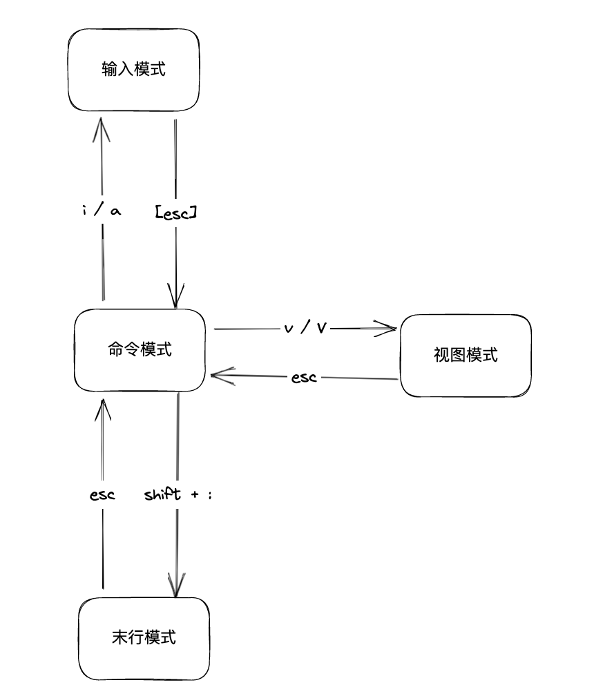
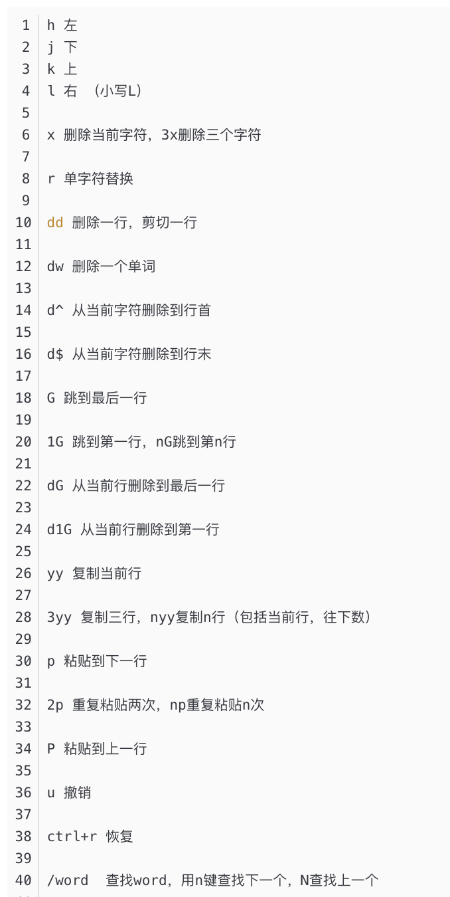
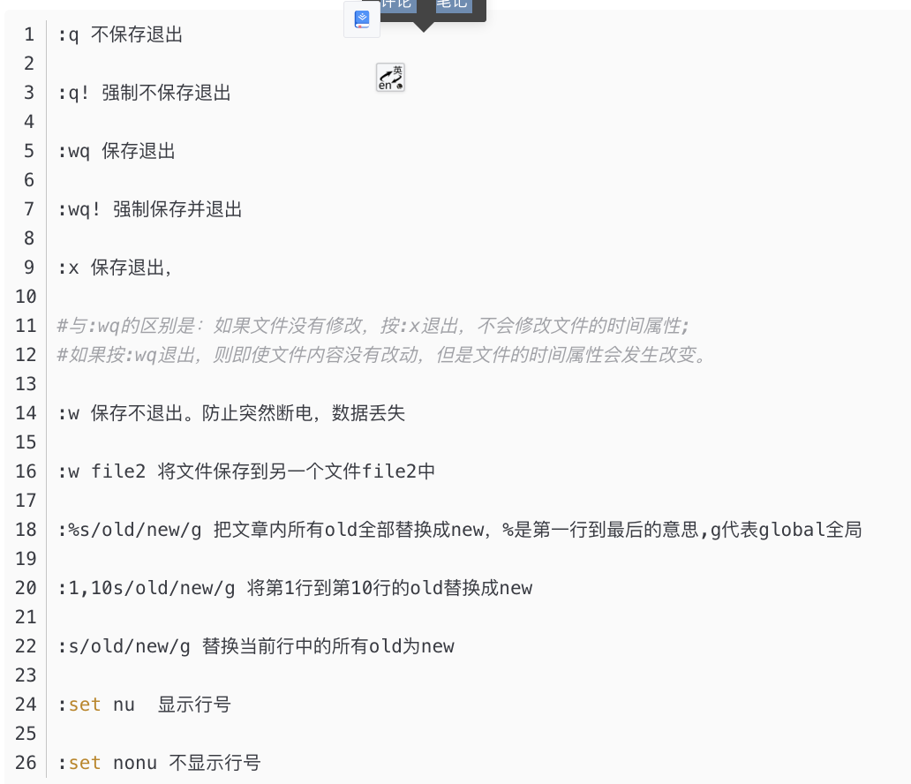

## CPU 

## 存储
### 内存
* free -h

### 磁盘
* ln -s /old path /newPath 创建一个新的地址，直接链接到旧的地址
* df -hT 查看硬盘使用情况

### 扩展盘
* 查找硬盘U盘： fdisk -l
* 挂载盘： mount  /dev/sbd1(fdisk查找U盘地址) /root/Upan （挂载地址）

### 文件
* mkdir
* 解压bz文件 tar xvf r8125-9.009.02.tar.bz2  -C /usr/src
* 解压gz文件： tar -zvxf make-3.81.tar.gz

### vim
vim : 结构模型 
命令模式下的命令集合 ： 
末行模式下的命令集合： 

## 网络
moodinfo ： 驱动信息

## 其他
* pidof XXX | xargs pwdx 很多命令查看的command不知道是那个，可以通过此命令查找

## 端口
ps -ef |grep XXX 查看进程
netstat -nltp |grep pid 通过应用找端口号
lsof -i:端口号  通过端口号找应用
