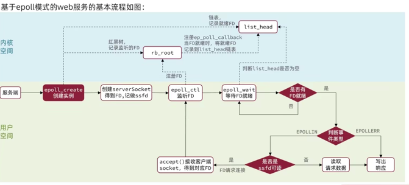

# <a id='network_fun'>网络函数</a>
套接字的组成 :
* 协议 : 套接字描述符(socketfd)所在文件地址上存储着协议的具体内容。
  * 在未绑定端口前，它代表着一个具体协议的副本，在绑定端后之后，它代表着该协议的具体连接的一端
  * 套接字描述符 : unix 一切皆文件的理念，网络协议的一个具体实现的指针 
* 地址 : ip 地址
* 端口 : 端口号
### socket函数
定义一个通信协议，并返回指向其的int类型的文件描述符。负数(-1)代表失败
* C语言函数定义
~~~c
#include <sys/socket.h>
int socket(int family,int type,int protocol)
~~~
* family : 协议族
* type : 套子节类型

 | type\famliy    | AF_INET  | AF_INET6 | AF_LOCAL | AF_ROUTE | AF_KEY |
 |----------------|----------|----------|----------|----------|--------|
| SOCK_STREAM    | TCP/SCTP | TCP/SCTP |          |          |        |
| SOCK_DGRAM     | UDP      | UDP      |          |          |        |
| SOCK_SEQPACKET | SCTP     | SCTP     |          |          |        |
| SOCK_RAW       | IPv4     | IPv6     |          |          |        |
* protocol : 协议类型常量
 * IPPROTO_TCP : TCP
 * IPPROTO_UDP : UDP
 * IPPROTO_SCTP : SCTP
* return（返回值）: 套接字描述符(sockfd)
* 意义： socket描述符是一个地址，该地址上存储着协议的具体内容

### bind函数
把一个本地协议地址赋予一个套接字。为一个套接字绑定本地的IP和端口号。之后它将该socket就代表着tcp连接的一端
* c语言定义
~~~c
#include <sys/socket.h>

int bind(int sockfd,const struct sockaddr *myaddr,socketlen_t addrlen);

~~~
* socketfd : socket描述符，指向协议具体的实现
* myaddr : 本地IP和端口号组成的地址.
  * 如果指定了IP，客户端发起请求的IP和服务端监听的IP不一致，ACK将会被RST替代，进而结束TCP连接
    * 为什么IP会不一致呢？
      * 使用ifconfig，你可以看到计算机会有多个地址，包括：回环地址(127.0.0.1),ipv4,ipv6
  * 如果不指定IP，IP将不再作为验证条件。主动方tcp首部的目的地址的IP就作为连接中被动方的IP
  * 如果port未指定，操作系统会选择一个临时端口。端口往往作为传输层分发请求到进程的凭据，不能随机应变的。
* addrlen : 协议的长度
* return : 0 成功 -1 出错
* 方法结束后，端口即被占用状态，无法再此绑定到其他套接字，直到端口被释放。

### connect函数
向一个指定的服务发起tcp连接
* C语言函数定义
~~~c
#include <sys/socket.h>

int connect(int socketfd,const struct sockaddr *socketaddr,socklen_t addrlen);

struct sockaddr {
 uint8_t sa_len;         /*无符号8位整数 结构长度*/
 sa_family_t sa_family;  /* address family : AF_XXX value*/
 char sa_data[14];       /* protoco-specific address*/
}
~~~
* socketfd    : socket文件描述，通过socket()函数获取到的
* *socketaddr : 目标地址的ip:port
* socketlen_t : socketaddr的大小
* 返回值：0:成功 -1:失败

### listen 函数
把一个套接字从主动状态转变为被动状态。根据TCP协议 ，将一个socket转化为listen状态。
* C语言函数定义
~~~c
#include <sys/socket.h>
int listen(int socketfd,int backlog);
~~~
* socketfd 文件描述符，此描述符一定是一个初始化过了的（至少拥有端口）
* backlog:要求内核为当前套接字排队的最大连接数 [套接字队列](../../io/tcp/readme.md#a-idtcpbacklog服务端被动建立连接的过程a)。这个参数Jdk包括netty框架都有暴露出来，让开发者自定义

### accept 函数
从已完成连接的队列中获取一个连接。如果队列未空，则线程进入睡眠
* c语言定义
~~~c
#include <sys/socket.h>
int accept(int socketfd,struct sockaddr *cliaddr , socketlen_t *addrlen);
~~~
* socketfd : 本地的一个监听套接字描述符
* *cliaddr : 这其实也是一个返回值，在调用结束后，该对象会存放客户端的socket_addr信息。
  * **可以视作返回值。null表示不获取该值**
* *addrlen : 同上，也是一个返回值，内核存在该套接字地址结构内的确切字节数。
  * **可以视作返回值。null表示不获取该值**
* return : 由内核自动生成的一个全新的套接字描述符，代表着一个客户端的tcp连接。
  * -1 表示发生错误。但不一定是本地socketfd发生了错误，也可能是队列长度太大，从队列弹出的客户端tcp连接已经死亡了。所以跳过开始下一个就好

### close函数

### read函数
* read / write
  * ssize_t read(int fd,void *buf,size_t len);
  * ssize_t write(int fd,void *buf,size_t len);
    * return 成功返回读写字节数，失败返回-1
* readv / writev
  * ssize_t readv(int filedes,const struct iovec *iov,int iovcnt);
  * ssize_t writev(int filedes,const struct iovec *iov,int iovcnt);
* recv / send
  * ssize_t recv(int socketfd,void *buf,size_t len,int flags);
  * ssize_t send(int socketfd,void *buf,size_t len,int flags);
* recvfrom
  * ssize_t recvfrom(int socketfd,void *buf,size_t len,int flags,struct socketaddr *src_addr,socketlen_t *addrlen);
  * ssize_t sendto(int socketfd,void *buf,size_t len,int flags,struct socketaddr *src_addr,socketlen_t *addrlen);
* recvmsg / sendmsg
  * ssize_t recvmsg(int sockfd,struct msghdr *msg , int flags);
  * ssize_t sendmsg(int sockfd,struct msghdr *msg , int flags);
    
* pread 针对文件的，可以获取输入流的大小
* readn 按行读取

| 命令            | read/write | readv/writev  | pread    | readn | recv/send | recvfrom/sendto | recvmsg/recvmsg |
|---------------|------------|---------------|----------|-------|-----------|-----------------|-----------------|
| 任何描述符         | 是          | 是             |          |       |           |                 |                 |
| 仅socket读写     |            |               |          |       | 是         | 是               | 是               |
| 单个缓冲区读/写      | 是          |               | 是        | 是     | 是         | 是               |                 |
| 分散/集中/读/写     |            | 是             |          |       |           |                 | 是               |
| 可选flag标记      |            |               |          |       | 是         | 是               | 是               |
| 可选对端地址        |            |               |          |       |           | 是               | 是               |
| 可选控制信息        |            |               |          |       |           |                 | 是               |
| 相较于read/write |            | 允许单次调用操作多个缓存区 | 预读获取文件大小 | 读取一行  | 多了flags参数 | udp专用           | socket通用方法      |
--------------------------------------------------

* flags参数：
* iovec *iov 参数 数组指针的地址。参数指定多个缓存区地址
~~~c
struct iovec {
    void * iov_base; /*starting address of buffer*/ 
    size_t iov_len; /*size of buffer*/
};
~~~
  

### IO 复用
#### IO就绪的触发条件
* 读就绪
  * 缓冲区内有数据可读。（有数据的标准是字节数是否达到低水位标记：SO_RCVLOWAT选项可配置，默认为1）
  * 读半关闭 : 接收到TCP的FIN数据报。
    * 这种
* 写就绪
  * 

#### 复用相关函数
* select函数
  * select函数
~~~
typedef struct {  
   // 这里就是关键了，fd_set能表示的文件描述符数量 = __fds_bits.length * long.length;
   // 早期版本中，数组的最大长度是32，long类型在32位系统中，也只有32位。因此认为FD_SETSIZE = 32 * 32 = 64
    unsigned long __fds_bits[FD_SETSIZE / __NFDBITS];  
} fd_set;

int select(
  int nfds,
  fd_set *readfds, // 读集合
  fd_set *writefds, // 写集合
  struct timeval *timeval
)

// 我们来看看，C中宏FD_SET的伪代码， 该函数用于将fd转换并填充 fd_set

#define __NFDBITS   /* 每个 long 能表示的文件描述符位数，通常是 32 或 64 */  
#define __FD_MASK   (/* __NFDBITS 位的全 1 掩码 */)  
  
void FD_SET(int fd, fd_set *set) {  
    unsigned long *bits = set->__fds_bits;  
    unsigned long index = fd / __NFDBITS;  
    unsigned long offset = fd % __NFDBITS;  
    bits[index] |= (1UL << offset); // 设置相应位为 1  
}
~~~
  * 
* pselect函数
  * 文件操作
* poll函数
  * 
  * 它实际就是select的升级版本，为了解决bitmap有数量上限的问题。
  * 如图中poll函数定义用于，
* fcntl 函数
  * 配置socket参数，阻塞或者非阻塞等
* epoll函数
  * 和select/poll不一样，它是一组函数
  *  epoll_create(size) 返回一个epoll描述符，参数size用来告诉内核监听的文件描述符的个数，跟内存大小有关
  * int epoll_ctl(int epfd, int op, int fd, struct epoll_event *event) 控制某个epoll监控的文件描述符上的事件：注册、修改、删除
    * epfd epoll文件描述符
    * op 动作：新增、修改、删除
    * fd 目标文件
    * event 本次操作文件新增/修改/删除的事件
  * int epoll_wait(int epfd, struct epoll_event *events, int maxevents, int timeout)  等待所监控文件描述符上有事件的产生
    * epfd : epoll描述符
    * *events ：事件数组（用于存储返回的事件集合）
    * maxevents：告知内核events数组的大小
    * timeout -1:阻塞 0:非阻塞 >0 阻塞时间
    * return 成功返回有多少文件描述符就绪，时间到时返回0，出错返回-1
  * 
  * epoll-model : 
  * epoll 实战 
  * 来看个具体的实例：
~~~ c
// 创建一个epollfd对象
int epollfd = epoll_create1(0);  
if (epollfd == -1) {  
    perror("epoll_create1");  
    return 1;  
}
//构建epoll_event对象
struct epoll_event ev, events[MAX_EVENTS];  
int fd; // 假设这是你要监视的文件描述符  
ev.events = EPOLLIN; // 监视读事件  
ev.data.fd = fd;     // 与事件关联的文件描述符  

//将fd添加到监听列表中
if (epoll_ctl(epollfd, EPOLL_CTL_ADD, fd, &ev) == -1) {  
    perror("epoll_ctl: add");  
    return 1;  
}
while(1){
  // 查询监听结果
  int num_events = epoll_wait(epollfd, events, MAX_EVENTS, -1);  
  if (num_events == -1) {  
      perror("epoll_wait");  
      return 1;  
  }
  
  // events中存储的就是有事件的fd集合啦
  // 当然jdk本地方法中到这就结束了，select()方法返回events[i].data.fd集合。
  for (int i = 0; i < num_events; ++i) {  
      int fd1 = events[i].data.fd ;
      // LT模式，每次读取部分，所以下一次循环时该fd还会再触发，知道数据读完为止
      read(fd1,buf,1024);
      
      //ET模式 循环读，直到把流读空。这样下一次循环时，就不会再触发了。
      while(read(fd1,buf,1024)>0){
        read(fd1,buf,1024);
      }
      
  }
}

~~~
# 文件函数

# 进程/线程函数
