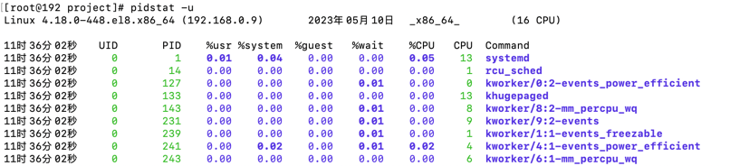
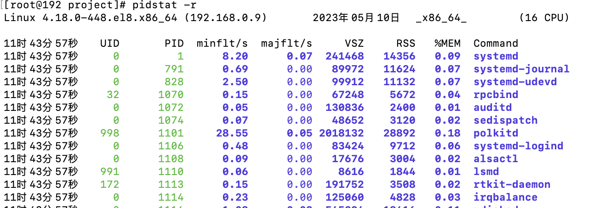
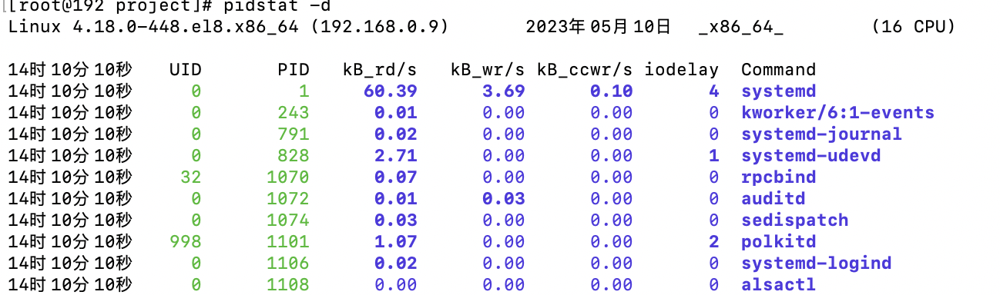
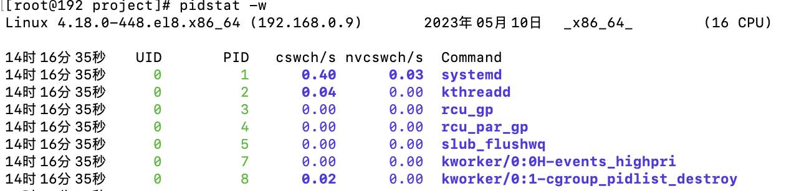
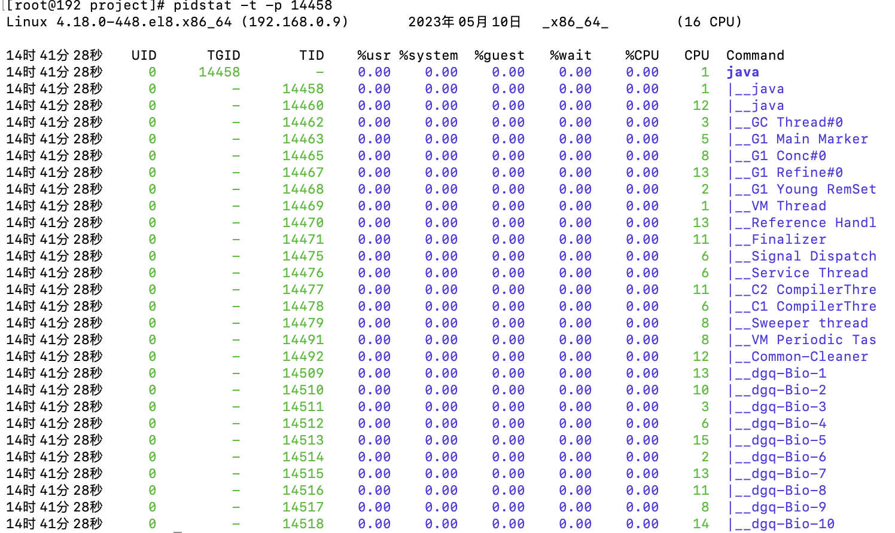

# pidstat
* pidstat首次运行时显示自系统启动开始的各项统计信息，之后运行pidstat将显示自上次运行该命令以后的统计信息。
* 用户可以通过指定统计的次数和时间来获得所需的统计信息。
  * pid -command   times interval
  * 在命令的后面追加的两个数字，分别为次数和间隔

### pidstat -u  cpu统计

* 第一行为系统简介
* 表格为CPU使用情况统计
  * 第一列为采样时间点
  * uid 启动应用的用户ID 可使用【getent passwd】命令查看
  * pid 进程ID
  * %usr 进程在用户空间占用cpu的百分比
  * %system：进程在内核空间占用cpu的百分比
  * %guest：进程在虚拟机占用cpu的百分比
  * %CPU：进程占用cpu的百分比
  * CPU：处理进程的cpu编号
  * Command：当前应用的启动命令

### pidstat -r 内存统计

* 第一行为系统简介
* 表格为内存使用情况统计
  * 第一列为采样时间点
  * uid 启动应用的用户ID 可使用【getent passwd】命令查看
  * pid 进程ID
  * Minflt/s: 不需要从磁盘中加载页
  * Majflt/s: 需要从磁盘中加载页
  * VSZ：虚拟内存
  * RSS：物理内存
  * %MEM: 内存使用百分比
  * Command：当前应用的启动命令

### pidstat -d 磁盘IO统计

* 第一行为系统简介
* 表格为IO使用情况统计
    * 第一列为采样时间点
    * uid 启动应用的用户ID 可使用【getent passwd】命令查看
    * pid 进程ID
    * kB_rd/s 每秒从磁盘读取的KB
    * kB_wr/s 每秒往磁盘写的KB
    * kB_ccwr/s 任务取消的写入磁盘的KB。当任务截断脏的pagecache的时候会发生。
    * iodelay  任务的I/O阻塞延迟，以时钟周期为单位，包括等待同步块 I/O 和换入块 I/O 结束的时间
    * Command：当前应用的启动命令

### pidstat -w  上下文切换次数： 以进程纬度统计的

* 第一行为系统简介
* 表格为IO使用情况统计
    * 第一列为采样时间点
    * uid 启动应用的用户ID 可使用【getent passwd】命令查看
    * pid 进程ID
    * Cswch/s:每秒主动任务上下文切换数量
    * Nvcswch/s:每秒被动任务上下文切换数量
    * Command：当前应用的启动命令

### pidstat -t -p [pid] 查询线程CPU使用信息

* 第一行为系统简介
* 表格为线程的CPU使用情况统计
  * 第一列为采样时间点
  * uid 启动应用的用户ID 可使用【getent passwd】命令查看
  * TGIO 主进程ID 从command可以看出来，主次是有个树形结构的
  * TID 线程ID
  * %usr 进程在用户空间占用cpu的百分比
  * %system：进程在内核空间占用cpu的百分比
  * %guest：进程在虚拟机占用cpu的百分比
  * %CPU：进程占用cpu的百分比
  * CPU：处理进程的cpu编号
  * Command：当前应用的启动命令 / 线程名称
