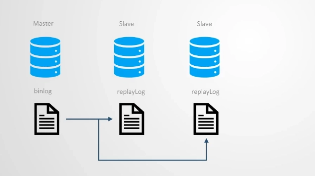
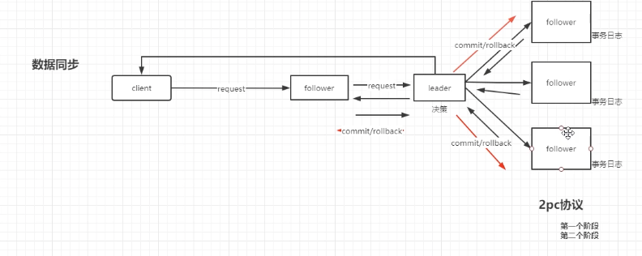
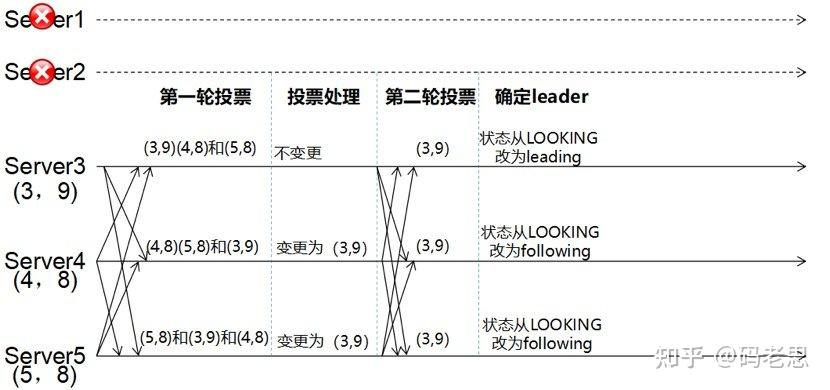
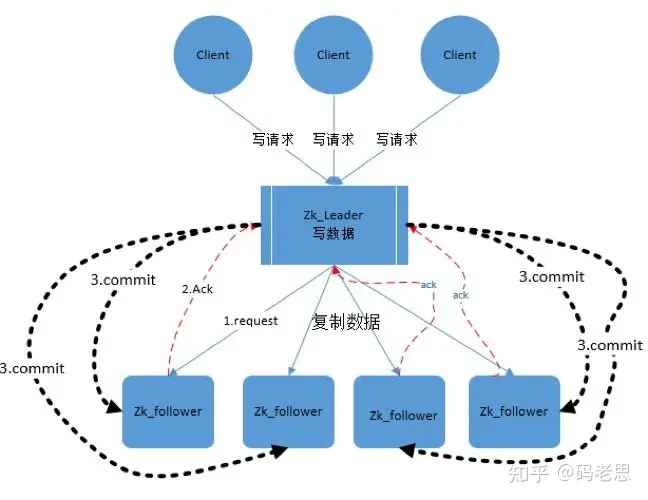

# 分布式协调（同步）组件
### 分布式场景下的一致性能问题：
* 拜占庭问题背景：一组拜占庭将军分别各率领一支军队共同围困一座城市。为了简化问题，将各支军队的行动策略限定为进攻或撤离两种。因为部分军队进攻，部分军队撤离可能会造成灾难性后果，因此各位将军必须通过投票来达成一致策略，即所有军队一起进攻或所有军队一起撤离。因为各位将军分处城市不同方向，他们只能通过信使互相联系
* 拜占庭问题原因：信使可能叛变，或者在传信的图中遭遇劫杀
* 拜占庭问题本质： 在存在消息丢失的不可靠信道上试图通过消息传递的方式达到一致性是不可能的。

### 分析
* 所谓一致性具体到操作可分为：
  * 写读一致性 : 线程A或者客户端A发起的写(insert or update)请求,完成后，其他的线程或者客户端可以读取到正确的值
  * 写写一致性 : 写请求具有顺序一致性，不会发生线程B把线程A的数据覆盖
  * 读读和读写，没有这两种情况，只有预言家需要吧
* 单节点应用保证一致性的方案很简单，他们毕竟是内存共享模型。
  * 内存共享模型也不是天然就有一致性，线程缓冲区也会造成数据隔离(高速缓冲区)，需要额外的处理。
  * 比如redis的单线程，java的volatile或者锁机制
* 分布式存储系统一定会保证写写一致性。例如下面这些中间件。他们都保证了弱一致性
  * zk 的写使用同一客户端进行写操作，而写操作具有原子性
  * redis集群模式可以多主节点同时写，但是它是经过分区的，单个key最终还是会在同一个节点进行操作
  * es 的解决方案和redis差不多
* 集群模式下基本都是采用主从模式或者hash分区模式，或者2者兼而有之
  * 对于主从模式，从节点实时复制主节点数据，而这个过程必然存在时间差，主从无法保证数据一致性
  * 如需实现写读一致性，必须要实现2pc协议，主节点进行的写操作，必须要等到所有从节点都完成了同步才能完成  
* 而对于强一致性，基本没有采用完整的2pc协议，因为确实太影响性能了
  * 过半提交。2pc太费，完全不保证呢又舍不得。所以中间策略，超过一定比例的从节点成功同步的时候就算写请求完成
    * zk 、 es 等都采用这种方式。当然，你也可以把比例配置为100%，那就是强一致了。或者zk也开放了sync()这样的API
  * 或者就干脆不要了。坦坦荡荡，我就是AP系统
    *  redis 就是这样。
* eureka 是个特例。这家伙根本没有一致性保障。弱一致性都没有，各节点平等，广播所有更新。它是实实在在的最终一致性。
  * 当然它的性能也是最好的。对于计算存储分离的应用系统而言，作为他们的注册中心丝毫没问题。
  * 即使发生脑裂，只要脑裂后的微服务结构是完整的，那么该分布式集群依然可以正常服务。

### 解决方案

##### 共享内存
**分布式系统一致性的一种解决方案，就是计算和存储分隔开，集群中的数据都来自关系型数据库，而数据库天然具有一致性**
* 关系型数据库ACID原则：该原则是针对数据库的，要求数据库的数据具有强一致性
  * 原子性（Atomicity）：每次事务都是原子的，事务包含的所有操作，要么全部成功，要么全部失败，一旦有失败，则需要回退到执行事务之前； 
  * 一致性（Consistency）：数据库的状态在事务执行前后的状态是一致和完整的，无中间状态，即只能处于成功事务提交后的状态； 
  * 隔离型（Isolation）：各种事务可以并发执行，但彼此之间互相不影响。按照标准 SQL 规范，从弱到强可以分为读未提交、读已提交、可重复读和串行化。
  * 持久性（Durability）：状态的改变是持久的，不会失效。一旦某个事务提交，则它造成的状态变更就是永久的。

##### 主从模型
**一般都是数据存储系统中使用。主节点进行事物处理，从节点复制主节点数据。即状态机复制。如图：**
主从模型又分为两种实现方式：
* 固定主节点。
  * 如redis。这种主从模型不支持主节点故障自愈，为了高可用可以选择多主节点集群部署。
  * 各主节点是平等的，通过一致性hash把数据分区存储在不同主节点上
  * 发生故障时，可把从节点升级为主节点
* 选举方式。该方式在启动时或者原主节点宕机时，所有节点是平等的，通过一定的选举算法，选举出新的节点。在此期间，服务不可用
  * 选举主节点 (保证分区容错和高可用，主节点挂掉服务依旧可用)
  * 数据同步 (保证数据一致性)
###### 这样就会出现一些问题：
* FLP 不可能原理：在网络可靠、但允许节点失效（即便只有一个）的最小化异步模型系统中，不存在一个可以解决一致性问题的确定性共识算法
* BASE原则：在大型高可用分布式的场景下，牺牲掉对强一致性的要求，转而寻求最终一致性。
* CAP 原理：分布式系统无法同时确保一致性（Consistency）、可用性（Availability）和分区容忍性（Partition）
  * 一致性（Consistency）：任何事务应该都是原子的，所有副本上的状态都是事务成功提交后的结果，并保持强一致；
  * 可用性（Availability）：系统（非失败节点）能在有限时间内完成对操作请求的应答；
  * 分区容忍性（Partition）：系统中的网络可能发生分区故障（成为多个子网，甚至出现节点上线和下线），即节点之间的通信无法保障。而网络故障不应该影响到系统正常服务。
  * 设计中往往需要弱化对某个特性的需求。该原理认为，分布式系统最多只能保证三项特性中的两项。
  * AP：你发一个请求，我先给你响应，响应完成后你才能进行同步操作
  * CP：是发出请求之后先同步，所有都同步完后，再返回响应。我们使用的zk其实就是多数派的，只要超过一半成功，就返回信息。
###### 同步算法基本大差不差
* 两阶段提交算法(2PC)
  * 预提交（PreCommit）：协调者（Coordinator）发起执行某个事务的执行并等待结果。各参与者（Participant）执行事务但不提交，反馈是否能完成，并阻塞等待协调者指令
  * 正式提交（DoCommit）：协调者如果得到所有参与者的成功答复，则发出正式提交指令，否则发出状态回滚指令。
* 三阶段提交算法(3PC)
  * 询问提交（CanCommit）：协调者询问参与者是否能进行某个事务的提交。参与者需要返回答复是否准备好，但无需执行提交，也无需阻塞。这就避免出现参与者被阻塞的情况； 
  * 预提交（PreCommit）：协调者检查收集到的答复，如果全部为真，则发起执行事务请求。各参与参与者（Participant）需要执行事务但不提交，并反馈能否完成。注意此时说明所有参与者都已经处于准备好状态。； 
  * 正式提交（DoCommit）：协调者如果得到所有参与者的成功答复，则发出正式提交请求，否则发出状态回滚指令。本阶段时，如果参与者一直收不到请求，则超时后继续提交。
###### 常用一致性算法
* paxos（帕克索思） 算法
  * 2pc算法
  * [看不懂看不懂，根本看不懂](https://zhuanlan.zhihu.com/p/630468476)
* raft 算法
  * [raft流程演示](https://acehi.github.io/thesecretlivesofdata-cn/raft/)
  * 选举：
    * 每个节点可成为主节点的概率相同
    * 主节点冲突通过随机超时间来解决
* ZAB 算法
  * 该算法是paxos的改良版，区别在于其写操作只能由主节点完成
  * 
  * 节点分为
    * leader：  Zookeeper集群的核心角色，在集群启动或崩溃恢复中通过Follower参与选举产生，为客户端提供读写服务，并对事务请求进行处理。 
    * Follower：Zookeeper集群的核心角色，在集群启动或崩溃恢复中参加选举，没有被选上就是这个角色，为客户端提供读取服务，也就是处理非事务请求，Follower不能处理事务请求，对于收到的事务请求会转发给Leader。 
    * Observer：观察者角色，不参加选举，为客户端提供读取服务，处理非事务请求，对于收到的事务请求会转发给Leader。使用Observer的目的是为了扩展系统，提高读取性能。
  * 选举过程
    * 
    * 特点：优先事物编号大的作为主节点，其次根据节点启动项配置的优先级。避免主节点冲突问题
  * 广播消息
    * 
    * 和标准2pc区别在于当leader挂掉的时候，事物在超时后自动提交。当新的leader选举时，过半规则会使得至少一个acceptor的事物编号是最新的。

## 常用的分布式协调组件
* [zk](Zookeeper.md)
* [eureka](./eureka.md)
* [nacos](./nacos.md)

## 关于一致性思考
##### 顺序一致性 & 存储一致性
* 存储一致性是分布式系统中必须要考虑的问题。
* 存储一致性的一种解决方案就是顺序一致性。如果所有的操做(包括读写)的执行都具有完全的顺序一致性，那存储必然是一致的。
* 归根结底，其实还是多线程/多客户端对于临界数据访问的安全性问题
* 在业务开发中能遇到的一致性问题，也可以采用相同的解决方案
  * 分布式锁。这是常规的解决方案，但是他不具备顺序一致性
    * redis
    * zk
    * mysql 行锁
  * 消息队列(中间件、本地队列)。让操作串行化。当然这个还需要搭配选主模式
  * 跨节点事务。2pc协议
##### 弱一致性的问题
* 幂等性屏蔽不一致带来的问题
* 分布式锁，利用谢谢一致性屏蔽写读一致性问题
* 需要强一致性的可以只选择读写分离，放弃多主集群部署
