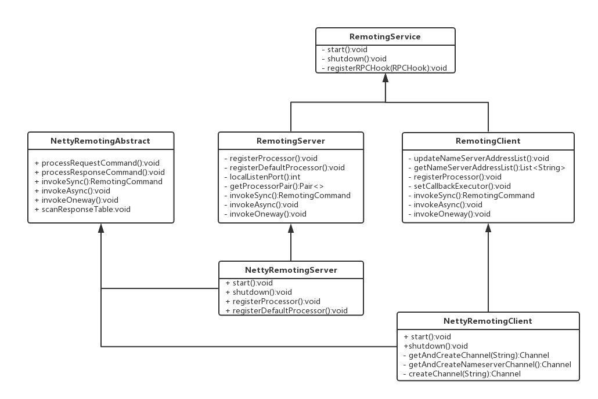

# rocketMQ RPC 通信 ：netty
##### 整体架构

**协议内容这里就跳过了。不去过分研究。这里主要看看netty的使用**

## 客户端
~~~java buildNettyClient
  public class NettyRemotingClient{
    Bootstrap bootstrap = new Bootstrap();
    
    public void start(){
        // boss 线程池
        this.eventLoopGroupWorker = new NioEventLoopGroup( 
                // boss 线程池写死 1
                1,
                new ThreadFactory() {
            private AtomicInteger threadIndex = new AtomicInteger(0);
            @Override
            public Thread newThread(Runnable r) {
                return new Thread(r, String.format("NettyClientSelector_%d", this.threadIndex.incrementAndGet()));
            }
        });
        // worker 线程池
        this.defaultEventExecutorGroup = new DefaultEventExecutorGroup(
                // 设置工作线程池数
                nettyClientConfig.getClientWorkerThreads(),
                new ThreadFactory() {
                    private AtomicInteger threadIndex = new AtomicInteger(0);
                    @Override
                    public Thread newThread(Runnable r) {
                        return new Thread(r, "NettyClientWorkerThread_" + this.threadIndex.incrementAndGet());
                    }
                });

        Bootstrap handler = this.bootstrap.group(this.eventLoopGroupWorker).channel(NioSocketChannel.class)
                // 禁用Nagle算法
                .option(ChannelOption.TCP_NODELAY, true)
                // 禁用TCP长连接检测
                .option(ChannelOption.SO_KEEPALIVE, false)
                // 设置连接超时时间
                .option(ChannelOption.CONNECT_TIMEOUT_MILLIS, nettyClientConfig.getConnectTimeoutMillis())
                .handler(new ChannelInitializer<SocketChannel>() {
                    @Override
                    public void initChannel(SocketChannel ch) throws Exception {
                        ChannelPipeline pipeline = ch.pipeline();
                        if (nettyClientConfig.isUseTLS()) {
                            if (null != sslContext) {
                                pipeline.addFirst(defaultEventExecutorGroup, "sslHandler", sslContext.newHandler(ch.alloc()));
                                log.info("Prepend SSL handler");
                            } else {
                                log.warn("Connections are insecure as SSLContext is null!");
                            }
                        }
                        pipeline.addLast(
                                defaultEventExecutorGroup,
                                new NettyEncoder(),
                                new NettyDecoder(),
                                new IdleStateHandler(0, 0, nettyClientConfig.getClientChannelMaxIdleTimeSeconds()),
                                new NettyConnectManageHandler(),
                                new NettyClientHandler());
                    }
                });
        if (nettyClientConfig.getClientSocketSndBufSize() > 0) {
            log.info("client set SO_SNDBUF to {}", nettyClientConfig.getClientSocketSndBufSize());
            handler.option(ChannelOption.SO_SNDBUF, nettyClientConfig.getClientSocketSndBufSize());
        }
        if (nettyClientConfig.getClientSocketRcvBufSize() > 0) {
            log.info("client set SO_RCVBUF to {}", nettyClientConfig.getClientSocketRcvBufSize());
            handler.option(ChannelOption.SO_RCVBUF, nettyClientConfig.getClientSocketRcvBufSize());
        }
        if (nettyClientConfig.getWriteBufferLowWaterMark() > 0 && nettyClientConfig.getWriteBufferHighWaterMark() > 0) {
            log.info("client set netty WRITE_BUFFER_WATER_MARK to {},{}",
                    nettyClientConfig.getWriteBufferLowWaterMark(), nettyClientConfig.getWriteBufferHighWaterMark());
            handler.option(ChannelOption.WRITE_BUFFER_WATER_MARK, new WriteBufferWaterMark(
                    nettyClientConfig.getWriteBufferLowWaterMark(), nettyClientConfig.getWriteBufferHighWaterMark()));
        }

        this.timer.scheduleAtFixedRate(new TimerTask() {
            @Override
            public void run() {
                try {
                    NettyRemotingClient.this.scanResponseTable();
                } catch (Throwable e) {
                    log.error("scanResponseTable exception", e);
                }
            }
        }, 1000 * 3, 1000);

        if (this.channelEventListener != null) {
            this.nettyEventExecutor.start();
        }
    }
}
~~~

## 服务端
