[TOC]
## 冯·诺伊曼结构 
####主要内容
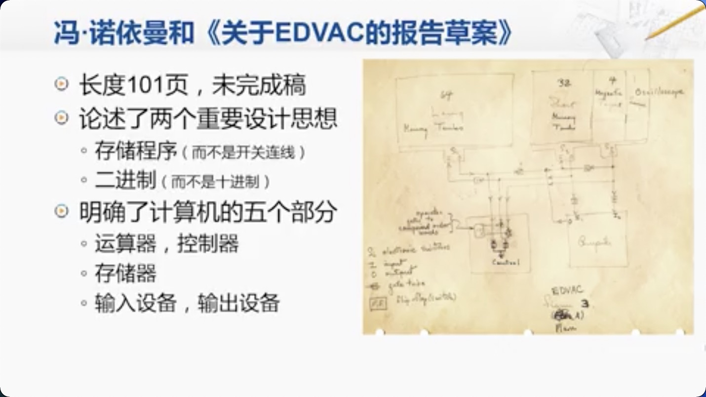  

####要点：
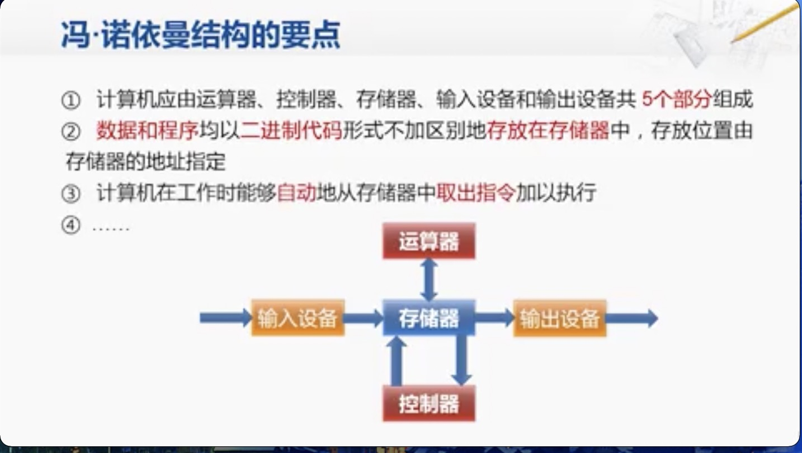  

####原理：  
冯·诺伊曼CPU的运作原理可分为四个阶段：提取、译码、执行和写回 
  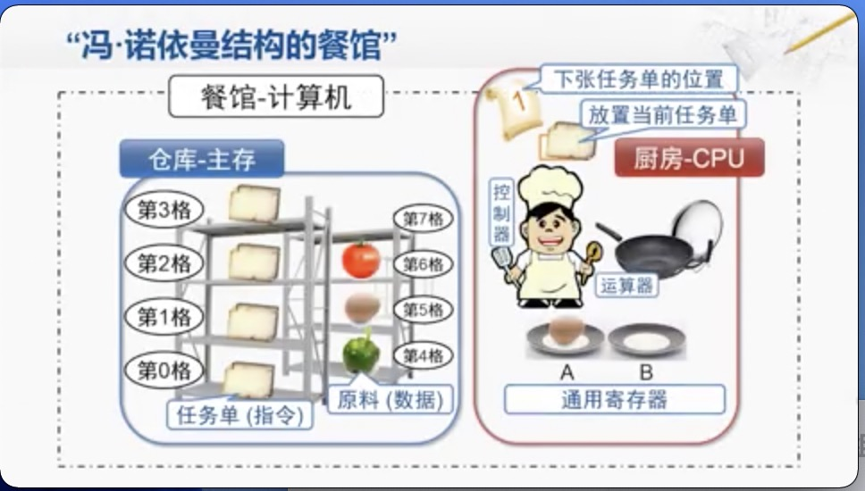
* 提取：  
由程序计数器指定程序存储器的位置，程序计数器保存供识别目前程序位置的数值 
 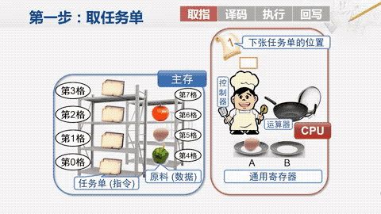
* 译码：
指令被拆解为有意义的片段  
 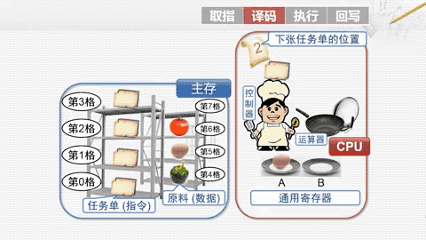  
* 执行：  
连接到各种能够进行所需运算的CPU部件   
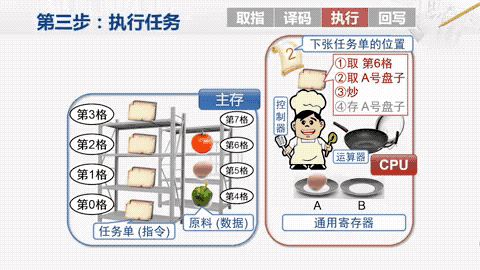  

* 写回： 
以一定格式将执行阶段的结果简单的写回。运算结果经常被写进CPU内部的寄存器，以供随后指令快速访问 
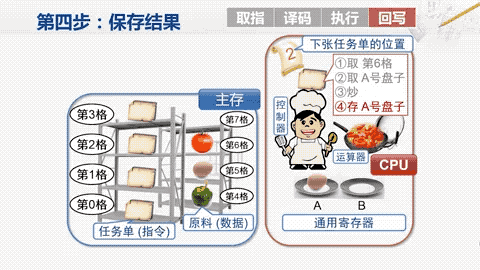

#### 冯·诺伊曼结构简化模型
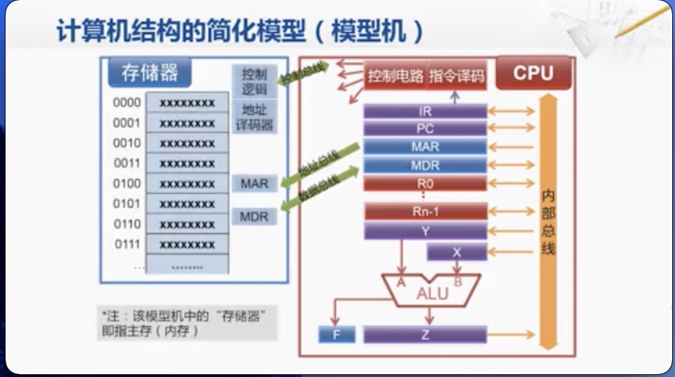

##### 存储器模型
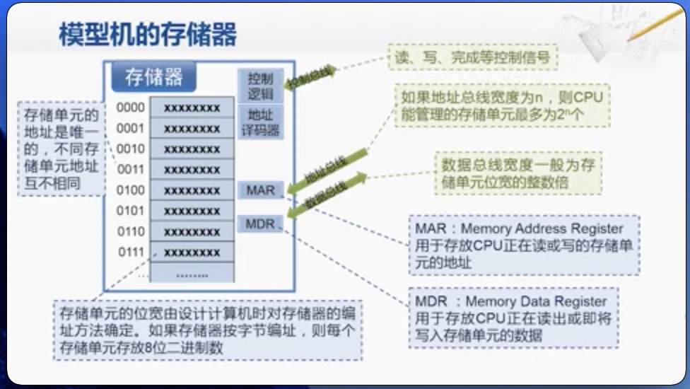
##### CPU模型
* 控制器模型
 
每个组建功能详情： 
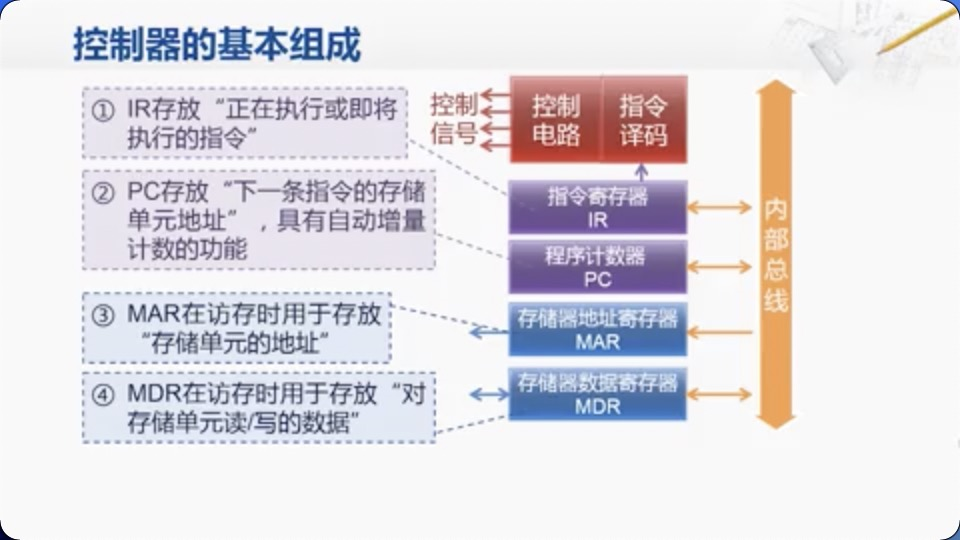
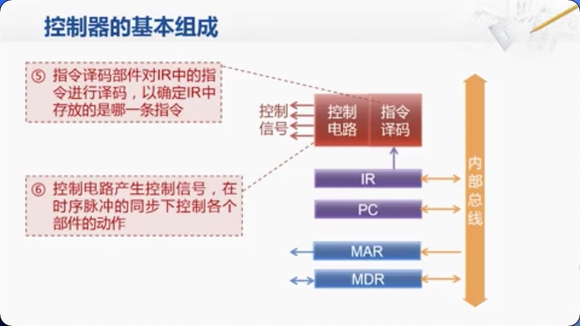
* 运算器模型
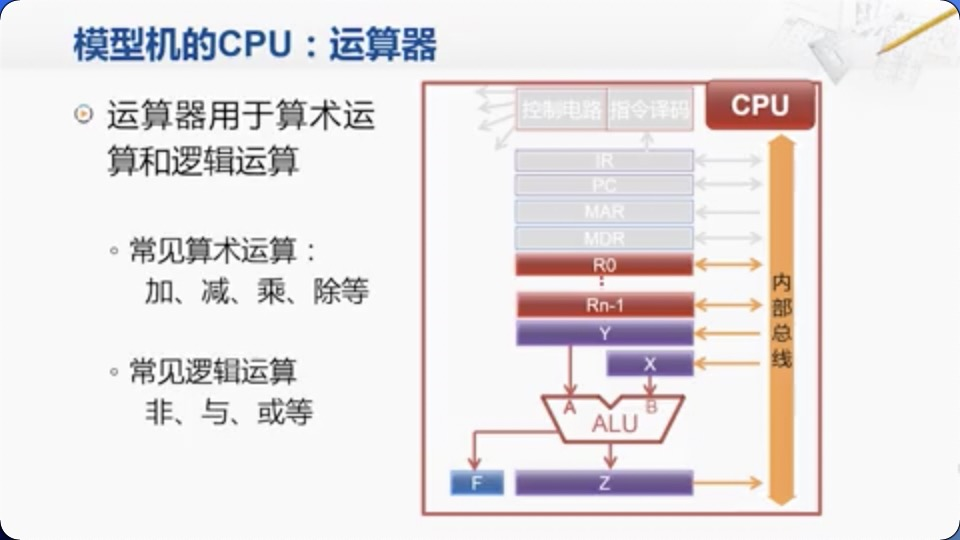
详情 
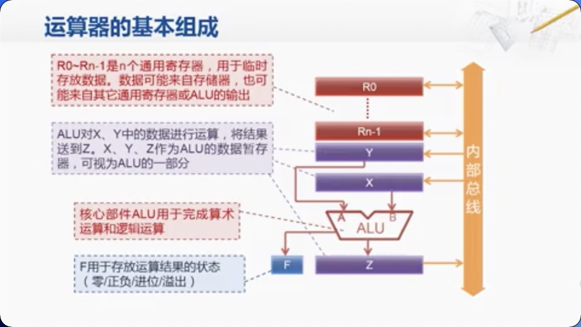
* CPU内部总线
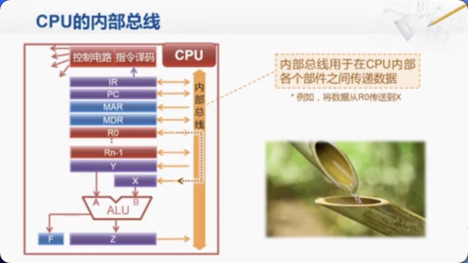

#### 计算机指令执行步骤  
使用加法指令来看整个流程的进行  
一条指令，包含指令和0个或多个操作数，例如 add为具体指令  
R0即是源操作数，也是目的操作数，表示R0寄存器上的数值为入参数，同时结果也存放在R0寄存器上  
[6]为操作数，具体在存储器上编号为6的位置上存着    
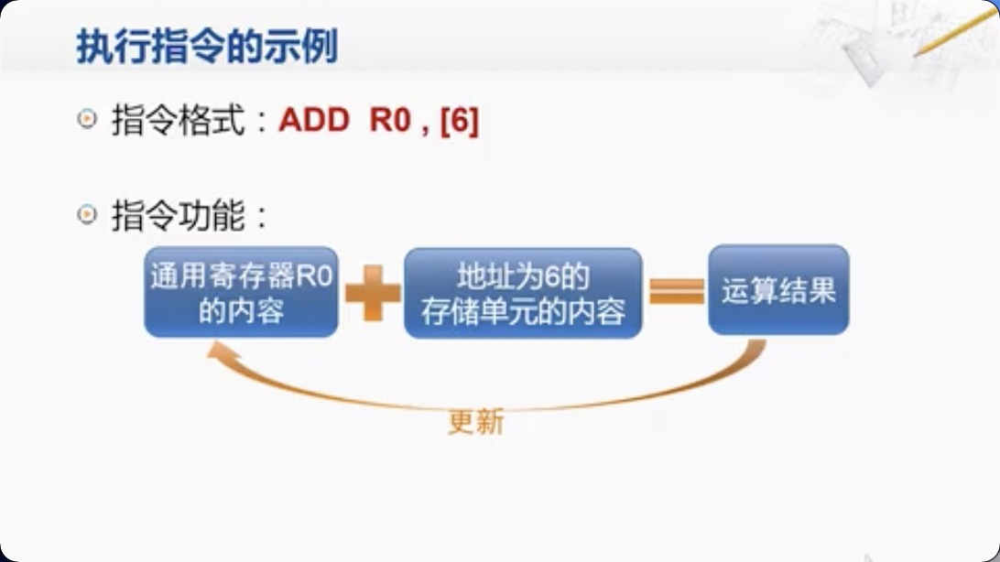 
 
* 取值:  
 1、控制器把指令的地址传入到存储器  
 2、存储器取出对应地址上的指令送回到控制器  
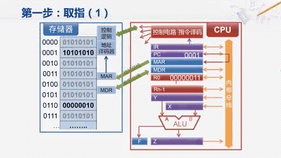
* 译码：
控制器分析指令的操作性质  
控制器向有关部件发布所需控制信号  
* 执行：  
控制器从通用寄存器或者存储器中取出操作数  
控制器命令运算器对操作数进行指令规定的运算  
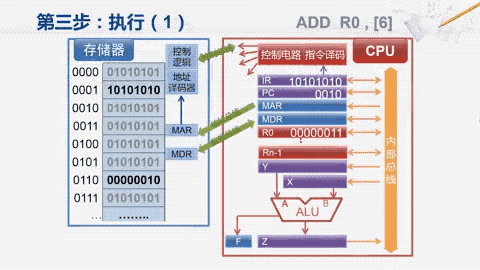
* 写回： 
将运算结果写回通用寄存器或者存储器中  
计算机输入输出设备  

#### 计算机输入输出设备  
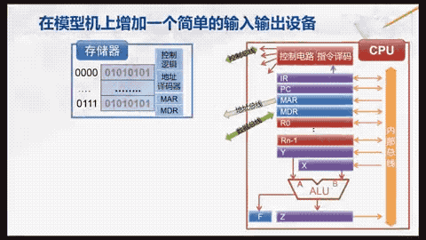
