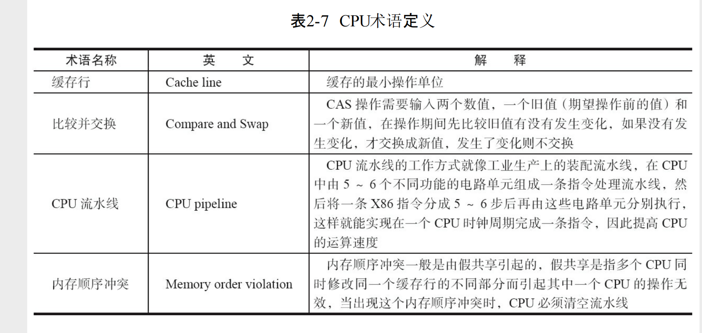

# atomic
* 本义： 不可被分割的最小粒子
* 原子操作： 不可中断的一个或者一系列操作

## 术语
 
 
## CPU实现原子性的原理
* 总线锁定  CPU输出一个LOCK信号到总线后，总线将会拒绝其他CPU的请求
* 缓存锁定  锁定制定的内存区域，使得其他CPU无法读取该区域的信息，或者已经读取的缓存行失效(利用缓存一致性协议)
     * 当制定的区域超过一个缓存行 、 或者 CPU不支持缓存锁定时，依旧使用总线锁定
* 缓存一致性协议  在多CPU的环境下，缓存在多个缓存行中的共享数据，保持数据的一致性

## java中的原子性
* JVM并没有要求64位的long 和 double类型的读写具有原子性。而在32位的系统中，64位的long和double的读写可能分配在不同的总线事物中，那么这次读写就不具备原子行

 
     
