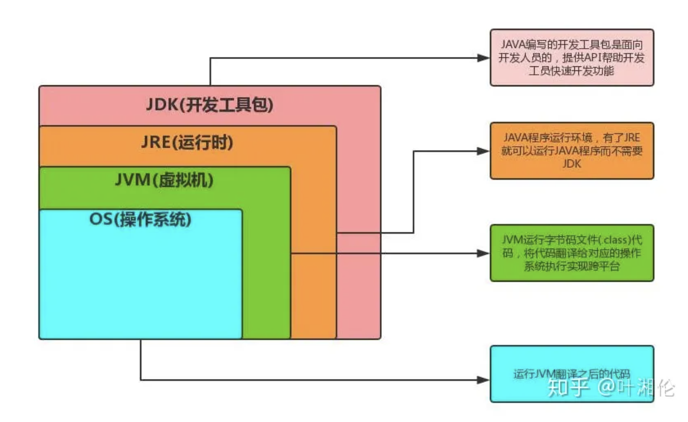
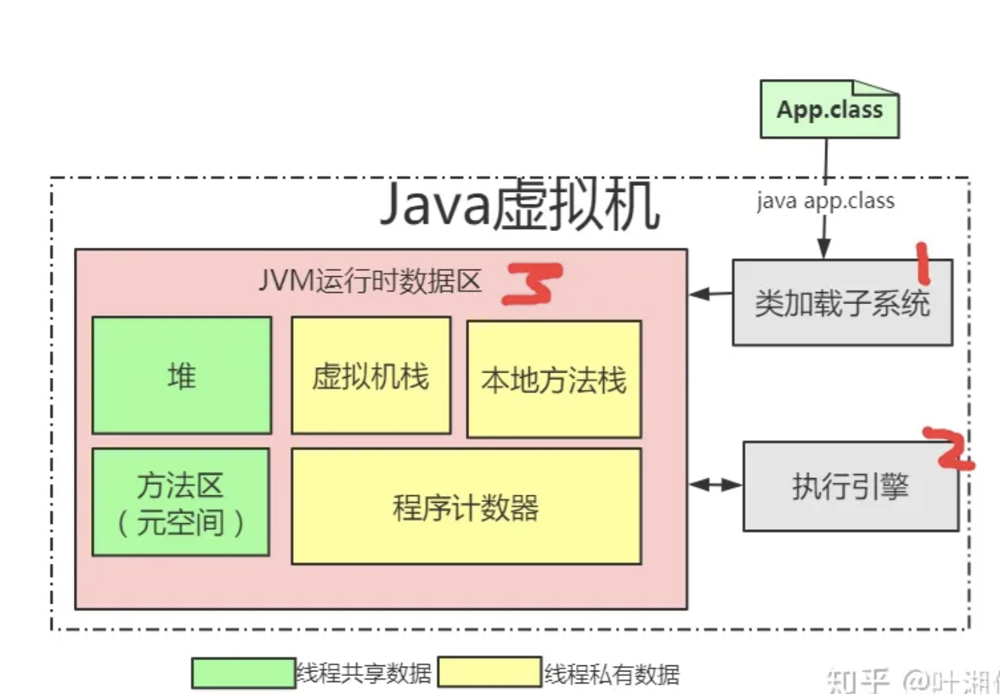

# JVM
* jdk的整体架构大致如下 
* 从图中可以看出，JVM是实现跨平台能力(屏蔽平台差异)的关键
* JVM底层由三个系统构成分别是：类加载、运行时数据区、执行引擎。

### 1、[java运行时内存区域](./runtimeMem/mem.md)

### 2、[classLoad类加载子系统](vmRunSystem/classload/classload.md)

### 3、[编译解释执行](vmRunSystem/compile/compile.md)
