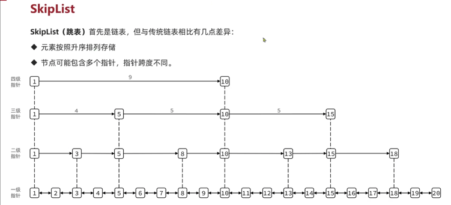

# 数据结构
### redis 实现上的数据结构

###### 动态SDS
* 解决C语言字符串的缺陷

###### intset
* 特性
  * 有序性
  * 内存根据数字大小自适应扩容
  * 唯一性（查询采用二分法查找）
* 编码：
  * content：content数组只是用来申请内存空间的，对数组的操作，需要自行通过指针进行。（在java中也是可以的哈，利用unsafe搞）
  * encoding：定义每个元素数据长度。16bit，32bit，64bit
    * 内容起始地址：intset的起始地址+64位  
    * 元素n(0开始)的起始地址：内容起始地址 + n * (encoding bit) 
* 结构示例：
  * 
* 缺陷：
  * 1、用有序数组实现set，虽然可以利用二分法实现快速查找，但是当数据量太大时，始终还是比不过hash查找的
  * 2、仅限于long类型一下的整数类型

###### zipList
* 
* 
* 典型的空间换时间策略
  * 空间：空间的极致压缩结构
    * 使用上一个节点数据长度和本节点起始指针计算上一个节点起始位置，从而获取上一个节点的完整数据
    * 使用本节点的起始节点，加上本节点的长度，获取下一个节点的起始指针。再获取下一个节点的长度，以获取完整数据
  * 时间：
    * 相比与传统双向链表，他获取上一个或者下一个节点的数据，需要额外计算才能获取到指针地址
  * 缺点：
    * 1、修改连锁反应
      * 前置节点修改了，导致长度增加，后节点也需要修改长度信息。如果数值增加的过大，还会导致下一个记录修改节点长度的区域字节增加，从导致到修改节点下一个节点长度变大，又要修改下一个的下一个节点。。。。。
    * 2、数据的完整地址必须连续的。否则无法通过计算获取
    * 3、查询只能顺序遍历，无法随机查询
  *  config： list-max-ziplist-size 

###### quickList
* 解决zipList无法一次性申请一个大内存区域，以存储大量数据

##### skipList
* 
* C语言结构体 
* 结构示例  
* 优点
  * 解决随机访问只能顺序遍历的问题

###### dict(字典)

###### 总结：

|           | 优势              | 缺陷                 | 场景                  |         |
|-----------|-----------------|--------------------|---------------------|---------|
| sds       | 解决c语言字符串不可变问题   | 需要自行访问，不能使用c语言特性   | string结构            |         |
| intset    | 有序、唯一、内存小       | 只能存long类型以下整型数据    | set结构               |         |
| zipList   | 双端队列，内存占用小      | 不能进行随机查询，数据量越大性能越差 | zset结构  hash结构      |         |
| skipList  | 双端队列，有序，随机查询效率高 | 内存占用较大，不是合适存储大量数据  | quickList的基础，hash结构 |         |
| quickList | 掩饰skipList的缺陷   |                    | list结构              |         |
| dict      | k-v结构           | 内存占用高              | hash结构              |         |

###### redisObject
* redis 中所有的key 和 value都被封装为对象： redisObject
* code： 
  * 图中的部分可以看做对象头信息，总计占用 16个字节
  * 一般情况下，redis创建一个对象分三步
    * 1、申请redisObject内容空间，将内容存入并返回指针地址
    * 2、申请redisObject头部空间，并将redisObject头部按需构建并存储
* 重点来了：
  * **redis开放的数据结构在实现上使用什么样子的存储格式就决定了 我门如何使用才能使得这种结构的性能和空间利益最大化**
* 实现对应关系 

### redis对外提供的数据结构
###### string

* string类型的数据可选3中存储结构
  * 1、int: 利用redisObject的ptr指针位存储。要求必须是整型数字，且只能存储8个字节。就是long类型数据。
    * 总结限制： 8个字节的整数（对应java的long）
  * 2、embstr: 对象头和数据连续存储。一次性申请一个较大的内存区域同时存头部和内容。这样可以节省一次申请内存的操作，写操作也可简化，以提交写入写性能
    * 总结限制： redis一次最多只申请64字节数据，除去对象头，和string的头部信息，最多额外存储44字节内容
  * 3、raw：在不满足上述条件时，string内容过大，不能一次性申请大内存，只能选择分开存储。但是能存储的最大：512MB
  * 结构示图：

###### list
* 3.2版本以后统一使用quickList存储结构

###### set
* set类型采用两种存储结构
  * 1、intset： 利用有序数组实现。可以有效的减少内存占用。也是典型的空间换时间
    * 限制 ：整数类型，且元素数量不超过set-max-intset-entries
  * 2、dict：字典类型。和java的hashSet一样，采用hashMap实现
* 总结：
  * 如果可以使用整型，尽量使用整型
  * 如果确定不能使用整型，也别浪费redis的感情，第一个元素直接存入string，断绝redis优化的势头

###### sortset
* sortset 采用两种数据结构存储
  * 1、zipList 典型的空间换时间。
    * 结构存储和唯一性都可以使用代码取解决，在数据量不多时，性能差距不大
    * 限制1：节点个数小于 zset-max-ziplist-entries : 128（默认值）
    * 限制2：节点字节数小于 zset-max-ziplist-value : 64字节（默认值）
  * 2、skipList + dict
    * skipList 满足sortset的有序性和唯一性，并天然根据score排序
    * dict 满足sortset的唯一性，以及通过元素快速查找其对应的score
    * 结构示例：
* 总结：
  * 内存损耗还是比较大的。业务需求大时再选择使用
  * 使用时，为了减少内存，可将list数量减少到 zset-max-ziplist-entries 个，value也尽量少
  * 如果内存不吃紧，其实无所谓了

###### hash
* hash 采用两种数据结构
  * 1、zipList  空间换时间策略。
    * 限制1：节点个数小于 hash-max-ziplist-entries : 512（默认值）
    * 限制2：节点字节数小于 hash-max-ziplist-value : 64字节（默认值）
  * 2、dict 字典结构。量身定制版
* 结构示例： 

###### bitmap
###### stream
###### geo
###### HyperLogLogs

### 总结
* 1、无论是key，value应该尽量减少其字节量
  * 1.1 字符串的大小保持44byte以下最好
  * 1.2 set sortset hash 元素数量少时带来的优化
* 2、long类型优于其他类型
  * set 使用intset的优化
  * string类型long类型优化
* 3、集合在内存上优于多个key

# 持久化

###### rdb
* 每个间隔一定的时间或者内存持久化一次
* 持久化的是某个时间点的内存快照
###### fork # copyOnWrite
* fork()函数生成一个子进程
* 子进程和父进程先后从fork函数返回，子进程返回0。
* 此后父子进程公用之前的内存区域，但是该内存区域是只读的。
* 当两个进程需要写操作时，再把需要写的内存页copy一份给子进程。
* 之后copy后的内存页即存在两份，各自互不影响。
* **fork的语义：从fork函数返回后的子进程拥有父进程相同的内存快照。**
  * 而实现这一方式的原理不是在fork的时候copy一份内存区域，而是利用copyOnWrite来降级内存复制的损耗。

###### aof
* 类似mysql的binlog。先执行命令，后将命令记录到AOF日志
* appendfsync 控制AOF日志写盘策略
  * Always  同步写回
  * EverySec 每秒写回
  * No      依赖操作系统写回
* 这个mysql的binlog可太相似了  

|        | rdb                                  | aof                   |
|--------|--------------------------------------|-----------------------|
| 持久化方式  | 定时保存内存快照                             | 顺序追加命令                |
| 数据完整性  | 不完整，两次备份之间的数据丢失                      | 相对完整，取决于刷盘策略          |
| 文件大小   | 小，最大不过内存大小，而且可以再压缩                   | 大，保存历史所有的命令，重构策略可减少体积 |
| 宕机恢复速度 | 快                                    | 慢                     |
| 资源占用   | 高， 在备份时会耗费CPU（copy on write），恢复时相对简单 | 低，但恢复时耗费大量CPU执行命令     |
| 优先级    | 正常重启：高，异常宕机恢复：低                      | 正常重启：低，异常宕机：高         |
| 使用场景   | 必须要容忍备份期间的数据丢失                       | 数据安全性要求较高，但依然存储1s延迟   |

# 集群模式
### 主从模式
* 从节点启动后执行：slaveof/replicaof  master-ip master-port

##### slaveof 同步原理
###### 流程
[slaveof.puml](slaveof.puml)
###### 全量同步
* 全量同步依赖RDB日志。所以必须开启RDB日志

###### 增量同步
* 增量同步实现大概率和AOF日志相同
* 增量日志缓存区： replica buffer 。
  * 类似于mysql redo log的设计。采用固定大小区域进行循环写。

### sentinel模式
##### 宕机检测
* sentinel 必须采用集群部署
* redis 节点和sentinel的集群的每个节点都保持长连接
* 当某个sentinel检测到redis节点心跳没有回复时，就认为该节点主观下线
* 当sentinel集群超半数都认为该节点主观下线时，就认为该节点客观下线
* 如果该节点时主节点，并存在从节点，则进行主节点切换

##### 选主策略
* 类似ZAB的选择策略
* 选择顺序
  * 同步的offset最新的作为主节点
  * 同步相同时，根据节点优先级，优先级高的作为主节点

### 分片模式
##### 插槽分片
* 集群模式是固定分片大小设计的。类似es
* 将16384个分片，平均分配给所有节点
* 分片即为：slot
* 当客户端连接到某个节点上，而其需要操作的数据不再该节点时，该节点就会将客户端请求重定向到有该插槽的节点上
##### 故障转移 & 集群伸缩
* 集群在建立后slot即固定了。
* 当需要扩容时，新节点加入到集群中，是没有slot的
* 需要自行移动插槽
* 当节点发生故障时，也可手动将插槽移动到其他节点上
* 插槽移动是基于RDB日志实现，移动过程中，是不能进行修改操作。

### 部署方式优劣势分析

|      | 读写能力                           | 数据一致性问题                    | 完整性问题                            | 客户端性能问题                              | 数据倾斜问题                        | 高可用 |
|------|--------------------------------|----------------------------|----------------------------------|--------------------------------------|-------------------------------|-----|
| 单机模式 | 单机也能过万QPS                      | 主要考虑宕机场景，可能造成数据丢失          | 完整                               | 好                                    | 宕机时服务不可用                      |
| 主从模式 | 主节点的读写能力一定影响，但从节点可以有效的提升整体的读能力 | 主从复制具有一定的延迟性，redis不是强一致性协议 | 完整                               | 在发送主备切换时，可能但时间不可用                    | 主节点宕机时，采用sentinel模式可以动态主备切换   |
| 分片模式 | 单个节点的能力收到一定的影响，但是整体的读写能力可以提升   | 在配置从节点的情况下，同上              | 节点只能处理自己分槽内的数据，批处理必须考虑处理数据的完整性问题 | 客户端需要维护的连接较多，命令发送的分配问题，重定向等，影响着客户端性能 | 可配置主备主动切换，以及部分分槽不可用时，其他分槽不受影响 |

总结：
* 优先选择单机部署
* 对高可用有需求时选择主备部署
* 业务需求量确实很大时，再选择集群部署，而不是无脑提升内存

# redis多线程
* 单线程执行命令
* 整体是多线程模式

* 多线程表现在网络IO的读写上
  * 写结果其实多线程没多大关系
  * 但是读和解析redis命令，再交给主线程执行，这一步就会出现多线程的顺序性问题
    * 而redis只保证单个连接内部的所有命令是顺序执行的，
    * 不同连接发送的命令不是谁先发送谁先执行，而是谁先解析完，谁先执行
* 相比于 mysql的多线程同步时的分发问题
  * mysql 采用将**同一个事务** **对同一行修改的事务** 放在同一个线程队列中有序执行
* 但是这里的问题又不太一样，mysql主要的瓶颈在于更新速度慢，而redis此处解决的是IO速度慢
  * 而解决IO速度慢时并不知道具体的语句，所以没办法根据key进行有效的归类分流

# key的过期策略
#### 过期时间的存储结构
* hash 存储key-ttl
#### 惰性删除
* 在每次查询key时，先查询ttl，如果ttl已经过期了，则删除key
#### 周期删除
* 
* 
* code：

# 内存淘汰策略

