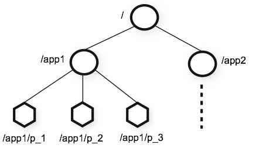

# zk介绍
* 背景：众所周知，协调服务很难做好。它们特别容易出现竞争条件和死锁等错误。ZooKeeper 背后的动机是减轻分布式应用程序从头开始实现协调服务的责任
* zookeeper 是一个高性能的分布式协调组件
* 为分布式系统提供以下公共的服务：
  * 命名服务
  * 配置服务
  * 同步服务
  * 分组服务
* 利用zookeeper，开发者可以轻松实现；
  * 领导这选举
  * 服务分组管理
  * 内存共识(一致性)
  * 业务协议
## 特性
* ZooKeeper 允许分布式进程通过共享的分层命名空间相互协调，该命名空间的组织方式与标准文件系统类似。（解决节点之间数据不共享问题）
* 与专为存储而设计的典型文件系统不同，ZooKeeper 数据保存在内存中，这意味着 ZooKeeper 可以实现高吞吐量和低延迟数。（高性能）
* 集群化部署，主节点自动选举。（高可用性）
* 严格有序的访问。 （顺序一致性）

## 数据结构和命名空间
* ZooKeeper 提供的命名空间与标准文件系统的命名空间非常相似。
* 名称是由斜杠 (/) 分隔的路径元素序列。
* ZooKeeper 命名空间中的每个节点都由路径标识。
* 跟节点不可更改

#### 节点
* 与标准文件系统不同，ZooKeeper 命名空间中的每个节点都可以具有与其关联的数据以及子节点
  * 同一个层级的节点不允许命名重复
* 这就像拥有一个允许文件也成为目录的文件系统。一个目录文件也可以拥有数据
* 节点可以是永久的也可以是临时的。
  * 临时节点生命周期在客户端连接端断开是失效
  * 后续新版本又加入了容器节点。和临时节点类似，它旨在当子节点为空时，异步失效
  * 临时节点下不能创建永久节点
* 节点可以是有序的
  * 有序节点的前缀由客户端给出，完整的文件名由服务器生成。
  * 而zk的节点是没有归属者的。假设节点在创建完成后，客户端连接意外断开，或者主服务器宕机，此时文件创建完成，客户端却没有收到
  * 解决方案：文件的前缀使用唯一ID，通过文件前缀先查询，再重试。curator客户单的保护模式就是这么干的

#### 元数据（节点数据）
* 节点数据成为元数据
* 版本信息 .最后一列是zk连接工具中的行头
  * cversion: children version
  * version : data version
  * aversion: CAL version
* 子节点数量
  * numChildren number of children
* 数据长度
  * dataLength  data length
* 事务信息
  * pzxid 子节点最近一次修改的事务ID     node id 
  * czxid 创建的事务ID                creation id     
  * mzxid 最近一次修改的事务ID          modify id
* 时间信息
  * ctime :创建时间
  * mtime :最近一次修改时间

#### ACL权限机制
* 每个文件都可以设置ACL权限。
* 每个客户端创建完连接后，可随时为自己进行认证[示例](../../../../../../../../DubboZk/zk-curator/src/main/java/com/example/ZKOpTest.java)
  * 为自己设立权限时，密码不需要加密
* 权限组成：忘记的时候看 ZooDefs.Ids.OPEN_ACL_UNSAFE
  * 权限集：Perms类
  * scheme:权限类别：
    * world 默认值 
    * digest:自定义账号密码 
    * auth：是digest的省略用法。在设置权限时可以不用输入账号密码，转而使用连接本身的账号密码
  * id:pwd：有加密工具的

## watch机制
* 一次性机制。一次监听，只会响应一次
* 虽然是异步通知，但是保证顺序一致性。当你收到事件时，一定能获取到最新的值
* 事件类型包括：
  * create event
  * delete event
  * change event
  * child event
* watch不能单独设置。
  * getData() and exists() set data watches. 
  * getChildren() sets child watches.
* 断链的客户端所监听的事件在重新连接后会重新注册，但如果节点删除了，那就拉到了

## 应用场景
### curator 框架
#### 分布式锁

#### 注册中心

#### 选举中心

#### 配置中心

## 源码中进行原理分析

#### NIO通信 & 线程模型

#### 选举机制

#### watch机制

#### 存储机制

#### 顺序一致性机制

#### 数据同步机制
