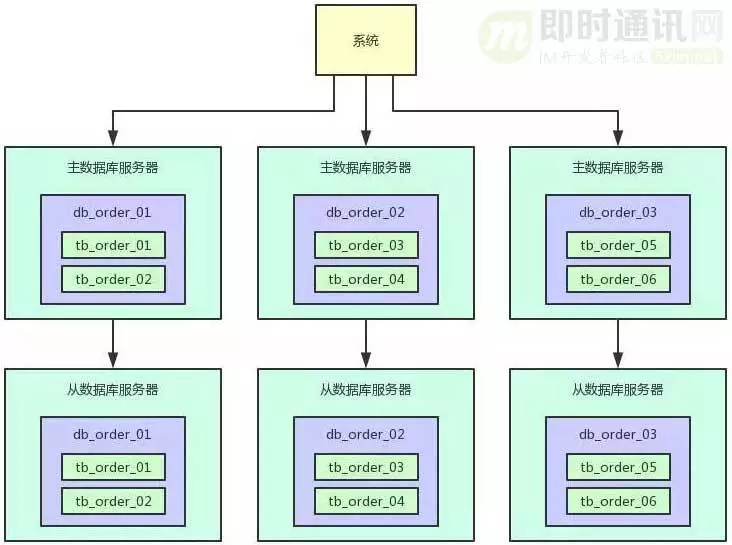

### 一些数据上限 
以一台 16 核 32G 机器单机部署mysql 为例
* QPS上限  :  2000
* 单表存储上限 : 阿里手册（500万行）
  * 这和innerDb原理有关。innerDb为了加快查询速度，会将数据进行缓存，只有当内存吃紧，查询需要磁盘IO时，性能才会有明显下降
  * b+树常规场景下3层可存储3千万数据，4层便可存储十亿数据
* 查询时间：4次IO时间在4ms左右

### 数据库的瓶颈
* qps 太高
* 行数太多

# 解决方案

### QPS 太高
##### 分析
QPS高不一定会有性能问题，要看实际情况，从以下几点分析
  * 读/写 分开计算qps。读一般情况不牵涉行锁，所以性能上要比写好。
  * 监控实际情况。要看CPU和磁盘IO情况
  * 是否有慢sql
##### 解决方案
*解决方案主要从两个方向入手*
* 提高单机TPS
  * 读写分离。读节点的QPS会明显升高
    * 例如：直播间活动数据
  * [SQL 优化](../../db/mysql/mysql优化篇.md)
* 降低QPS
  * 库拆分，可以降低一部分QPS，同时为后续读写分离做准备
    * 例如：直播的存储体系
  * 批量操作
    * 例如：直播间弹幕的写
    

###### <a id='RWSplitting'>读写分离</a>
主要解决读多写少时高QPS的问题
* 主要正对读多写少的场景
* 常规配置一主(写)多从(读)，可一显著的提高读的TPS
* 高可用。可灵动的对从进行水平扩展

### 数据量太大
##### 解决方案
* 分场景解决
  * 历史数据几乎无用，可采用文件存储或者直接删除
    * 例如：直播的弹幕。
  * 历史数据也需要查询，可采用[分库分表](#a-iddatabasesharding分库分表a)分离存储
    * 例如：直播用户表
    
###### <a id='databaseSharding'>分库分表</a>

主要解决数据量太多的问题.优点：分库分表可以按需进行扩容
* 是分库还是分表
  * 分库是分表的更进一步解决方案。分库不仅可以提高数据读写的效率还可以翻倍的增加读写的TPS
* 根据数据量预算分多少库，多少表
  * 当然设计上要保证可扩展性
* 疑难杂症
  * [全局唯一ID的设计](#a-idglobelid全局唯一id设计a)
  * 从单一表到分库分表的平滑过度（向下兼容）
  * 负载均衡设计

### <a id='globelId'>全局唯一ID设计</a>
* uuid
* 发号器
* SnowFlake 算法
* 个人计划：利用mysql自增主键设置初始值和最大值
