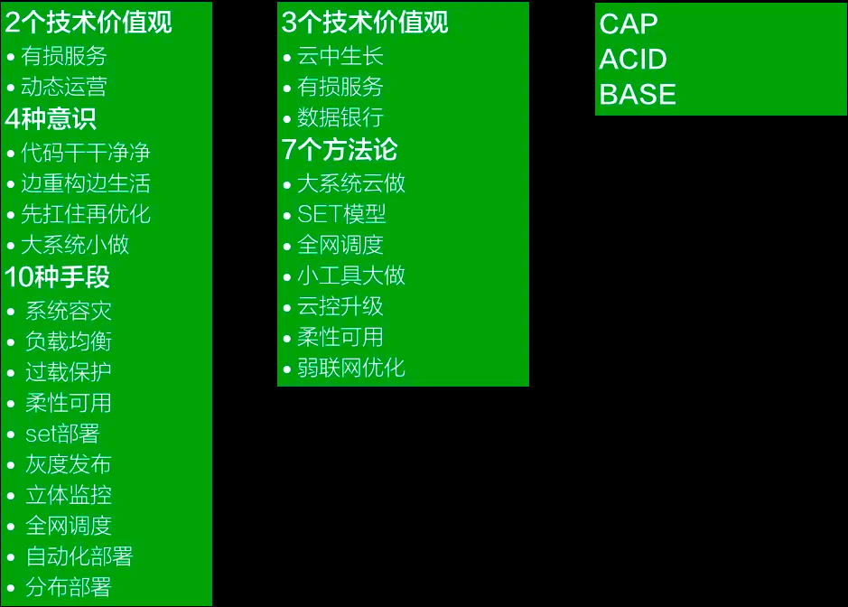

# 概述
* 海量服务的核心是可用性
* 最终的目的是用高可用性来支撑海量用户的海量请求。
* 无论是意识、方法论、价值观还是手段，都体现了对于某个方面的方式方法的高可用性追求。
* 下述是海量服务之道的概述

* 有损服务：服务不可能是完美的
  * 弱一致性
  * 多层缓存
  * 降级/兜底策略
* 动态运营：是对运营指标采取即时反应，通过不同运营手段，基于数据不断优化产品的一种运营方法。
  * 动态运营有三大关键点：
    * 第一，即时反应；
    * 第二，以小时为单位看结果；
    * 第三，准备更多的备案
  * 其核心目标是通过观测到的数据和人为的干预，快速及时的反应，最终能够改变数据，达成运营的目标
  * 这就要求对各类数据的监控必须是完整且有效的
* 柔性可用。 在有损的情况下，尽可能的提供更适合用户的替换方案
* set部署
  * 异地多活
  * 按照一定的规则如：位置、用户纬度分区服务。各分区之间数据互相同步
  * 通过负载均衡动态分配流量，当某分区不可用时，可动态切换到其他分区提供服务

  
# 架构
整个系统层面可以划分为三层：
* 终端（前端）
* 计算层（后端）
* 存储层

## 边界
###### 终端-计算边界
* 终端是最直接面向客户的，计算层就是为终端服务的。在终端的眼里，计算层是一个大的黑盒子
* 终端是多种多样的，包含APP(安卓、苹果)、网页（各类浏览器）
* 处理好边界问题就是对协议的定义。
  * 常规的情况下，http是首选协议。但是消息体的规范如何定义，就是关键了
  * 在双端通信的需求下，websocket协议也会比较常用。对于socket协议如何定义也会成为关键

###### 微服务内的边界
* 为了高并发和高可用，微服务必不可少
  * 微服务必然存储多入口，如何为终端提供一个统一个的入口便是关键
  * 接入层会由很多技术。包括：安全、网关、负载均衡、就近分区等等
* 微服务如何划分是一个关键
  * 前期可以简单的按照业务模块划分。比如 交易、商品、
