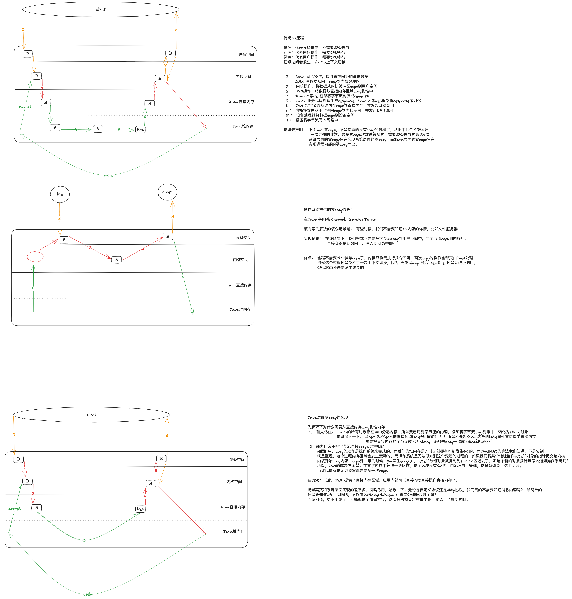

操作系统IO的实现：

IO 的4中模型

具体是什么模型，其实还是要看站在哪个角度。
比如：
 我们站在操作系统角度上，其实selector 还是同步非阻塞模型
 站在java 的角度来说，它是多路复用模型
 站在netty的角度来说，它就是异步模型

~~~java
    SocketChannel clientChannel = (SocketChannel)selectionKey.channel();
    ByteBuffer allocate = ByteBuffer.allocate(1024);
    try {
       while (clientChannel.read(allocate)>0){
            
       }
    
    } catch (IOException e) {
        throw new RuntimeException(e);
    }
~~~
read 该read多少呢？ 可以read的字节数是多少呢？ 一个数据包？多个数据包？ 和TCP 粘包/拆包有关系吗？
