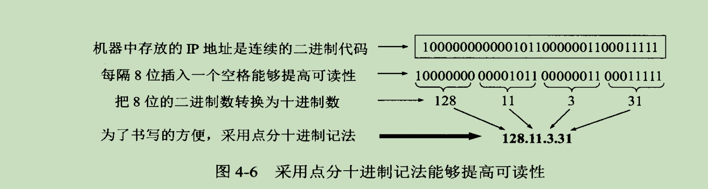
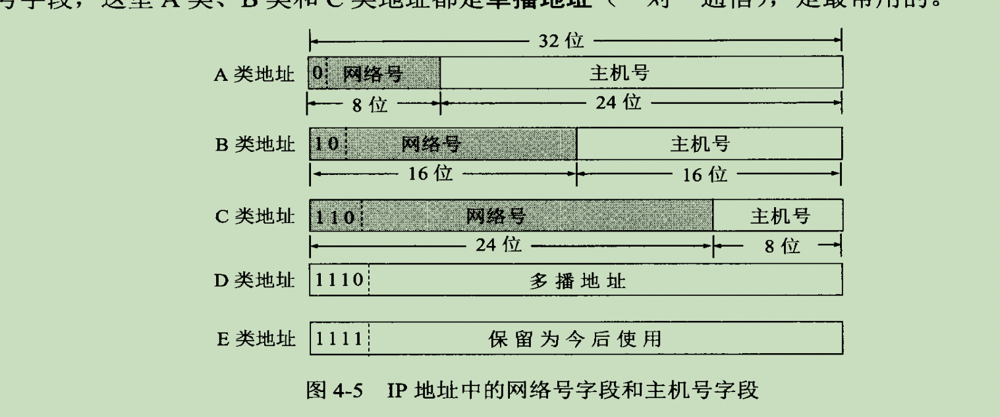
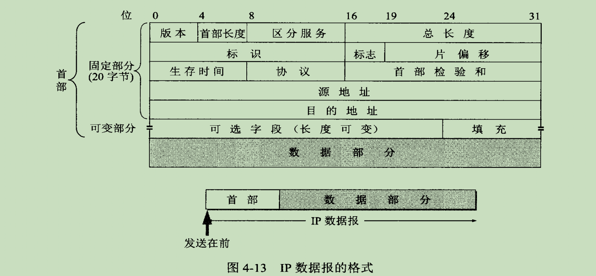

# IP 协议 
## 简介
* IP指网际互连协议，Internet Protocol的缩写，是TCP/IP体系中的网络层协议。
* 设计IP的目的是提高网络的可扩展性：
  * 一是解决互联网问题，实现大规模、异构网络的互联互通；
  * 二是分割顶层网络应用和底层网络技术之间的耦合关系，以利于两者的独立发展。
* 根据端到端的设计原则，IP只为主机提供一种无连接、不可靠的、尽力而为的数据包传输服务（IP不保证分组的交付时限和可靠性，所传送分组有可能出现丢失、重复、延迟或乱序等问题）。

## 主要任务
IP是网络层的主要协议，任务主要是根据源主机和目的主机的地址来传送数据。 为此，IP协议主要分为三个功能点

## IP地址分类
* IP地址在网络中作为主机的唯一识别码
* 由32位2进制数字表示  

* IP地址拆分为两个部分组成： 网络号+主机号 。不同类别的IP，它的网路号和主机号位数是不一样的，但同一类别固定
  * IP地址 ::= {<网络号>，<主机号>}
  * 
  * 统一局域网下的主机或者路由器必须是同一网络号下的IP，这样路由器在进行路由时就可以根据网络号查找表进行寻址

* A类地址：0.0.0.0    ~    127.255.255.255
  * 第一个字节表示网络号段，后3个字节表示主机号。
  * 第一个字节表示网络号，可用数为2的8次方-2。其中 0 代表**本网络** 127 代表**回环地址**，供本机进程之间通信  
  * 后3个字节表示主机号，可用数为2的24次方-2。 其中 *.0.0.0 表示单个网络地址，*.255.255.255 代表本网络的全部主机
* B类地址：128.0.0.0  ~    191.255.255.255 
  * B类地址的前两个字节都是网络号，后两个字节为主机号。其中128.0.0.0保留。
  * 网络号共16位，其中前两位固定了，所以可使用的共14位，共有2的14次-1个。每个都可指派
  * B类地址的主机号也是2的14次方-2个，其中*.*.255.255 代表本网络的全部主机
* C类地址：192.0.0.0  ~    223.255.255.255  
  * C类地址前三个字节都是网络号，只有一个字节的主机号。其中192.0.0.0保留
  * 网络号共24位，前三位固定，可指派位数位21位，共有2的21次方-1个可指派网络号
  * 主机号只有1位，254个，255 表示本网络的全部主机
* D类地址：224.0.0.0  ~    241.255.255.255  
  * 多播地址
* E类地址：242.0.0.0  ~    255.255.255.255
  * 预留地址

## IP地址和mac地址的区别

## ARP协议

## IP 数据报格式

