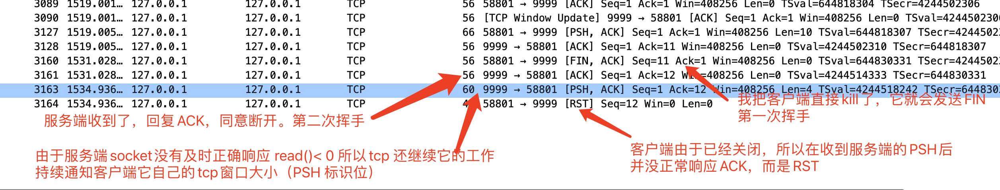
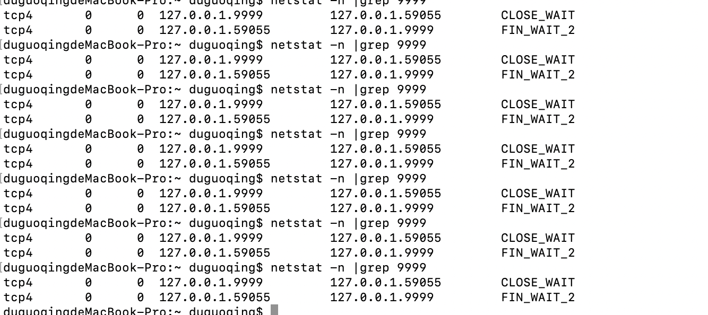
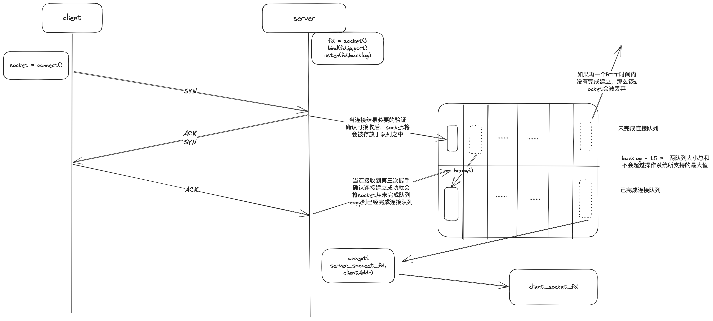

# TCP协议
* 可靠的传输协议（确认递送、故障通知）
  * 除了ACK消息以外的其他所有消息都需要有一个ACK进行回复确认
* RTT算法预估发送一次数据包的时间
  * RTT计算得出RTO，用于重传定时器，没间隔N*RTT时间就会重新发送一次数据，直到收到了ACK为止
* 应用层数据报在TCP层进行分组为多个IP包进行发送
  * 每个分组具有独特的序列号，接收端可用于重组和去重
* 通告窗口
  * 发送端可根据服务端告知的字节数动态调整数据包大小，避免缓冲区溢出
* 数据准确性校验
  * 这和TCP的可靠性无关，即使UDP也会进行数据校验。大都采用的方法都是校验和对比的方式

### 头部关键属性
* MSS：对端总是会告知它在任何时刻一次能接受的字节数
  * MSS最大为IP报的最大值65535，还要减去一部分IP和TCP头部
  * 通常为了减少网络层的分组，采用以太帧的最大值MTU：1518字节，去除IP首部和TCP首部，1460为最合适的值。

### 端口号
* 端口号并不属于最初的tcp/ip协议，它是早期unix操作系统在对数据流进行多路复用/多路分解时用于区分不同协议和服务的，后续基本演化为用于标识特定的进程或者服务。
  * 公认服务端口： 1024以内的端口用于标识或者保留标识一些公认服务。比如：1-icmp 80-http 443-https 21-FTP
  * 动态端口：动态端口搭配IP组成socket套子节，可以作为在互联网上的唯一标识。
* 网络层只负责对数据进行传输和接收，操作系统上搭载的多个应用或者单因应用多个同时进行的网络流的分离工作就必须由传输层进行，传输层根据端口号把数据流和socket描述符相关联

### TCP进程的流程

* #1 第二次握手失败的场景，以及可能的引起的DOS攻击，见下面分析
* #2 这里会引发很多问题
  * [滑动窗口](#windowing)
    * 一问一答的模式效率太低，必然要优化 
    * ACK是可靠传输的保证，同时也是性能的浪费
    * 数据包的大小如何确定 
    * 网络阻塞（接收端缓冲区满了，客户端还在不停的发，数据又不能真的像水一样静置于网络中，这是就会造成数据丢失）

### FQA
* 通常会考虑为什么需要4次
  * TCP规定FIN和最后一次数据报合并发送，以减少tcp交互。被动关闭方在应答了主动放的FIN后，还需要对数据包进行处理，这中间需要时间间隔。
  * 即使没有合并，如果最后一次数据报和FIN间隔太短，也会引发这样的问题。把2，3次挥手分割开，留给被动关闭方一些时间。
  * 支持双端可同时挥手
* 为什么要3次握手
  * 网络是复杂的，A到B和B到A即使是一个连接中，他们的路径也不一定相同，必须双方保证可以正确的收到来自对方的问候
  * 一问一答，双方都确认了对端可以收到，只不过被动方的确认和发起合并为一步

         A ---------你听得见吗------------>  B
         A <---------我听得见。你听得见吗----  B
         A ------------听得见------------>  B  
* TCP的关闭还真的是粗暴
  * 只要一端想关闭了，那一定能关闭
  * 无论中间发送了什么，发起关闭的一方一定不会在read消息了
  * 被动的一方就真的很被动，如果不处理好，还真的就是浪费内存。反正连接一定是不能用了的
* TCP数据包能传输的数据量
  * TCP最大传输数据字节量：65535。（16位MSS能表达的最大值）
  * IP最大传输数据字节量：
    * IPv4:65535 - 20（TCP首部） -20 （IP首部）
    * IPv6:65535 - 20（TCP首部） -40 （IP首部）
  * 上述都没用。以太网常规字节量（MTU）：1500字节
    * TCP常规 MSS = 1500 - 20（TCP首部） - 20（IP首部，v6翻倍）
* TCP连接建立过程中已经建立过程后存放在哪里呢
  * [转](#tcp_backlog)
 
### 每一步出错的现象以及挽救措施
连接是传输层的抽象概念，而IP向下的层次没有，无论什么消息的发送都还是一次单向的流发送，都有可能会失败。
* 第一次握手失败： 那连接就没法建立，客户端只能进行重试或者失败，不可达。
* 第二次握手失败： 
  * 客户端： 会不断的进行重试，直到超时或者收到ACK
  * 服务端： 由于没有收到第三次握手的消息，所以也会不断的进行重试
    * 第二次握手消息（SYN+ACK）会一直重试，虽然客户端也在不停的进行重试，但是服务端在重试期间对于后续客户端的重试请求会立刻回复，但不会重置重传定时器
* 第三次握手失败： 
  * 服务端： 不断的进行重试，直到超时或者收到ACK
  * 客户端： 客户端基本已经确认连接建立，进入establish状态了。
    * 即使服务端已经超时宣告连接失败，客户端也会继续保持着，直到保活探测宣告它的死亡。在此期间，它发送的消息是得不到回复的。
  * 客户端没有发起ACK。这是DOS攻击的一种手段，客户端大量连接停止在此处，就会造成服务端存在大量SYN_RECV的连接。
* 消息发送失败：
  * 接收方没有收到数据包:  发送方定时器重传
  * 发送方没有收到ACK: 发送方定时器重传，接收端收到重复数据。这种是比较浪费的情况
* 挥手失败
  * 但是连接是抽象概念，一如第三次握手失败，一方挥手失败，直接宣布连接失败，对于自身也没啥问题
  * 但是对端的连接依旧保持着。如果对端使用了例如http1.1的keep-alive，那这个连接只能等到空闲/超时检测时才清理

* 记忆：
  * 对端上一步发送了什么，下一步期待什么
  * 本端期待的是什么
  * 双端都会根据自己的期许进行重试

### <a id='windowing'>滑动窗口</a>
    初始为2mss
    A --------SYN1---------->  B
    A --------SYN2---------->  B
    A <--------ACK2----------  B
    A <--------ACK3----------  B
    正确的ACK触发窗口大小翻倍
    乱序或者丢包时，服务器回复期待的序列号
    A --------SYN3---------->  B
    A --------SYN4-------X--->  B
    A --------SYN5---------->  B
    A --------SYN6---------->  B
    A <--------ACK4----------  B
    A <--------ACK4----------  B
    A <--------ACK4----------  B
    连续相同的ACK触发客户端重传
    A --------SYN4---------->  B
    A <--------ACK7----------  B
    并且窗口大小减半
    A --------SYN7---------->  B
    A --------SYN8---------->  B
    A <--------ACK7----------  B
    A <--------ACK8----------  B
    

**发送方依次发送数个数据包而无需等待相应的ACK的过程，而窗口大小取决于接收方缓冲区的大小。对方缓冲区就是窗口的最大值，对方缓冲区/MSS就是窗口内同时发送数据包的个数**
* 慢启动：
  * 起始默认窗口大小为发送端MSS的2倍
  * 当收到ACK时，会逐渐增加滑动窗口的大小，每次翻倍
* 阻塞避免：
  * 当发生三重ACK时（多个包丢失或者乱序）滑动窗口减半
* 服务端ACK总是回复ACK_num 等于它所期待的下一个序列号，而不是它所对应SYN消息的SYN_num + 1
* 快速重传 (ACK_num < SYN_num) 服务端要求客户端快速重传丢失的数据
  * 窗口内连续发送的数据可能不会还没到重传时间，而接收端发送了乱序或者丢包，这时服务端该SYN的ACK中ACK_num不再是相对应的SYN_num+1了，而是按数据包照序列顺序所期待的序列号。图中#2部分
  * 客户端在连续收到同样(具体数字默认3可配置)的ACK_num时，立刻对该序列进行重发，而不等待重发定时器
* 快速恢复 (ACK_num > SYN_num) 服务端高速客户端后续的一大坨我其实已经收到，你别重传了
  * 如上所述，服务端的ACK_num总是等于它所期待的序列号，当前面的数据后到达服务端时，服务端对数据进行重组，返回ACK_num就会发送跳段的情况。如#2中对于 SYN_SEQ = 13的回复一次性跳到了17

### Time_wait状态的意义
* 1、正确的完成tcp的第4次握手
* 2、保证连接传输数据的准确性
  * 场景：连续发起的两次TCP拥有相同的IP和端口，如果前一次连接发出的数据报在网路中迷失了方向，在下一次连接的时候才到达目的地，那服务器将无法识别本数据报是本次TCP请求的数据报还是上一次请求的
  * 为此，time_wait被规定为2MSL，保证一定超过IP数据包在网络中的存活时间。

### RTO & RTT 对重传的意义
* RTT是连接一次往返的时长
* RTO是根据最近几次RTT通过加权平均计算来的预估值，用于确定超时时间
* 重传定时器 会根据RTO来增量计算每次的间隔时间。1 3 7（每次增加2n*RTO）

# 服务端TCP状态诊断
#### **确认连接**
* SYN_SEND :  理论来说没有
* SYN_RECV :  除非受到攻击，否则应该不多的
* ESTABLISH:  通信中，同时建立的连接过多。这也不一定没问题。得和实际的访问量相比较。连接数不应该小于实际的访问量
#### **主动断开方**
* FIN_wait_1: 主动发起断开连接的状态，一般不会有问题，如果有可考虑是否是FIN_ACK 被拦截，或者瞬间断网的情况
* FIN_wait_2: 主动发起断开连接，并已经收到对端断开的响应，在等待对端close的状态。
  * 出问题场景：
    * 被动关闭的一方没有正确的关闭连接导致的。或者防火墙导致的。可通过抓包被动关闭方的TCP包查询问题
  * 解决方案：
    * 被动方解决bug
    * 转换关闭方
* time_wait:  主动方在连接关闭后必然会进入这种状态。
  * 出问题场景：
    * 如果服务端主动断开连接，且QPS较高，必然导致服务端无法建立新的连接。
  * 解决办法：
    * 转换关闭方。
    * 降低系统配置time_wait的时间
#### **被动方**
* close_wait: 被动断开时一定会进入此状态
  * 出问题场景：
    * 被动关闭方在回复主动关闭方后没有正确关闭连接。如果正确关闭了，应该是last_ack 或者 closed状态。
  * 解决方案:
    * 找出导致问题的原因，正确的关闭连接。一般是收到客户端断开信号后没做处理导致的。
    * 修改系统属性   tcp_timeout_close_wait：close_wait停留时长。    tcp_keeepalive_time 连接存活时长。tcp_keepalive_intvl:检测间隔 tcp_keepalive_probes:失效次数
* last_ack:   被动断开时一定会进入此状态

## 具体场景
~~~java
public class NIOServer {

    @SneakyThrows
    public static void main(String[] args) {
        new Thread(NIOServer::startServerClient).start();
    }

    static ExecutorService executor = Executors.newFixedThreadPool(5);//线程池
    @SneakyThrows
    private static void startServerClient() {

        final ServerSocketChannel serverSocketChannel = ServerSocketChannel.open();
        serverSocketChannel.bind(new InetSocketAddress(9999));
        serverSocketChannel.configureBlocking(false);

        final Selector selector = Selector.open();
        serverSocketChannel.register(selector, SelectionKey.OP_ACCEPT);

        while (true){
            if (selector.select(1000)==0){
                continue;
            }
            final Set<SelectionKey> selectionKeys = selector.selectedKeys();
            final Iterator<SelectionKey> iterator = selectionKeys.iterator();
            while (iterator.hasNext()){
                final SelectionKey selectionKey = iterator.next();
                if (selectionKey.isAcceptable()){
                    SocketChannel clientChannel =  serverSocketChannel.accept();
                    clientChannel.configureBlocking(false);
                    SelectionKey clientKey = clientChannel.register(selector, SelectionKey.OP_READ);
                    clientKey.attach(new MyContent(clientChannel,clientKey));
                }
                if (selectionKey.isReadable()){
                    doOperation((MyContent)selectionKey.attachment());
                }
                iterator.remove();
            }
        }
    }

    @SneakyThrows
    private static void doOperation( MyContent content){
        System.out.println("read start ");
        SocketChannel socketChannel = content.socketChannel;
        final ByteBuffer byteBuffer = ByteBuffer.allocate(1024);
        int length;
        try {
             length = socketChannel.read(byteBuffer);
        }catch (Exception e){
            e.printStackTrace();
            // 发送异常时，如若没有关闭连接，TCP连接会持续卡在内核内存中
//            socketChannel.close();
            return;
        }
        if (length<=0){
            // 必须正确的关闭连接，否则tcp连接将固定在close_wait 2小时，期间持续占用内存
            // 而且必须立刻响应。如果不是立刻响应，期间tcp 可能会不定期发送窗口变更通知/轮训状态验证等消息，
            // 由于对端已经关闭处于time_wait阶段，它会回复RST_ack消息，服务端下次发送消息时就会发生 connect peer rest 异常
            if (length<0){
                content.clientKey.cancel();
                System.out.println("client closed itself!");
//                socketChannel.close();
            }
            return;
        }
        byteBuffer.flip();
        System.out.println("client request : "+new String(byteBuffer.array(),0,length));
        sendMsg(socketChannel);
//        executor.execute(()->{
//            try {
//
//            } catch (IOException e) {
//                e.printStackTrace();
//                if (socketChannel.isConnected() || socketChannel.isOpen()){
//                    try {
//                        socketChannel.close();
//                    } catch (IOException ex) {
//                        e.printStackTrace();
//                    }
//                }
//            }
//        });
    }

    private static void sendMsg(SocketChannel channel) throws IOException {
        byte[] bytes = new byte[1024];
        int len = System.in.read(bytes)-1;
        if (!channel.isConnected() || !channel.isOpen()){
            System.out.println("channel is already closed!");
            return;
        }
        System.out.println("read size = "+len);
        if (isClose(bytes,len)){
            channel.close();
            return;
        }
        if (len<=0){
            System.out.println("blank msg send!");
        }
        ByteBuffer sendMsg = ByteBuffer.wrap(bytes,0,len);
        channel.write(sendMsg);
        System.out.println("send over");
    }

    static byte[] close = "close".getBytes();
    private static boolean isClose(byte[] bytes, int len) {
        if (len != close.length){
            return false;
        }
        for (int i =0 ;i < close.length; i++){
            if (close[i] != bytes[i]){
                return false;
            }
        }
        return true;
    }

    static class MyContent{
         SocketChannel socketChannel;
        SelectionKey clientKey;

        public MyContent(SocketChannel socketChannel, SelectionKey clientKey) {
            this.socketChannel = socketChannel;
            this.clientKey = clientKey;
        }

    }
}

public class NioClient {

  public static void main(String[] args) throws IOException {
    clientSendMsg();
  }

  @Test
  public void test() throws IOException {
    NioClient.clientSendMsg();
  }

  private static void clientSendMsg() throws IOException {
    Selector selector = Selector.open();
    final SocketChannel clientChannel = SocketChannel.open(new InetSocketAddress("127.0.0.1", 9999));
    clientChannel.configureBlocking(false);
    clientChannel.register(selector, SelectionKey.OP_READ);
    System.out.println("client host = "+clientChannel.getLocalAddress());
    // 客户端发起聊天
    clientChannel.write(ByteBuffer.wrap("hello boy!".getBytes()));
    while (true){
      int select = selector.select(1000);
      if (select<=0){
        continue;
      }
      Iterator<SelectionKey> iterator = selector.selectedKeys().iterator();
      while (iterator.hasNext()){
        SelectionKey selectionKey = iterator.next();
        if (selectionKey.isReadable()){
          if (readRcvAndSendMsg(selectionKey)){
            return;
          }
        }
        iterator.remove();
      }
    }

  }

  private static boolean readRcvAndSendMsg(SelectionKey selectionKey) throws IOException {
    System.out.println("read start ");
    SocketChannel channel = (SocketChannel) selectionKey.channel();
    String message = doRead(channel);
    System.out.println("rcv : "+message);
    if (StringUtils.equals("closed",message)){
      return true;
    }
    return sendMsg(channel);
  }

  private static boolean sendMsg(SocketChannel channel) throws IOException {
    byte[] bytes = new byte[1024];
    int len = System.in.read(bytes)-1;
    if (isClose(bytes,len)){
      channel.close();
      return true;
    }
    ByteBuffer sendMsg = ByteBuffer.wrap(bytes,0,len);
    channel.write(sendMsg);
    return false;
  }

  static byte[] close = "close".getBytes();
  private static boolean isClose(byte[] bytes, int len) {
    if (len != close.length){
      return false;
    }
    for (int i =0 ;i < close.length; i++){
      if (close[i] != bytes[i]){
        return false;
      }
    }
    return true;
  }

  private static String doRead(SocketChannel channel) throws IOException {
    final ByteBuffer response = ByteBuffer.allocate(1024);
    int length = channel.read(response);
    if (length<=0){
      if (length<0){
        channel.close();
        return "closed";
      }
      return "";
    }
    return new String(response.array(),0,length);
  }
}
~~~
###### 场景描述
* 1、在连接建立成功后，客户端主动断开连接（停止进程）
* 2、服务端会收到read事件
* 3、但是服务端可能还在处理客户端的请求，没有及时处理read事件，比如代码中在等待console输入回复的内容
* 4、当服务端处理完请求后，在调用socket的读写，就会出现报错：connect rest by peer

###### 解释
* tcp连接已经进入挥手过程，主动方已变更为fin_wait_2，被动方也进入close_wait了
* 但是由于服务端迟迟不愿释放channel引用，所以第三次握手始终无法进行，此时服务端还是可以发送消息的
* 当服务端进行write操作时，写入的不是FIN而是普通消息，客户端已经不具备读的能力了，它只能回复RST表示拒收
* 此时如果服务端报错处理中没有对channel进行释放，那tcp连接还是会继续保留

###### 后果
* 造成大量close_wait请求堆积在服务端

###### 解决方案
* 1、netty基于事件驱动，其实它的读写也是同步的，同时把读 和 处理放在不同队列，稍微解耦了一下下，但这并没有什么大用，最终要求还是要处理速度快。及时AIO完全异步，也不一定就能完全避免这个问题。CPU运作总是有时间顺序性问题
* 2、对于readable事件后进行read操作却返回-1时，一定要对请求进行关闭
* 3、对于发送异常的连接，大胆的进行关闭就行。连接是个抽象概念，无论哪方处理问题，IOException总是标识着连接不能再信任了

## <a id="tcp_backlog">服务端被动建立连接的过程</a>

