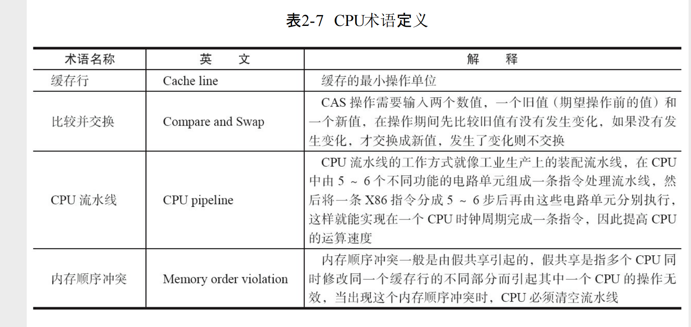

# atomic
* 本义： 不可被分割的最小粒子
* 原子操作： 不可中断的一个或者一系列操作

## 术语
 
 
## CPU实现原子性的原理
* 总线锁定  CPU输出一个LOCK信号到总线后，总线将会拒绝其他CPU的请求
* 缓存锁定  锁定制定的内存区域，使得其他CPU无法读取该区域的信息，或者已经读取的缓存行失效(利用缓存一致性协议)
     * 当制定的区域超过一个缓存行 、 或者 CPU不支持缓存锁定时，依旧使用总线锁定
* 缓存一致性协议  在多CPU的环境下，缓存在多个缓存行中的共享数据，保持数据的一致性

## java中的原子性
* JVM并没有要求64位的long 和 double类型的读写具有原子性。而在32位的系统中，64位的long和double的读写可能分配在不同的总线事物中，那么这次读写就不具备原子行

## java 原子操作类
* java中的原子操作类，大都内部定义一个变量，然后使用CPU的xch指令完成CAS操作
* 为了使得变量修改具有可见性，变量大都使用volatile修饰
* 内部的操作大都使用Unsafe类实现，并不是所有的方法都具有可见性。 lazySet 就跳过了volatile特性 
基本类型
* AtomicBoolean：原子更新布尔类型。 
* AtomicInteger：原子更新整型。 
* AtomicLong：原子更新长整型。
* 提供方法：
  * int addAndGet（int delta）：以原子方式将输入的数值与实例中的值（AtomicInteger里的 value）相加，并返回结果
  * boolean compareAndSet（int expect，int update）：如果输入的数值等于预期值，则以原子方 式将该值设置为输入的值
  * int getAndIncrement()：以原子方式将当前值加1，注意，这里返回的是自增前的值
  * void lazySet（int newValue）：最终会设置成newValue，使用lazySet设置值后，可能导致其他 线程在之后的一小段时间内还是可以读到旧的值。
  * int getAndSet（int newValue）：以原子方式设置为newValue的值，并返回旧值。
数组类型
* AtomicIntegerArray：原子更新整型数组里的元素。 
* AtomicLongArray：原子更新长整型数组里的元素。 
* AtomicReferenceArray：原子更新引用类型数组里的元素。
* 提供方法
  * int addAndGet（int i，int delta）：以原子方式将输入值与数组中索引i的元素相加。 
  * boolean compareAndSet（int i，int expect，int update）：如果当前值等于预期值，则以原子 方式将数组位置i的元素设置成update值。
引用类型
* AtomicReference：原子更新引用类型。 
  * [AtomicReferenceTest](AtomicReferenceTest.java)
* AtomicReferenceFieldUpdater：原子更新引用类型里的字段。
  * [AtomicReferenceFieldUpdaterTest](AtomicReferenceFieldUpdaterTest.java)
  * 要求属性必须是volatile修饰
  * 要求属性必须是调用的地方可访问的 private会报错
* AtomicMarkableReference：原子更新带有标记位的引用类型。可以原子更新一个布尔类 型的标记位和引用类型。
  * 此类含有 一个对象和一个boolean变量，CAS时，通过new新的pair对象来保证原子性，但是如果利用反射等修改了pair的值，这时候是不能保证CAS的正确性的
字段类型
* AtomicIntegerFieldUpdater：原子更新整型的字段的更新器。 
* AtomicLongFieldUpdater：原子更新长整型字段的更新器。 
* AtomicStampedReference：原子更新带有版本号的引用类型。
     
