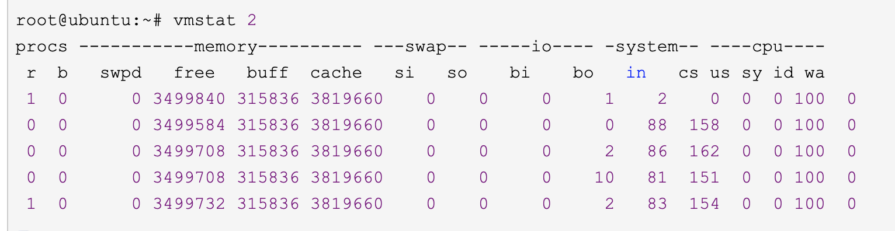

# 并发
### 并发的意义
* 启动多个线程让程序最大限度的并发执行，以达到让程序更快运行的目的

### 并发的应用
#### 线程基础
* 进程是系统资源分配的最小单位，而线程作为系统调用的最小单位。
* 线程状态包括：NEW -> runnable -> stop     其中，NEW 和 STOP是无法使用Jstack监控到的  
                       ^
                       | -> blocking  
                       |
         time-waiting<---> waiting
 * 线程中断interrupt： 中断只是一个标志，当线程被标记中断时，可抛出异常：ThreadInterruptException        

### 并发中的难题
* 上下文切换带来的消耗
    * 
* 死锁问题
    * 减少一个线程同时获取多个资源锁
    * 避免在锁内占用多个资源
    * 使用超时锁代替永久锁（这种方式可能会引发其他问题）
    * 总结： 细化锁的粒度，减少锁中资源的占用
* 硬件、软件方面的资源竞争
    * 硬件问题可以通过增加物理资源解决，比如集群
    * 软件限制可以采用资源复用

### 关键词
* 上下文切换
   * 当线程暂停运行退出CPU资源时，需要讲当前线程的运行状态保存起来，以便下一次运行。从任务的保存到再加载的过程就叫上下文的切换。
   * 在程序的运行时，上下文的切换实际上是一种资源的浪费，它本身也就暂用CPU等硬件资源   

### 性能检测工具
jps
jstack
jconsole

#### Lmbench3 

#### vmstat
* linux / unix自带的系统工具
* vmstat 1(采样间隔) 2（采样次数）
* 
* 表头解释
    * process
        * r 表示运行队列(就是说多少个进程真的分配到CPU)，我测试的服务器目前CPU比较空闲，没什么程序在跑，当这个值超过了CPU数目，就会出现CPU瓶颈了。这个也和top的负载有关系，一般负载超过了3就比较高，超过了5就高，超过了10就不正常了，服务器的状态很危险。top的负载类似每秒的运行队列。如果运行队列过大，表示你的CPU很繁忙，一般会造成CPU使用率很高。
        * b 表示阻塞的进程,这个不多说，进程阻塞。可能线程处于IO阻塞中
    * Memory
        * swpd 虚拟内存已使用的大小，如果大于0，表示你的机器物理内存不足了，如果不是程序内存泄露的原因，那么你该升级内存了或者把耗内存的任务迁移到其他机器。
        * free   可用的（空闲的）物理内存的大小
        * buff   缓冲区大小
        * cache  cache直接用来记忆我们打开的文件,给文件做缓存(这里是Linux/Unix的聪明之处，把空闲的物理内存的一部分拿来做文件和目录的缓存，是为了提高 程序执行的性能，当程序使用内存时，buffer/cached会很快地被使用。)
    *swap    
        * si  每秒从磁盘读入虚拟内存的大小，如果这个值大于0，表示物理内存不够用或者内存泄露了，要查找耗内存进程解决掉。我的机器内存充裕，一切正常
        * so  每秒虚拟内存写入磁盘的大小，如果这个值大于0，同上。
    * IO （Linux版本块大小是1024byte）     
        * bi  块设备每秒接收的块数量，这里的块设备是指系统上所有的磁盘和其他块设备
        * bo 块设备每秒发送的块数量，例如我们读取文件，bo就要大于0。bi和bo一般都要接近0，不然就是IO过于频繁，需要调整。
    *os
        * in 每秒CPU的中断次数，包括时间中断
        * cs 每秒上下文切换次数，例如我们调用系统函数，就要进行上下文切换，线程的切换，也要进程上下文切换，这个值要越小越好，太大了，要考虑调低线程或者进程的数目,例如在apache和nginx这种web服务器中，我们一般做性能测试时会进行几千并发甚至几万并发的测试，选择web服务器的进程可以由进程或者线程的峰值一直下调，压测，直到cs到一个比较小的值，这个进程和线程数就是比较合适的值了。系统调用也是，每次调用系统函数，我们的代码就会进入内核空间，导致上下文切换，这个是很耗资源，也要尽量避免频繁调用系统函数。上下文切换次数过多表示你的CPU大部分浪费在上下文切换，导致CPU干正经事的时间少了，CPU没有充分利用，是不可取的。
    *CPU
        * us 用户CPU时间，我曾经在一个做加密解密很频繁的服务器上，可以看到us接近100,r运行队列达到80(机器在做压力测试，性能表现不佳)。
        * sy 系统CPU时间，如果太高，表示系统调用时间长，例如是IO操作频繁
        * id  空闲 CPU时间，一般来说，id + us + sy = 100,一般我认为id是空闲CPU使用率，us是用户CPU使用率，sy是系统CPU使用率。
        * wt 等待IO CPU时间。  
  
## 线程间通信和同步
* 通信： 线程间的数据交换    
* 同步： 不同线程对同一操作发生的相对顺序控制
* Java采用的内存共享模型。通过共享内存中的数据交换数据，通过并发控制达到同步的效果
* wait-notify 等待通知模式 进行线程间通信
    * wait-notify 依赖synchronized关键字。它的实现是存储在对象头中的标准位来实现，为了保证线程安全，所以该模式必须配合synchronized关键字使用
* Thread.join 当前线程等待目标线程完成后再继续执行
* ThreadLocal [ThreadLocal详解](./ThreadLocal.md)

### 可见性问题
* JMM中，线程间通过访问共享属性以达到线程间通信的目的
* 但是由于线程内本地变量（缓冲区内）何时刷新的主存中被其他线程知晓就是问题。也就是我们常说的可见性问题

##### 原因
* 1、CPU流水线设计、CPU写缓冲设计等导致线程本地数据延时刷新到主存 、 主存数据提前缓存至线程本地缓存
* 2、指令重排序导致引起指令执行顺序与程序员预期不符 
* 总结： 顺序一致性模型是理想状态，如果严格执行，那CPU的高速缓存意义就不大了，并发的收益也将大大缩减，另外各类重排序优化必然不能发生

##### JVM本身的解决方案
* 1、JVM 自身通过内存屏障遵守happen-before规则和as-if-serial规则，以实现程序尽量按照程序员的想法进行
    * as-if-serial ： 不管怎么重排序，单线程的最终结果一定是正确的
    * happen-before ： JVM通过一些特殊处理，保证了一些基本的功能的顺序，比如加锁必然发生在同步代码前    
* 2、JMM保证经过经过同步处理的程序具有严格的顺序一致性
* 3、未经过同步处理的线程在执行时，其读取的值要么是其他线程提前写回的，要么是初始化的默认值(null,0,false)

##### 程序员的解决方案
在大部分情况下，多线程做做的事情都是互不相干的，他们不需要经过特意的同步处理，只有在存在数据竞争或者依赖关系的时候，才需要程序员特别注意。
而这，JVM是不会明白如何处理的，但是它提供了一系列的方法供我们驱使：
* volatile关键字
    * JVM通过插入内存屏障禁止了volatile变量读写的重排序
    * volatile变量本身的操作也使用LOCK#开头的CPU指令修饰，以保证对于变量的修改会及时刷回主存，并通知其他线程变量个已修改
    * volatile变量每次读也会从主存读取数据。这个说法，不知道成不成立。因为存在也合理，但每次都从主存读取数据，有点浪费了吧，人家说不定不常变更呢？但无所谓了，相比来说，它已经是最轻量级的方案了
    * 总结 ： volatile关键字 通过只是保证了单个变量的读写操作具有原子性，解决的是最基本的可见性问题。
* final关键字。在构造函数中初始化的final对象，在其他线程中读取到的值是最新的    
* 加锁 [LOCK详解](../JVM/lock/readme.md)
    * synchronized 关键字
    * 自己实现的CMS
    * LOCK 接口及LockSupport工具类    
    
##### 案例
 * 双重检测规则。对象的初始化和引用赋值的重排序
 
 
 
 
### 原子性问题
原子性问题看起来更像是顺序一致性的细化问题。顺序一致性说的是什么顺序呢？是以什么作为单位呢？
个人觉得，所谓顺序一致性研究的就是具有原子性的一系列列操作的顺序问题。反之，具有原子性的一个或者一系列操作，在本层次就不需要考虑它内部的顺序性问题。至于其内部的顺序性那是下层次的事情
比如说i++，在Java代码里，它是一条指令，然而在CPU指令里，它确实两条指令，那可以把它当成一个单位去和其他指令进行排序吗？肯定是不能的
但是AtomicInteger.increase()在java里也是一条指令，翻译成CPU指令，那可不止一两条指令了。但是它却可以。

##### 案例
* 32位系统中double 和 long等64位变量的写入时，如果64位变量的写入不在同一个总线事物中，那么该次写入不满足原子性

## 多线程编程工具类
### concurrentHashMap
