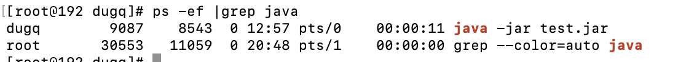
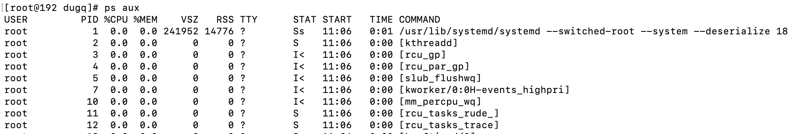

# PS 
* 是一个很复杂的命令，其参数有12个，还可以各种组合使用
* 这里列举一些常用的组合形式

### ps -ef |grep XXX
显示进程相关信息，连同命令行

* 第二列是进程ID
* 第一列是启用进程的用户
* 第四列是CPU使用百分比
* 最后一列是进程的启动命令
* 这个命令通常是通过command查找进程ID

### ps aux

这个命令和top命令的最后一部分很相似了

