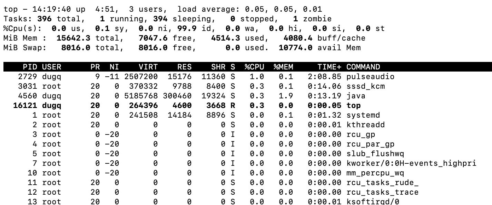
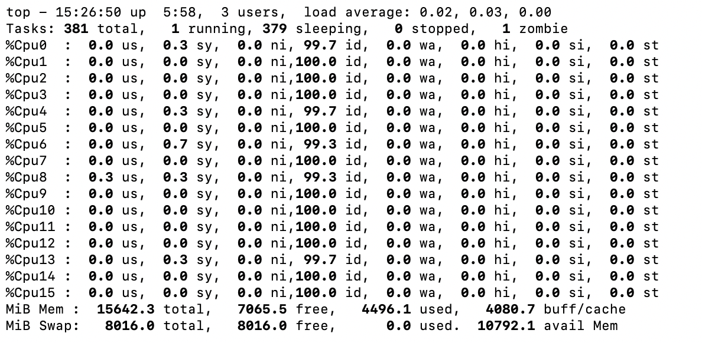
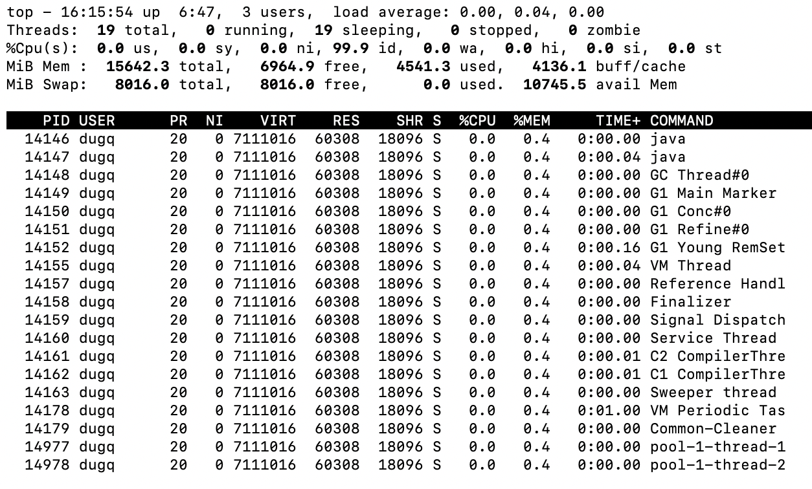

# TOP
* CPU   监控
* 内存   监控
* 进程   监控

## 命令
* -p 【pid】 指定进程ID进行查看
* -d 【nunber】 指定刷性频率
* -S 累计模式
* -n 更新次数
* -H 查看线程情况

## 命令详解

* 第一行 系统概括
  * -14:19:40    ： 当前时间 
  * up 4:51      ： 系统启动时间
  * 3 users      ： 3个用户登陆系统
  * load average ： 连续三个时间段内的CPU load，分别是最近1分钟，5分钟、15分钟
    * load average数据是每隔5秒钟检查一次活跃的进程数，然后按特定算法计算出的数值。如果这个数除以逻辑CPU的数量，结果高于5的时候就表明系统在超负荷运转了。
* 第二行 任务概括
  * 396 total    : 当前任务总数
  * 1 running    : 正在运行的任务数
  * 394 sleeping : 休眠数量
  * 0 stopped    : 停止的任务数
  * 1 zombie     : 僵尸状态的任务数
* 第三行 CPU概括，单位 : 百分比 
  * 0.0 us       : 用户空间占用CPU百分比
  * sy           : 内核空间占用CPU百分比
  * ni           : 改变过优先级的进程占用CPU的百分比
  * id           : 空闲CPU百分比
  * wa           : IO等待占用CPU的百分比
  * hi           : 硬中断（Hardware IRQ）占用CPU的百分比
  * si           : 软中断（Software Interrupts）占用CPU的百分比
  * st           : 
  * 这里可以按 1   : 切换到CPU详细列表  每行显示一个CPU核心的使用情况
* 第四行 内存概括 单位 
  * MiB 单位 MB 
  * total        : 物理内存总量
  * used         : 使用中的内存总量
  * free         : 空闲内存总量
  * buffers      : 缓存的内存量
* 第五行 swap交换区概括
  * MiB 单位 MB
  * total        : 交换区总量
  * free         : 空闲总量
  * used         : 以使用总量
  * avail Mem    : 可用于进程下次分配的物理内存总量
* 第七行开始依次列举所有进程
  * PID          : 进程id
  * USER         : 进程所有者
  * PR           : 进程优先级
  * NI           : nice值。负值表示高优先级，正值表示低优先级
  * VIRT         : 进程使用的虚拟内存总量，单位kb。VIRT=SWAP+RES
  * RES          : 进程使用的、未被换出的物理内存大小，单位kb。RES=CODE+DATA
  * SHR          : 共享内存大小，单位kb
  * S            : 进程状态。D=不可中断的睡眠状态 R=运行 S=睡眠 T=跟踪/停止 Z=僵尸进程
  * %CPU         : 上次更新到现在的CPU时间占用百分比
  * %MEM         : 进程使用的物理内存百分比
  * TIME+        : 进程使用的CPU时间总计，单位1/100秒
  * COMMAND      : 进程名称（命令名/命令行）
  * 可以通过一些指令重新排序
    * P : 根据CPU使用情况排序
    * M : 根据内存使用情况排序
    * N : 根据pid排序
    * T : 根据时间排序

## top thread
* top -H -p 【pid】 thread 太多了，根本看不过来，最好和-p 一起使用  
* 第2行。 基本和task差不多
* 第七行，线程详细列表
  * pid 指向线程ID
  * command 为线程名称
