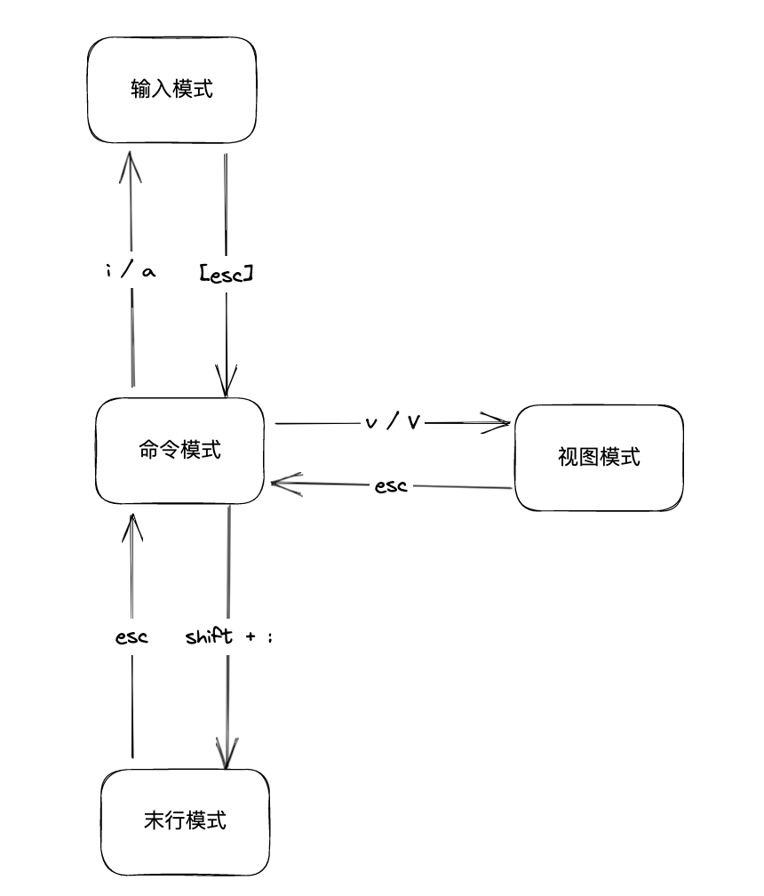
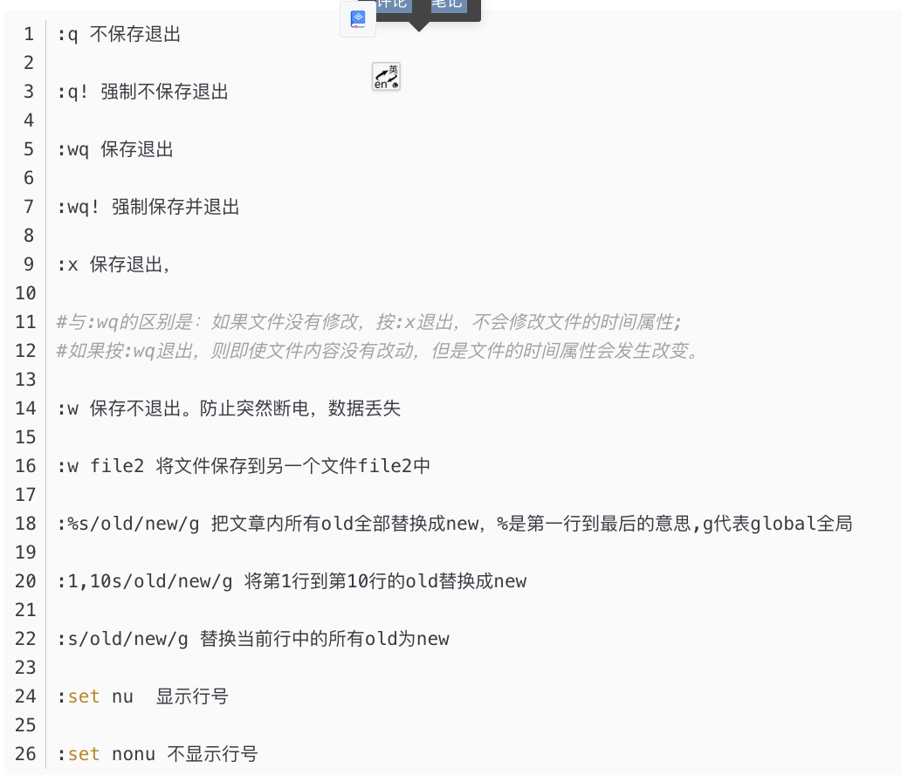

# vi 编辑器
vi具有四种模式分别为
* 命令模式
  * 这个模式下，最好嘛不要瞎按，不然文件莫名其妙就修改了，而且不知道咋修改的
  * 
* 输入模式
  * 从命令模式有几种不同的方式进入命令模式
  * i/a 从当前光标所在字符 前/后开始编辑，差别不大
  * I/A 从当前行 首/未 开始编辑
  * o/O 当前行的 上/下 新起行开始编辑
  * s/S 删除当前字符/当前行开始编辑
  * 建议对于长文，可以通过/word 查找或者 (n)G 跳至指定位置或者结尾，在进入编辑模式
* 末行模式
  * 主要是用来结束编辑的
  * 
* 视图模式
  * 不知道有啥用
