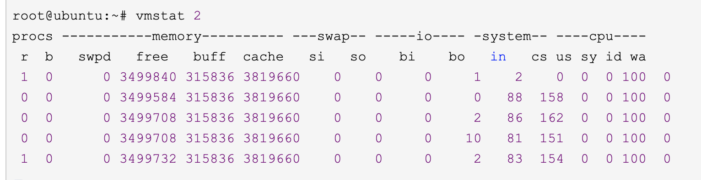
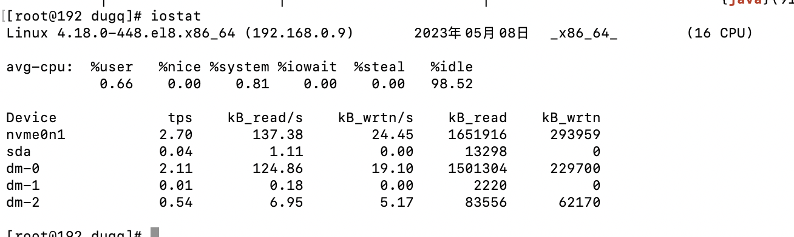

# vmstat
* linux / unix自带的系统工具
* vmstat 1(采样间隔) 2（采样次数）
* 
* 表头解释
    * process
        * r 表示运行队列(就是说多少个进程真的分配到CPU)，我测试的服务器目前CPU比较空闲，没什么程序在跑，当这个值超过了CPU数目，就会出现CPU瓶颈了。这个也和top的负载有关系，一般负载超过了3就比较高，超过了5就高，超过了10就不正常了，服务器的状态很危险。top的负载类似每秒的运行队列。如果运行队列过大，表示你的CPU很繁忙，一般会造成CPU使用率很高。
        * b 表示阻塞的进程,这个不多说，进程阻塞。可能线程处于IO阻塞中
    * Memory
        * swpd 虚拟内存已使用的大小，如果大于0，表示你的机器物理内存不足了，如果不是程序内存泄露的原因，那么你该升级内存了或者把耗内存的任务迁移到其他机器。
        * free   可用的（空闲的）物理内存的大小
        * buff   缓冲区大小
        * cache  cache直接用来记忆我们打开的文件,给文件做缓存(这里是Linux/Unix的聪明之处，把空闲的物理内存的一部分拿来做文件和目录的缓存，是为了提高 程序执行的性能，当程序使用内存时，buffer/cached会很快地被使用。)
          *swap
        * si  每秒从磁盘读入虚拟内存的大小，如果这个值大于0，表示物理内存不够用或者内存泄露了，要查找耗内存进程解决掉。我的机器内存充裕，一切正常
        * so  每秒虚拟内存写入磁盘的大小，如果这个值大于0，同上。
    * IO （Linux版本块大小是1024byte）
        * bi  块设备每秒接收的块数量，这里的块设备是指系统上所有的磁盘和其他块设备
        * bo 块设备每秒发送的块数量，例如我们读取文件，bo就要大于0。bi和bo一般都要接近0，不然就是IO过于频繁，需要调整。
          *os
        * in 每秒CPU的中断次数，包括时间中断
        * cs 每秒上下文切换次数，例如我们调用系统函数，就要进行上下文切换，线程的切换，也要进程上下文切换，这个值要越小越好，太大了，要考虑调低线程或者进程的数目,例如在apache和nginx这种web服务器中，我们一般做性能测试时会进行几千并发甚至几万并发的测试，选择web服务器的进程可以由进程或者线程的峰值一直下调，压测，直到cs到一个比较小的值，这个进程和线程数就是比较合适的值了。系统调用也是，每次调用系统函数，我们的代码就会进入内核空间，导致上下文切换，这个是很耗资源，也要尽量避免频繁调用系统函数。上下文切换次数过多表示你的CPU大部分浪费在上下文切换，导致CPU干正经事的时间少了，CPU没有充分利用，是不可取的。
          *CPU
        * us 用户CPU时间，我曾经在一个做加密解密很频繁的服务器上，可以看到us接近100,r运行队列达到80(机器在做压力测试，性能表现不佳)。
        * sy 系统CPU时间，如果太高，表示系统调用时间长，例如是IO操作频繁
        * id  空闲 CPU时间，一般来说，id + us + sy = 100,一般我认为id是空闲CPU使用率，us是用户CPU使用率，sy是系统CPU使用率。
        * wt 等待IO CPU时间。 

# iostat
* 
* 第一行输出 系统信息
* 第二部分输出cpu状态信息
* 第三部分列举磁盘使用情况
  * Device      磁盘名称 下面的dm之类的需要搭配命令 
  * tps         io tps
  * KB_read/s   磁盘IO读速率 单位KB/s
  * 
* Device 列磁盘名称可以搭配其他命令查看
  * dmsetup ls 查看dm-x的指向情况
  * df -hT 查看缩略概括
  * fdisk -l 查看磁盘详情
