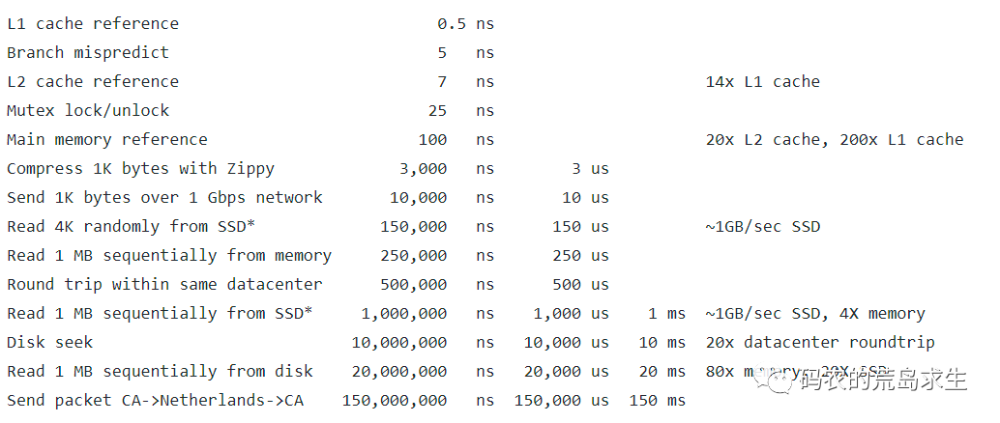
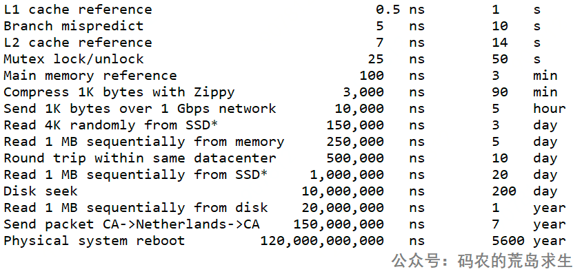

# 各类耗时总结 

* 在性能考虑方面，数据在各类介质中传输的速度相比于CPU来说，都是很慢很慢的
* 这张图，以0.5ns为1s，来看其他介质的速度 
* 总结下来
*  1、网络传输速度 
*  2、机械硬盘
*  3、SSD硬盘
*  4、主存
*  5、高速缓冲区
*  6、CPU周期

# 常用对比 
### 机械硬盘 VS SSD VS 主存
* 1MB数据读取顺序
  * 内存      250us    微妙
  * SSD       1ms      毫秒
  * 机械硬盘   20ms     毫秒

### 网络传输 VS 主存
* 一般来说我们认为内存比磁盘快，磁盘比网络快，但这这张表告诉我们用1Gbps网络发送1K数据仅仅需要20,000 ns，而磁盘的一次寻道则高达10,000,000ns(10ms)，在特定场景下网络IO可不一定比磁盘IO慢。当然，这也要看网络两端距离有多远。
* 网络耗时
  * 网络耗时分为很多部分：写入耗时，传输耗时，读取耗时。
  * 影响因素包含：网络拥堵情况、传输数据字节量、传输距离
  * 一般我们说的网络耗时是这3部分的总和。可以使用ping命令来查看。
  * 一般我们认为它是毫秒级别的
* 一次操作耗时
  * 访问百度一次来回   35ms
  * 主存一次读取      100ns

###### 为什么在我们的世界里网络IO要比主存慢呢
* 原因1: 网络是不稳定的
  * 互联网太过庞大，两点之间的距离不仅仅是地理距离来决定的
  * 各大运营上对带宽的控制不尽如人意
* 原因2:操作系统
  * 数据从网络端到达服务器后并不是直接就能被系统运用，要经过DMA复制和CPU复制两次才能被使用
  * 这其中就包括了两次内存写操作和一次读操作

###### 主存IO和网络IO
* 操作系统层面，两者差不多，都需要多次内存读写
* 速度层面
  * 要看磁盘的性能 和 网络速度
  * 不能简单的认为磁盘 优于 网络
  * 图中1GPS的网络，1MB的传输耗时只有10us，比SSD快了100倍

### CPU指令周期 VS L1 L2 L3 VS 主存
